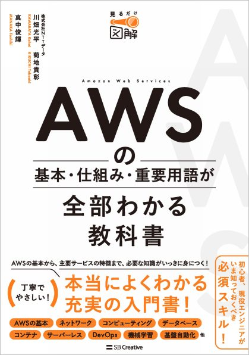
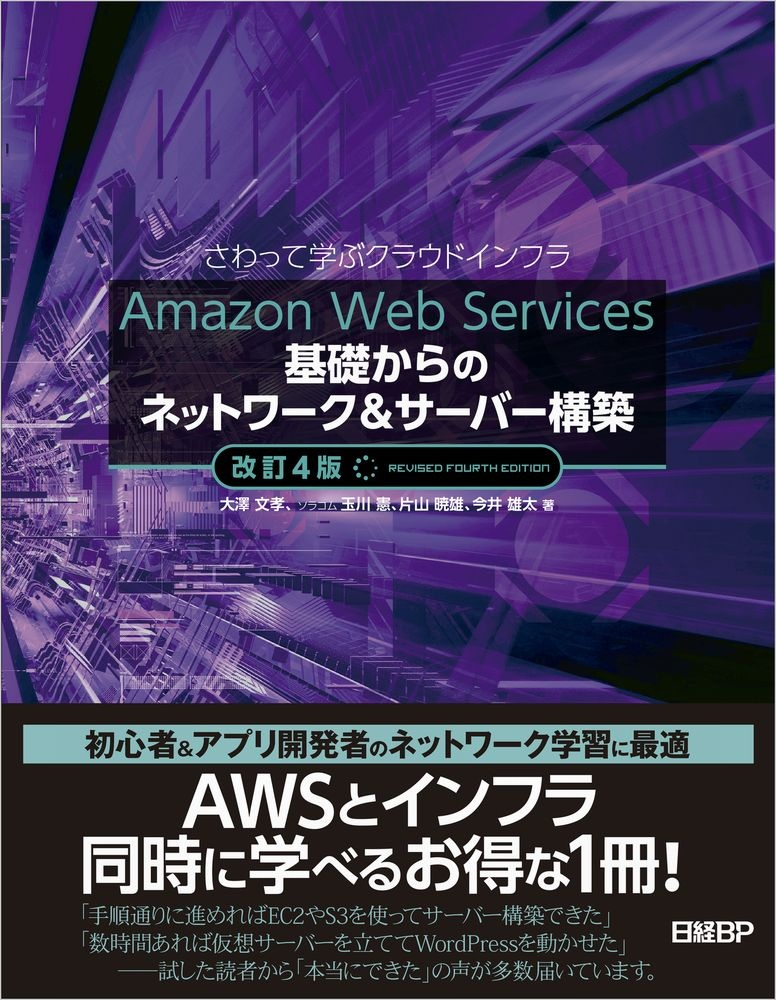
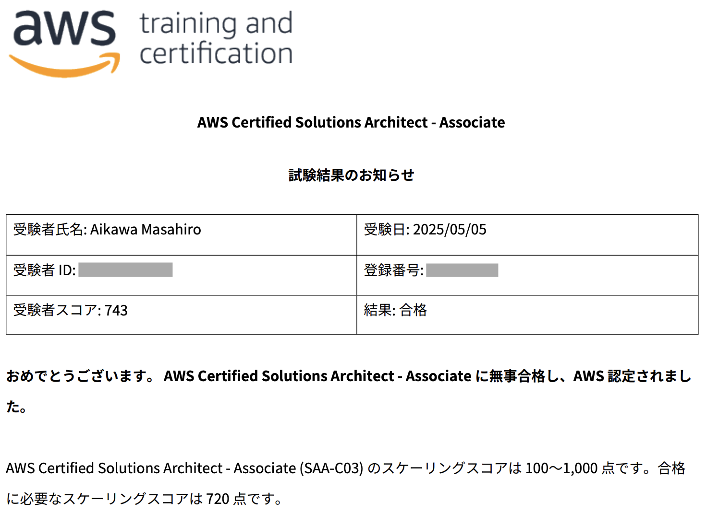
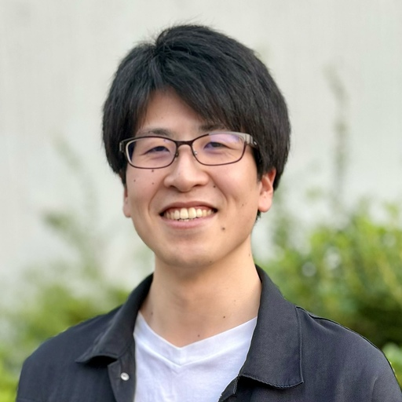

# Re:ゼロ(無冠)から始めるAWS生活

Masahiro Aikawa (@riv_infra)

## はじめに

ふざけたタイトルから始まりました。特にRe:の部分の要素はないかもしれません。この原稿は2025年のGW後半に書いており、2025年6月1日に実施される技術書展で物理の紙の上で書かれているのが見られるようです。物理本になって、手に取るのが楽しみですね。親方さんをはじめ、特にメインで色々やられている方々に感謝ですね。

さぁ何を書こうかと考え、他の方の原稿を読んでいるとAWS資格全冠の方の原稿がありました。逆に自分は最近までAWS資格は一つもない無冠だったなと思い、そんな人のページがあっても良いかと、これを書いています。

JAWSのイベントではAWS資格全冠の方によくお会いするのですが、最初はみんな無冠です。本章では、私の最初の資格取得までの道のりを書いてみます。これを読んでいるゼロから始める方がいたら参考になると幸いです。

## 資格取得のきっかけ

2025年4月に転職し、業務でAWSをがっつり触ることになりました。資格取得手当も出るし一石二鳥ということで勉強し始めました。

## やったこと

2025年4月23日にクラウドプラクティショナーを取得しました。教材としては、書籍で学ぶのが好きなので書籍で学びました。会社でUdemyとか使える方はUdemyの問題集もオススメかも。

## オススメ書籍

{width=30%}

結論これだけ読めばクラウドプラクティショナーは取れます。ただ、AWSのコンソールすら全く触ったことがないという方は読むのがつらいでしょう。

そんな方にはこちら。

{width=30%}

AWS初心者が書籍でハンズオンをしようとすると、誰もが読む本というイメージです。言わずもがなオススメです。AWSについて手を動かした経験がなく、書籍で学びたい人ならまずこれをやりましょう。

ちなみにこの本の著者の大澤さんもこの同人誌の原稿を書かれているようですね！

きのこカンファレンスでの登壇も拝見してすごく人気がある方だなぁと思いました。

## その後
クラウドプラクティショナーについては特に言うこともなく無事取得出来たので、SAAも申し込みました。試験日は5/5です(これを書いているのが5/3夜)。JAWS-UGのSlackを見てると、本を書こうぜ！と通知が来ていたので気づいたら書いていました。

こいつで勉強しています。時間がないのでとりあえず一番後ろの模擬試験を先にやって、苦手分野だけ個別でやろうと思います。受かってくれ〜。

### 5/6追記

{width=75%}

743点でぎりぎり受かった！私は模擬試験を結局半分くらいまでしか出来なかったので、模擬試験だけでもしっかりやると充分そうですね。ぎりぎりを狙いたい方、参考になったら嬉しいです。

## さいごに

資格のハナシは色々ありますが、取るインセンティブがあればいったん取ってみてもよいかもですね。損はないとは思います。ほぼ中身のない記事ですみませんがお読み頂きありがとうございました！

### 宣伝

{width=50%}

JAWS-UG以外のコミュニティでは、TechBullというコミュニティに所属しております。外部の方も参加可能なもくもく会やLT会を開催しているので、ぜひ遊びに来てください！

X:https://x.com/techbull_cloud

connpass:https://techbull.connpass.com/

### 著者紹介

---

    
    

        

            <b>Masahiro Aikawa </b>
            <a href="https://x.com/riv_infra">@riv_infra</a>
        

        

            株式会社サイエンスアーツ
        

        

            所属コミュニティ: JAWS-UG初心者支部 TechBull
        

    

エンジニア歴3年目で、2025年4月より現職。SREとしてAWSを学びつつDatadogなどの監視SaaSを触ったりIaCの導入を行ったりしている。技術イベントに行くのが好き。JAWS DAYS 2025やきのこカンファレンス 2025で当日スタッフを経験。今後はコアスタッフに挑戦したいと思っている。2024年ごろからバンドリ(Bang Dream!)熱が再燃し、技術イベントで意気投合したバンドリ好きとLIVEに行ったりしている。

