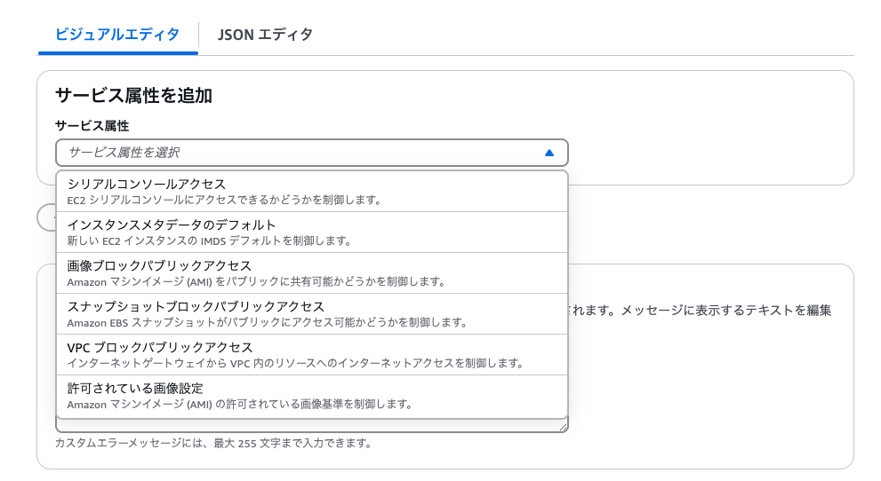
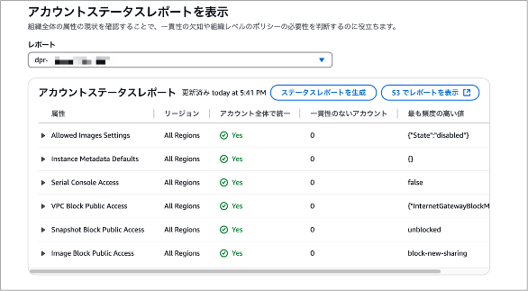
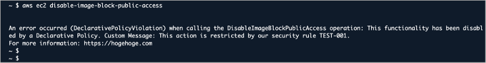

# 宣言ポリシーを活用しよう

<div class="flush-right">
佐藤亨@akira-sato22
</div>

## AWS Organizationsでの権限管理

AWS Organizationsを運用していくにあたって、権限管理は非常に重要です。
たとえば、アカウント利用者に特定の動作を実施させたくない場合（例：IAMユーザーを新規作成させたくない）にはサービスコントロールポリシーを用いることで、その動作を禁止することができました。サービスコントロールポリシーなどの認証ポリシーでは、APIレベルでの制御が可能な反面、APIの更新時にはポリシーの更新が必要になります。

本章ではAPIを意識せずに設定することができる宣言ポリシーについてご紹介します。

## 機能概要と特徴

執筆時点でEC2に関連する6項目に対するポリシーが提供されています。
公式ドキュメントを参照すると、"Supported attributes for declarative policies for EC2" とサービス名を含めて記載されていることから、今後もサービス単位での拡張が行われていくのではないかと個人的には想像しています。

今回は各機能詳細ではなく、宣言ポリシーとしての3つの特徴を中心にご紹介します。
特徴としては以下の3つがあげられます。

- APIを意識した設定が不要で、APIの変更時に更新作業が発生しない
- アカウントステータスレポートによる適応状況確認
- ポリシーによるエラーメッセージのカスタマイズ

以降、各特徴について詳しくご紹介します。

### APIを意識した設定が不要で、APIの変更時に更新作業が発生しない

記載のとおりの特徴にはなりますが、宣言ポリシーではAPIを意識した設定が不要です。設定時は以下の画像の様に設定したい制御を選択するのみとなります。



JSON形式での設定も可能で、以下のように記載できます。
（以下ではAMIのパブリック共有を禁止しています）

```json
{
  "ec2_attributes": {
    "image_block_public_access": {
      "state": {
        "@@assign": "block_new_sharing"
      }
    }
  }
}
```

ユーザーから見た時にAPIを意識するのではなく禁止したい制御を設定することがまず1つ目の特徴になります。
また、内部で利用されているAPI変更時にもユーザーによる更新作業が不要になるのも大きな特徴です。

### アカウントステータスレポートによる適応状況確認

ポリシーなどを適用する際に気になるのが既存のリソースがどれだけポリシーの影響を受けるかです。
宣言ポリシーではアカウントステータスレポートを用いることで、レポート作成時点でどのポリシーをどのアカウントで違反しているかを可視化できます。



このレポートはポリシーの適用前後どちらでも利用可能です。そのため、適用前の影響確認はもちろんのこと、適用後の違反リソースの追跡にも利用可能です。
ただ、ポリシーを提供するだけではなく、ポリシーの適用状況を可視化できることが2つ目の特徴です。

### ポリシーによるエラーメッセージのカスタマイズ

最後に、宣言ポリシーではポリシーによるエラーメッセージのカスタマイズも可能です。
他のポリシーで拒否を設定した場合、403 Access Deniedといったメッセージが返却されます。

宣言ポリシーでは一般的には利用できて欲しい機能ではあるが特定の理由で拒否されている、または利用時には申請してほしいなどの場合に以下のようなメッセージのカスタマイズが可能です。



この様に `This action is restricted by our security rule TEST-001.\nFor more information: https://hogehoge.com` とカスタムメッセージを設定することでユーザーの理解を助けるとともに、運用者へのサポート負担を軽減することが可能な点が3つ目の特徴です。

## まとめ

宣言ポリシーはこれまでのポリシーと比較して、運用負荷が低くセキュアなアカウント運用を可能にするサービスだと感じています。また、APIを意識しなくてもいいためAWS入門者にも優しいサービスと言えるのではないでしょうか。
現時点では利用可能なポリシーは少ないですが、これから充実していけばAWS Organizationsの運用がより楽になるのではないかと期待しています。

### 参考

[Declarative policies](https://docs.aws.amazon.com/organizations/latest/userguide/orgs_manage_policies_declarative.html):<br>
https://docs.aws.amazon.com/organizations/latest/userguide/orgs_manage_policies_declarative.html

#### 著者紹介

---

<div class="author-profile">
    
    <div>
        <div>
            <b>佐藤亨</b>
            <a href="https://x.com/akirarara16">X@あきららら</a>
        </div>
        <div>
            所属：JAWS-UG札幌
        </div>
    </div>
</div>
<p style="margin-top: 0.5em; margin-bottom: 2em;">
AWSが好きなエンジニア。これからもAWSで飯が食えるよう日々精進中。<br>
・AWS Community Builder<br>
・2024 Japan AWS Top Engineers
</p>