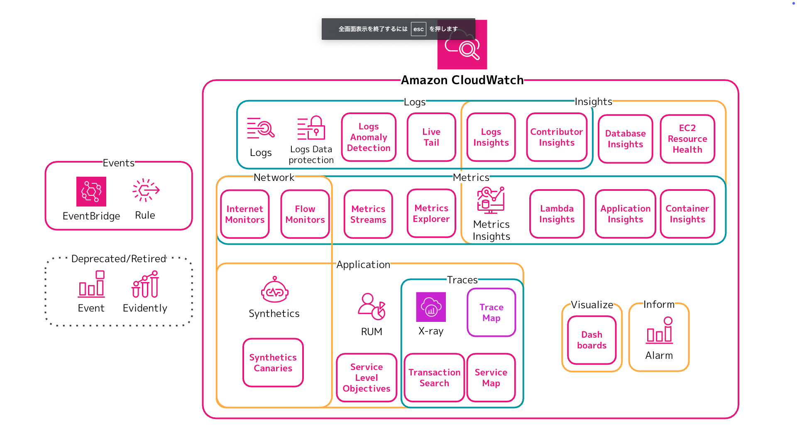
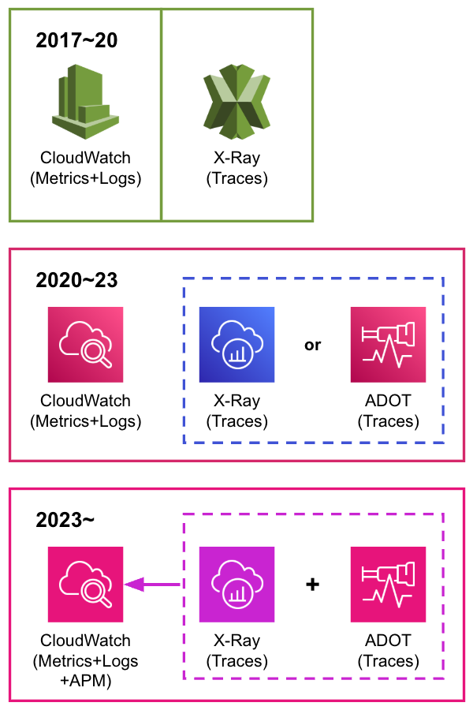

# AWS の APM: Application Signals でオブザーバビリティを探求しよう

木村 健人 @AoTo

## はじめに
すべての AWS ユーザーが利用する AWS サービスと聞いて何を思い浮かべますか？こう問いかけられて **Amazon CloudWatch** を思い浮かべる方は少ないかもしれません。
いずれかの AWS サービスを利用開始すると、ほとんどすべてのリソースは稼働状況を CloudWatch に自動的に記録し始めます。こうして多くの AWS ユーザーが意識しないうちに、CloudWatch は利用されているのです。

「すべての AWS ユーザーが利用する」という割には、CloudWatch どころか監視や**オブザーバビリティ**に興味のあるユーザーは比較的少数です。「運用監視は AWS 環境の構築後に考えるもの」だったり、「アーキテクトや開発者はシステム運用に詳しい必要はない」など意見を持たれる方もいらっしゃるかもしれません。

しかし、システムの状態が分からなければ構築・開発したものが正しく動くかを評価することすら困難です。システムの状態を外部からできる限り把握しようとする際に、オブザーバビリティの手法は欠かせないものとなっています。
こうしたオブザーバビリティの手法は、さまざまなテレメトリーシグナル(監視情報)を集めることで向上していきます。シグナルを基本的なものから詳細な動作を確認できるものまで、最小限の管理で収集できる単一のサービスこそ **Amazon CloudWatch** です。

## CloudWatch の全体像
**Amazon CloudWatch** は AWS の中でも最も古いサービスの一つです。ドキュメント履歴を参照すると、初めてのバージョンは2010年に遡ります。
現在の CloudWatch の機能は**25項目**を超え、さまざまな種類のシグナルを扱えます。

そもそも CloudWatch は『AWS 上のリソースをリアルタイムに監視するソリューション』として提供されていますが、近年はオブザーバビリティというキーワードと共に紹介されることが増えています。その背景として、CloudWatch とは異なるサービスとして存在していた **X-Ray** との統合があるように考えられます。

なぜ CloudWatch と X-Ray の統合が重要なのか、オブザーバビリティの前提からお話しします。オブザーバビリティの主要なシグナルであるメトリクス・ログ・トレースが紐づいていることで、その関連性によりシステムの状態を正しく把握することにつながります。例えば、あるシステムのエラーログから関連するトレースによってその時のアプリケーションの挙動が確認できたり、関連するメトリクスによってリソースの使用状況が確認できたりします。

AWS 上では CloudWatch と X-Ray という異なるサービスに収集されることによって、関連があるはずの各シグナルの関連性が失われていました。2016年末に X-Ray が単独のサービスとして発表されてから、2019年に CloudWatch に X-Ray が統合されるまでは AWS 上では理想的なオブザーバビリティが実現できない制約がありました。

その後も両者の統合は段階的に行われています。2023年に CloudWatch 統合 Agent が X-Ray トレースの収集をサポートし、同じ仮想ホストやコンテナから収集されたメトリクス・トレース・ログなどのシグナルを紐づけられるようになりました。

 - 2019年11月: Management Console 上で X-Ray Console が CloudWatch Console から表示できるように
 - 2021年11月: AWS Distro for OopenTelemetry(ADOT) がアプリケーショントレースをサポート
 - 2023年8月: CloudWatch 統合 Agent の X-Ray, OpenTelemetry トレースの収集サポート

一方で、こうした統合はメトリクス・ログ・トレースの関連性を完全に紐づけるところまではできませんでした。依然としてメトリクス・ログは CloudWatch Metrics Explorer や CloudWatch Logs Insight で探索し、トレースは X-Ray Traces から確認することになります。こうした分断を埋めるために生まれたサービスが **CloudWatch Application Signals** です！(現状はまだシグナルの完全な紐付けはできませんが、APM の中心としてさまざまな画面と統合されることを期待しています)

## アプリケーションパフォーマンス監視(APM)とは？
**CloudWatch Application Signals** を知る前に、**アプリケーションパフォーマンス監視(APM)**についても整理しましょう。

定義から整理すると、**APM** とは「組織がアプリケーションの可用性を確保し、顧客の期待に応え得ることを可能にするツールとプロセスの集合」です。つまり、エンドユーザーが存在するアプリケーションの可用性を可視化し原因分析ができれば、その手法は問いません。その代表的な手法として X-Ray や OpenTelemetry をはじめとする分散トレースが挙げられますが、その他にも合成監視(Synthetic Monitoring) や リアルユーザー監視(Real User Monitoring, RUM) などのユーザーエクスペリエンス(UX)監視も APM の手法の一つです。

これらを含む APM の重要な側面は、Gartner 社が 2011年に『**Gartner's 5 Dimensions of APM**』で整理しています。本質的な内容を残して筆者の独断で翻訳をすると、以下の5つの要素が挙げられます。

 - ユーザーエクスペリエンス(UX)監視(合成監視・RUM)
 - インフラストラクチャやランタイムの情報
 - トランザクションのプロファイリング
 - アプリケーション要素の詳細監視(分散トレース)
 - 分析ツール

また扱うテレメトリーシグナルの観点で考えると、APM は主に**メトリクス・トレース**の2種類のシグナルが中心となります。さまざまなメトリクスと全体のトレースを組み合わせることで、アプリケーションの動作の全体像を把握できるようになります。

 - メトリクス: 時間の経過に伴うサービスのパフォーマンスに関連する集計データ。メトリクスはサービスの内外から計測できます。
 - トレース: サービスを通過する個々のリクエストの詳細な記録。リクエストの各部分に要した時間・サービス間の依存関係・エラーが発生した場所などを示します。
  
## CloudWatch Application Signals の推したいポイント
**CloudWatch Application Signals** は複数の CloudWatch 機能を指す総称です。前述の APM の定義の通り、Application Signals は「アプリケーションの可用性」に関連するシグナルの計測・収集・可視化に焦点を当てています。**X-Ray, OpenTelemetry** から収集されたトレースデータの可視化だけではなく、以前からある **Synthetics Canaries, RUM, SLOs(サービスレベル目標)** も Application Signals に含みます。

単一の機能群としてこれらの機能を扱うことで、「アプリケーションの可用性」をできる限り把握するために複数の手法を組み合わせる重要性を窺い知ることができます。X-Ray や OpenTelemetry などの分散トレースだけではなく、Synthetic Canary や RUM などの UX 監視も APM の重要な要素です。特に、アプリケーションへの組み込み(計装)を必要とする分散トレースのアプローチに比べて、Synthetic Canary のような合成監視は比較的導入が簡単なソリューションです。APM を始めたい、という時にこれらの機能が選択肢に入ってくるのは推せるポイントです。

さらに Application Signals によって、組み込み(計装)が難しい分散トレースのアプローチがより簡単になっている点も推せるポイントです。Application Signals は EKS, ECS, EC2, Lambda 上の Java, Python, Node.js, .NET のアプリケーションへの組み込みをサポートしています。例えば、Lambda はチェックボックスをオンにするだけで Application Signals による分散トレースとメトリクスの記録が開始できます。分散トレースによる APM を AWS ユーザーにより身近にしているのが Application Signals の良さです。

SLOs はこうして計測された APM メトリクスを利用して簡単に設定ができます。APM メトリクスを SLI(サービスレベル指標)として選択し、与えられた項目に沿って評価期間や目標値と警告値を入れるだけで簡単に SLO を設定できます。Application Signals のサービス一覧画面からも SLO を設定できるので、どのサービスにどのような SLO が設定されているかを確認できるのも推したいポイントです。

これらの情報を俯瞰的・視覚的に確認できるのが Service Map です。どのサービスが分散トレースで確認できているのか、Synthetic Canary や RUM で計測できているサービスはどんな状況なのか、それぞれのサービスに SLO は設定されているのか・その状態はどうなっているのか、などを一つの画面で探索的に確認できるのは推せるポイントです。

## まとめ
AWS ユーザーがシステムのオブザーバビリティを探求しよりよいシステムを開発・構築・運用していくために、**CloudWatch Application Signals** は欠かせないサービスです。

この章では CloudWatch の全体像からオブザーバビリティやアプリケーションパフォーマンス監視の概念を解説し、Application Signals の推しポイントをお伝えしました。Application Singlas は「すべての AWS ユーザー」が扱える CloudWatch のサービスの一つです。皆さんも、Application Signals と共にシステムのオブザーバビリティを探求しはじめましょう！

#### 著者紹介

---

    
    

        

            <b>木村 健人(AoTo)</b>
            <a href="https://x.com/AoToLog_">@AoToLog_</a>
        

    

クラウド技術が好きな犬のツールの中の人。G で始まるクラウドのコミュニティ運営もやっています。AWS Community Builder(Cloud Operations), 2022-24 Japan AWS All Certifications Engineer, 2023 Japan AWS Jr. Champion。

