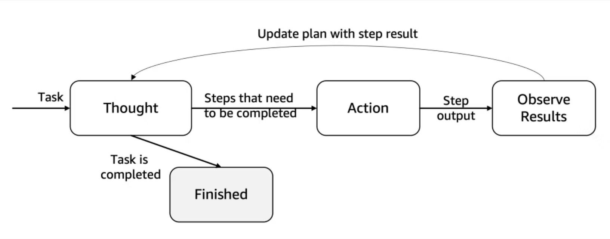
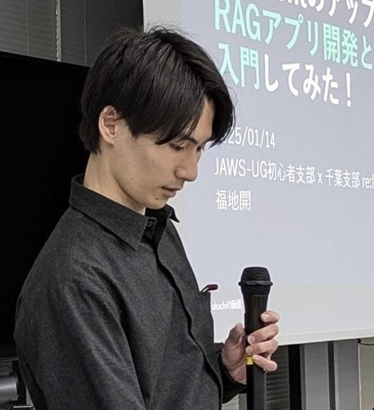

# Amazon Bedrock Agents カスタムオーケストレーション機能 の推しポイント

<div class="flush-right">
著者：福地 開(ふくち)
</div>

## はじめに

ふくちと申します。
2025年にAi Engineering領域のAWS Community Buildersに選出していただきました。

私からはAmazon Bedrockの中でも、悲しいことにあまり注目されていない機能、
**Amazon Bedrock Agents カスタムオーケストレーション機能**
について解説してみます。

## Amazon Bedrock Agents カスタムオーケストレーション機能 とは？
「Bedrockエージェントの行動順序や判断プロセスをワークフローとして定義できるもの」となっております。

通常のBedrockエージェントであれば、タスクをどのように行うかはエージェント自身で決定します。
エージェントにタスク実行権を付与した場合は、柔軟な対応が可能ですが、毎回の動作や出力が安定しない可能性があります。

一方でこのカスタムオーケストレーション機能を用いれば、エージェントが毎回同じような流れでタスクを実行してくれるようになります。
システマチックにAIエージェントを動かすことができるというのは、2025年における1つの注目技術です。

それをAWS上で実現できるのが、このカスタムオーケストレーション機能です。

## 従来のBedrockエージェント

従来のBedrockエージェントでは、いわゆるReAct(Reasoning&Acting)によってオーケストレーションされていました。
ReActとは、LLMを用いて推論と行動を同時に行うための手法です。
具体的に言うと、以下の3つを繰り返すフローがReActです。

- Reasoning：自身の行動と理由を推論すること
(推論は、人間で言う「考える」という行動に似ています)
- Acting：その推論に基づいて行動すること
- Observation：行動結果を観察し推論と行動を繰り返して、最終回答を出力する

ということで、LLM自身が考え、行動し、最終的に何かを決定して回答を出力してくれる、というようなものになっています。

Bedrockエージェントでも同じことが行われています。
LLMが各ステップを推論し、そのステップごとに収集された情報に基づいて次のアクションを決定する、という反復的な意思決定プロセスです。


この手法は、各ステップごとに推論が行われます。
したがって、段階的に行動を考えていくようなワークフローに適しています。
ステップ後の結果を鑑みて計画を変更したり、行動が変化したり、というようなこともあるようです。

その一方で、かなり逐次的な構造であるため、複雑な計画を実行する場合に遅延を引き起こす可能性もあります。
1回1回の行動ごとに思案する時間が入るようなものなので、それは確かに時間がかかりますよね。

ただし、エージェントが継続的に判断を見直しながら進められるという柔軟性が備わっています。

このReActが、これまでのBedrockエージェントでは用いられていました。

## カスタムオーケストレーション機能

それに対してカスタムオーケストレーションを用いると、ReWOO(Reasoning WithOut Observations)によってオーケストレーションされることになります。

ReWOOでは、ReActとは異なり、タスク実行後にLLMによるObservationが行われません。
**タスク計画を事前に作成しておき、推論や行動後の出力はチェックせずに一連のワークフローを実行**します。


このReWOOのメリットとしては、大きく2つあります。

- LLMの呼び出しを最小限にできる
- タスク完了までの遅延を削減できる

ReActでは、各ステップごとにObservationが行われていました。
このObservationはLLMが行っているため、1ステップごとにLLMを呼び出す必要があります。
最終的には、Nステップに対して、N+1回のLLM呼び出しが必要になります。

その一方で、ReWOOではObservationを行いません。
したがって、　1ステップごとにLLMを呼び出す必要がありません。

その結果、ReWOOではLLMの呼び出しを最大2回にまで削減できます。
ここまで呼び出し回数を減らせるとなると、タスクの実行時間も大きく減らすことが出来ますね。

では、なぜそんなことが可能なのか。なぜObservationが不要なのか。

それは、タスク開始前に、**タスクの実行計画を作成しているから**です。その計画に則って作業を実施するだけなので、LLMを逐一呼び出す必要がなくなっています。

先程の図でも、最初に CreatePlan と記載されています。ここで計画を作成しているというわけです。

そのタスク実行計画にあたるのが、Lambda関数です。
このLambda関数を元に、Bedrockエージェントの行動順序や判断プロセスをワークフロー化できます。
その分、トレードオフとして、プロンプトの指定が難しくなるようです。

何はともあれ、Lambda関数を用いることで、Bedrockエージェントの機能や動作を調整し、精度・適応性・効率を向上させることができるようになります。
また、動作する度にBedrockへ入力を渡す必要がないため、処理の高速化と安定化、そしてコスト削減を実現することができます。

それが、カスタムオーケストレーション機能です。

## サンプルコードを確認してみる
ドキュメントに記載されていたサンプルコードを例に、どんなことを行っているのか確認しましょう。

```js
function react_chain_of_thought_orchestration(event) {
    const incomingState = event.state;

    let payloadData = '';
    let responseEvent = '';
    let responseTrace = '';
    let responseAttribution = '';

    if (incomingState == 'START') {
        // 1. Invoke model in start
        responseEvent = 'INVOKE_MODEL';
        payloadData = JSON.stringify(intermediatePayload(event));
    } else if (incomingState == 'MODEL_INVOKED') {
        const stopReason = modelInvocationStopReason(event);
        if (stopReason == "tool_use") {
            // 2.a. If invoke model predicts tool call, then we send INVOKE_TOOL event
            responseEvent = 'INVOKE_TOOL';
            payloadData = toolUsePayload(event);
        } else if (stopReason == "end_turn") {
            // 2.b. If invoke model predicts an end turn, then we send FINISH event
            responseEvent = 'FINISH';
            payloadData = getEndTurnPayload(event);
        }
    } else if (incomingState == 'TOOL_INVOKED') {
        // 3. After a tool invocation, we again ask LLM to predict what should be the next step
        responseEvent = 'INVOKE_MODEL';
        payloadData = intermediatePayload(event);
    } else {
        // Invalid incoming state
        throw new Error('Invalid state provided!');
    }
                    
    // 4. Create the final payload to send back to BedrockAgent
    const payload = createPayload(payloadData, responseEvent, responseTrace, ...);
    return JSON.stringify(payload);
}              
```

### 1.ステート管理
この関数内では、3つの主要な状態(state)を管理しています。
1. `START`：会話の開始状態
1. `MODEL_INVOKED`：LLMが呼び出された後の状態
→恐らくですが、ここで言う「LLM」はエージェントを指しているのだと思います
→以降、LLMはエージェントのことだとして進めます
1. `TOOL_INVOKED`：ツールが呼び出された後の状態
→ここで言うツールとは、Knowledge baseやアクショングループを指します

### 2.イベント実行
この関数内では、3つのイベントを実行しています。
1. `INVOKE_MODEL`：LLMを呼び出す
1. `INVOKE_TOOL`：特定のツールを使用する
1. `FINISH`：会話を終了する

### 3.処理の流れ
やっていることとしては、**ステートごとにif文で処理を指定**しています。これがワークフローとなるわけですね。

ここからは具体的に、先程のサンプルコードを上から順番に見ていきます。
#### a)開始時のステート(`START`)

```js
if (incomingState == 'START') {
    // 1. Invoke model in start
    responseEvent = 'INVOKE_MODEL';
    payloadData = JSON.stringify(intermediatePayload(event));
}
```

新しい会話が始まると、最初は`START`ステートです。
この時は、`INVOKE_MODEL`イベントでLLMを呼び出します。
そしてユーザーの入力に基づいて、次のアクションを決定するように依頼します。

#### b)LLM呼び出し後のステート(`MODEL_INVOKED`)

```js
else if (incomingState == 'MODEL_INVOKED') {
    const stopReason = modelInvocationStopReason(event);
    if (stopReason == "tool_use") {
        // 2.a. If invoke model predicts tool call, then we send INVOKE_TOOL event
        responseEvent = 'INVOKE_TOOL';
        payloadData = toolUsePayload(event);
    } else if (stopReason == "end_turn") {
        // 2.b. If invoke model predicts an end turn, then we send FINISH event
        responseEvent = 'FINISH';
        payloadData = getEndTurnPayload(event);
    }
}
```

a)の処理において、`INVOKE_MODEL`イベントが実行されたので、ステートは`MODEL_INVOKED`に変化しました。その時の処理が書かれています。

LLMの応答に基づいて、2つのパスがあります。
1. ツールの活用が必要な場合、`INVOKE_TOOL`イベントを実行します
1. 会話を終了する場合、`FINISH`イベントを実行します

1.だった場合は、ステートが`TOOL_INVOKED`に変化し、それに応じた次のアクションへと移ります。

2.だった場合は、最終回等がユーザーに返却されて会話終了です。

#### c)ツール呼び出し後のステート(`TOOL_INVOKED`)

```js
else if (incomingState == 'TOOL_INVOKED') {
    // 3. After a tool invocation, we again ask LLM to predict what should be the next step
    responseEvent = 'INVOKE_MODEL';
    payloadData = intermediatePayload(event);
}
```

b)の処理において、`INVOKE_TOOL`イベントが実行された場合には、`TOOL_INVOKED`ステートへ変化します。その時に実行する処理が記載されています。

ツールの実行結果を受け取った後、再び`INVOKE_MODEL`イベントを実行してLLMを呼び出します。
この時、ステートは`MODEL_INVOKED`に変化します。

したがって、**ツールの実行結果を受け取ったら、b)に戻る**ということですね。
ただ順次実行しているわけではなく、ワークフローが定義されているのだということがここでわかると思います。

#### 具体例
簡単な例をご紹介します。
ユーザーから「明日の東京の天気を教えて」という入力があったとしましょう。

その際の処理フローとしては、
1. `START`ステート → `INVOKE_MODEL`イベントを実行
(LLMが、天気情報が必要と判断する)
1. `INVOKED_MODEL`ステート → `INVOKE_TOOL`イベントを実行
(天気APIツールを呼び出す)
1. `TOOL_INVOKED`ステート → `INVOKE_MODEL`イベントを実行
(天気情報を受け取り、応答を生成する)
1. `INVOKED_MODEL`ステート → `FINISH`イベントを実行
(ユーザーに回答を返す)

という形になります。
ワークフローに則って処理されているのがわかると思います。

## さいごに

今回はAmazon Bedrock Agents カスタムオーケストレーション機能について紹介しました。
最近では、Agentic Workflowと呼ばれているものをAWSのマネージドな機能として提供できるものだと私は認識しています。

上記は簡単な例でしたが、使い込むためにはかなり大変なLambda関数を作成しないといけなそうな印象を持ちました。

ただ、それでもこの機能がどんなものなのか・ReWOOとはなにか、を知っておくだけでもだいぶ違うのではないかな、と思います！

今後も発展を続ける、Bedrockから目が離せません！

#### 著者紹介

---

<div class="author-profile">
    
    <div>
        <div>
            <b>福地 開 ( ふくち )</b></br> 
            X：<a href="https://x.com/har1101mony">https://x.com/har1101mony</a></br> 
            Qiita：<a href="https://qiita.com/har1101">https://qiita.com/har1101</a></br> 
            LinkedIn：<a href="https://www.linkedin.com/in/haruki-fukuchi-bedrock-engineering">https://www.linkedin.com/in/haruki-fukuchi-bedrock-engineering</a></br> 
            運営：<a href="https://tunagari-tech.connpass.com/">ITなんでも勉強会 つながりテック</a>
        </div>
    </div>
</div>
<p style="margin-top: 0.5em; margin-bottom: 2em;">
2025~ AWS Community Builder (AI Engineering) </br> 
2025~ AWS All Certifications Engineer </br> 
今力を入れてること：技術アウトプット(LT登壇、ブログ投稿など)、筋トレ </br> 
好きなもの：Bedrock、Mastra、弱めのスパークリングワイン </br>
推し：小泉萌香さん </br>
</p>