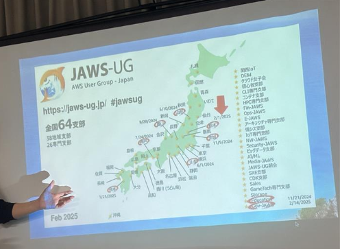
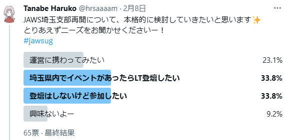
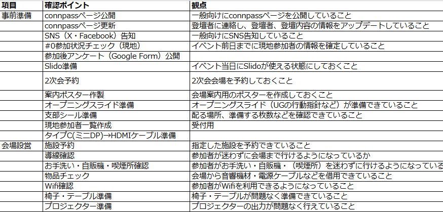

# JAWS-UG 彩の国埼玉支部　～設立ものがたり～

Tanabe Haruko @hrsaaaam

## はじめに
2025年4月7日、11名の運営メンバーと33名の推薦人の元、埼玉県を中心とした地域支部「JAWS-UG 彩の国埼玉支部」を新規設立しました。 

**【彩の国埼玉支部　支部コンセプト】** 
彩の国・埼玉県を中心とした首都圏エリアの支部として、AWSに関する勉強会を通じて楽しく自ら学び発信しあう活動を担います。また、各地方支部や専門支部とのコラボや、埼玉の地域創成を重視し、街や文化の紹介と体験イベントなどもあわせて、AWS初心者から習熟者まで、誰もが楽しく参加できる支部活動をめざします。 

JAWS-UGの支部設立について、以下の通り一定のルールはあるものの、正直手探りで進めた部分も多くあります 
* [JAWS-UG運営 行動規範 - Code of Conduct -](https://github.com/jaws-ug/manifesto/blob/master/for-contributors.md)

今回は、将来的にJAWS-UGの支部を新規設立したいと考えている方々、「JAWS-UGの支部ってどのように運営しているの？」と気になっている方々に向けて、JAWS-UG 彩の国埼玉支部の設立と、#0開催までの経緯をご紹介します。 

## プロローグ ～ものがたりの始まり～　編
この図、JAWS-UGのイベントに参加したことある方は１度は目にしたことがあると思います。 

そうです、JAWS-UGの支部一覧の図です。地域支部、専門支部併せてたくさんの支部がありますね。 
 
私も、2025年2月に開催されたJAWS-UG山梨の勉強会に参加した際にこの図を見ました。 
その時、違和感を感じたのです。 
 
**「JAWS-UG、埼玉県に支部無いの・・・？」** 
 
この違和感から、ものがたりの全てがスタートしました。 

## 無いのなら作ってしまえ　～支部設立に向けた情報収集～　編
私は思い立ったら即行動！のタイプなので、その当日、参加していたイベントが終わり、帰宅のため新幹線に乗っている間に勢いに乗って支部始動に向けて動き始めました。 

まずは情報収集です。Xの投票機能を利用して、埼玉県でのJAWS-UG支部活動の需要を調査しました。 

概ねポジティブな反応をいただいたところで、埼玉県を中心としたJAWS-UG地域支部（JAWS-UG さいたま支部）は、休眠状態ではあるものの存在することを初めて知ります。 
[JAWS-UG運営 行動規範 - Code of Conduct -](https://github.com/jaws-ug/manifesto/blob/master/for-contributors.md)では、新支部の立ち上げの前提条件として以下が記載されています。 

* 同じ地域、同じテーマで既存の支部がないか、[勉強会グループ一覧](https://jaws-ug.jp/act/)を確認して下さい。同じコンセプトで2つ支部が出来る事を極力避けてください。
* 同じコンセプトの支部が存在するが、活動していないように見える場合には、Slackのmake-jawsugドメイン #generalチャンネルにてご連絡下さい。関係者の協力の下、その支部をリブート（再起動）するように勧めてください。

今回は、既存のさいたま支部とはコンセプトが異なることから、関係者各所と調整を行ったうえで、リブートではなく新支部として立ち上げる方針となりました。 

## 運営メンバー集結　～JAWS Daysで初顔合わせ～　編
Xでの需要調査と並行し、募集要件として以下を設定したうえでJAWS-UG新支部の運営メンバーの募集を行いました。 
* JAWS-UGのイベントに参加したことがある。
* JAWS Daysに参加したことがある、もしくは参加予定である。 
　→ JAWS-UGでの活動経歴がある、イベントの雰囲気を知っている、運営が何かを理解している方が望ましいため。
* FBで連絡できる。

この時点で、ありがたいことに7名ほど候補者が集まりました。 
運営メンバーの募集をかけたのが2月下旬で、ちょうどJAWS Daysがもうすぐ開催される、というタイミングだったので、初顔合わせはJAWS Daysの懇親会で行うことにしました。 
JAWS Daysの懇親会でも新たな出会いがあり、その場で運営メンバーに立候補いただけた方も含め、計11名の運営メンバーがこの時集結しました。

## カラオケキックオフ　～役割分担、そしてガチ中華へ～　編
次に、支部活動を始めるためにキックオフを実施しました。 
理想としては、全員が同じ場所に集まって顔を合わせることが望ましいですが、11名にもなると全員の予定を合わせるのも大変です。 
なので、この時はオンライン、オフラインのハイブリッド形式で行いました。 
オフライン勢が集まる場所としては、ある程度人数が入れてインターネットが使える、ということで[おしごとパセラ](https://www.pasela.co.jp/oshigotopasela/shop/ikebukuro/)を利用しました。（埼玉じゃないじゃん、という突っ込みは甘んじて受け入れます） 
予約なしで利用でき、プロジェクター等も完備、1時間毎にドリンクが1杯無料（アルコールOK！）なので、気軽にわいわい話す場所としてはとても便利でした。 
 
キックオフでは、以下のようなアジェンダで決めるべきことを議論していました。 

* 自己紹介
* 支部コンセプトの検討 
　→ たたき台を用意してメンバーの意見を聞く
* イベント開催方針の共有 
　→ #0の日程調整、イベント開催頻度の方針確認
* #0開催に伴うタスク担当決め 
　→ タイムテーブル・イベントページ作成、支部ロゴ作成、会場抑え、等
* #0開催までのスケジュール

キックオフ後はガチ中華の[ムーさんの蒸鍋館](https://mu-sannomushinabekan.com/)で2次会でした。 

## 会場下見、リハーサル　～#0イベントへの最終調整～　編
#0イベント開催1週間前に、実際の会場の下見とリハーサルを行いました。 
事前に確認チェックリストを作成し、リストに沿って確認を行います。 
(チェックリスト抜粋) 

また、オープニングを一通り話すことで、タイムキープに問題がないか、PCの表示切替がスムーズに実施できるか、という点も確認しました。 
実際に会場に行ってみると、使えると思っていたフリーWi-Fiが使えなかったり、マイクの音声をPCが拾わなかったり、投影資料はZoomに画面共有しないとZoom参加組が資料見づらかったりと、新たな気づき、必要な対応が明確になったので、実会場でのリハーサルは大事だと実感しました。

## いざ#0イベント本番へ　～満員御礼、大盛り上がりの懇親会～　編
いよいよ#0イベント本番です。
現地参加枠（40名）は満員御礼、オンライン参加も63名と多くの方に参加いただきました。 
運営体制としては、以下の通り役割分担をして、裏で情報連携しながら動きました。 
| 役割 | やること | 
| :---- | :---- | 
| 司会・進行 | 進行、オープニング、クロージング |
| 受付 | 現地参加者の出席確認、参加費徴収 |
| 案内 | 会場入り口での誘導 |
| オンライン参加対応 | Zoom配信設定、録画、Zoomでのコメント・質問への対応 |
| タイムキーパー | LTのタイムキープ |
| SNSでの情報発信 | イベントの様子について公式アカウント（後日作成）で定期的にSNS投稿 |
| 懇親会 | 人数確定後のお店への連絡、会場移動の誘導、乾杯・締めの挨拶 |

初めてのイベントでしたが、運営メンバー、及び参加者の皆様のご協力もあり、勉強会・懇親会ともに大盛り上がりで成功といえる回だったのではないかと思います。

## 反省会　～成長し続ける支部活動へ～　編
イベントが終わったらそれで終わり、ではありません。今後、より良い支部活動にしていくために、反省会は必須です。 
参加者の皆様から頂いたアンケート結果をもとに、次回イベントに向けた改善点を運営メンバーで共有しました。以下はその一部です。 
* 会場が狭かった 
　→ 現地参加枠は会議室の収容人数からある程度余裕を持たせる。
* 室温が暑かった 
　→ 人口密度が高いと暑くなりがちなので、適宜確認を行う。
* Zoom配信でハウリングが生じていた 
　→ 管理者権限で参加者のマイクとカメラをオフにする設定をする。
* マイク音量が小さかった 
　→ 前もって音量調整を行う。また、マイクスタンドは利用しないほうがベター。 
 

このように、毎回参加者からフィードバックをいただき、次回イベントでの改善を続けることで、成長し続ける支部活動にしていきたいと思っています。

## さいごに
本章では、将来的にJAWS-UGの支部を新規設立したいと考えている方々、「JAWS-UGの支部ってどのように運営しているの？」と気になっている方々に向けて、JAWS-UG 彩の国埼玉支部の設立と、#0開催までの経緯をご紹介しました。 
 
支部運営、とても楽しいです！コミュニティを育てていく難しさもありますが、それ以上にやりがいや達成感を感じます。 
運営してみたいな、と思っていただけた方、まずはJAWS-UGのイベントにたくさん参加してみてください。 
そして、イベントの空気感を感じ、情報のアウトプットをして、たくさんの人とつながりましょう。 
些細な出会いを大切にすることで将来のチャンスにつながります。 
 
ここまで読んでいただきありがとうございました。JAWS-UGのイベントで皆さんとお会いできることを楽しみにしています！ 

#### 著者紹介
---

    
    

        

            <b>Tanabe Haruko</b> 
            X: <a href="https://twitter.com/hrsaaaam">@hrsaaaam</a> 
            Facebook: <a href="https://www.facebook.com/profile.php?id=61573074222758&locale=ja_JP">Haruko Tanabe</a> 
            Zenn: <a href="https://zenn.dev/haruko_tanabe">haruko tanabe</a> 
        

        

            JAWS-UG 彩の国埼玉支部 代表
        

    

外資コンサルティングファームのエンジニア/ 未経験エンジニア向けTraining講師経験あり / Google Cloud & AWS All Certifications Holder / TOEIC940 / デグーと暮らしています

