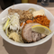

# わたしの最推し、AWS Support

hirosys_

## はじめに

はじめましてのかたは、はじめまして！お久しぶりの方はお久しぶりです。 @hirosys_ です。
今回は、わたしが激推しかつ最推ししてやまない AWS Support について愛をこめてお伝えします。

## AWS Support とは

AWS 上で発生したインシデントに対してのトラブルシューティングをしてくれることに加えて、ベストプラクティスに関する質問への回答や設定ガイダンスの提供などを通じて、ユーザーのビジネスを成功させるために櫃追うな成果を達成できるように支援（サポート）してくれるサービスです。

そんなAWS Supportには要件に応じた、次のようなサポートプランが存在します。

### サポートプランと重要度、初回応答時間

* デベロッパー
* ビジネス
* Enterprise On-Ramp
* エンタープライズ

各サポートプランは、インシデントに応じたケースの重要度の設定可能な項目が異なっています。プランと重要度に応じて初回応答時間が変わってくるように設定されています。
例えば、デベロッパーサポートの場合、**システム障害**の場合は12時間以内ですが、営業時間（平日の午前8時から午後6時までの10時間）で換算されるので注意が必要です。逆に最上位のエンタープライズサポートの場合は、非常事態の場合で15分以内という、ほぼ即時の応答が設定されています。さらに、TAM（Technical Account Manager）という担当者がアサインされ、問題解決の迅速化に寄与してくれます。

これらサポートプランについては、AWS と直接契約を行っている場合に有効になります。AWS パートナーであるシステムインテグレーターによるアカウント提供の場合は、サポート提供形態が異なってきますので、アカウント提供元にご確認ください。

さらに迅速な問題解決につなげるために、問い合わせ者に向けたガイドラインも用意されています。

### 技術的なお問い合わせに関するガイドラインについて

https://aws.amazon.com/jp/premiumsupport/tech-support-guidelines/

いろいろと書かれていて、どれも重要ですが以下については留意するとよいです。

* タイトルや本文に余計なことを書かない
 * 【緊急】や【1時間以内に回答求む】と書いても迅速な回答に寄与しません。
 * 適切な重要度とサポートプランによって初回応答時間が変わってきます。
* 解決したい課題や状況、経緯を明確にする
 * 発生している課題、問題とどうしたいのかを記載する
 * 問題が発生しているリソースやリージョン、発生日時を明確にする
 * 再現手順や切り分けした内容などを共有する

 あと、よくあるのが、AWSアカウントを超えた問い合わせをしてしまうことです。AWSでは、サポートケースで起票されたアカウントIDに対してのみ確認が行われるため、複数アカウントで連携しているようなワークロードの場合は、両方のアカウントで問い合わせるのが重要です。

## なぜ、最推しなのか

というわけで、ここからが本題です。
なぜ、最推しなのか。それを確認すべく、我々は Amazon Web Services の奥地へと向かうのであります。

ー閑話休題ー

冗談はさておいて、改めて、なぜ最推しなのか。

「親身になって問題解決に全力で協力をしてくれる」これに尽きます。

回答に対して「親身である」と感じたことは多々ありますが、いくつか例を挙げていきます。

### 言語の話

まずは「日本語」が通じます。何言ってるんだ！と思われる方もいらっしゃるかと思いますが、母国語でやり取りできるのは非常にありがたいものです。
わたし自身、英語は得意ではありません。そうなると必然的に機械翻訳や最近だと生成AIを用いての翻訳を使うことになります。確かに最近の翻訳ツールの精度は非常に高いものだといえますが、やはり、細かいニュアンスの伝えづらさや翻訳の手間を考えると、母語を使えるのに越したことはありません。

### 回答の補足資料

仕様やユースケース上で分かりづらい点を質問した際、AWSドキュメント（一次ソース）を用いてわかりやすく説明をしてくれます。もちろん、これも当たり前で何を言ってるんだ！となるでしょう。また、補足資料として、他社による解説記事（例：やってみた系ブログ）なども例示してくれます。もちろん、あくまでも「参考」としてではありますが、理解を深める手助けのために共有してくれるのは、非常に助かるしうれしいものです。

### 出来るだけ速く再現を試行

これも当たり前だろうとお思いの方も少なからずいらっしゃると思いますが、問い合わせ文とログなどからのみで判断するのではなく、切り分けのためにAWS Support側でもしっかりと再現確認を行ってくれます。再現しなかったとしても、その旨を伝えてくれますし、再現しないからって問題が起きていないということにはならないのでご安心を。
ちなみに、この再現確認は想像を超えて爆速に行われることが多く、出来るだけ早く解決させたいという想いが込められているのだなと感じています（時間がかかったからといって、そういった想いがないということではありません。様々な要因で時間がかかるのは往々にしてあり得ます）。

### AWS CLI や AWS SDK でのケース起票

これはクラウドサポートエンジニアの方の温かみ溢れる親身な対応とは異なりますが、トラブルや何かが発生したのを契機に自動的に起票できるのは非常に助かる場面が多いです。
例えば、DirectConectやSite to Site VPNで接続しているオンプレミスとのハイブリッドクラウド環境で、お互いに ping で疎通確認をしているがある一定のしきい値の回数疎通確認が失敗したら迅速にケース起票を自動的に実施することで被害の最小化につなげることが期待できます。
こういったところも、ユーザーフレンドリー（親身）であるといえると考えます。

## まとめ

いろいろと書いては来ましたが、こういった「親身」な対応をしてもらうために、問い合わせ者側も前述のガイドラインに沿った行動をとる必要があるわけです。「急がば回れ」という言葉のとおり、障害発生で焦っていたり慌てていたりする時ほど、クラウドサポートエンジニアの方々に伝わるようにすることで、迅速かつ的確な解決策を得やすくなります。

この場を借りて、AWS Support を支えている、クラウドサポートエンジニアの皆様、いつもありがとうございます！

---

    
    

        

            <b>hirosys_</b>
        

        

            所属： 
            <li><a href="https://storage-jaws.connpass.com/">Storage-JAWS</a></li>
            <li><a href="https://jawsug-iot.connpass.com/">JAWS-UG IoT 専門支部</a></li>
        

    

伝統的日本企業のクラウドCOEで所属企業やそのグループ企業に向けて、AWSクラウドの利活用促進や人財育成を推進しています。 
AWS Ambassador や AAI(AWS Athorized Instructor Champion)としても活動しています。

