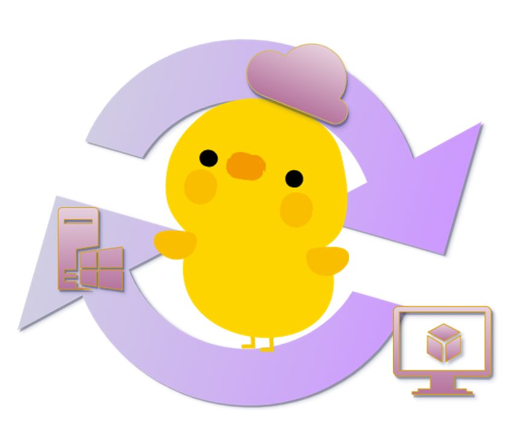

# インプット/アウトプットの場としてのコミュニティ

ひよこインフラエンジニア @hamijay_cloud

## はじめに
みなさんこんにちは、ひよこインフラエンジニアです。

普段はAWSを中心に、既存システムの保守運用や新規システムの要件定義・設計・構築・テストなどのお仕事をしています。

「みんなのAWS推しポイント」ということで、私は**インプット/アウトプットの場としてのコミュニティの魅力**をお伝えしたいと思います。

## なぜコミュニティが魅力的なのか
アウトプットときくと、「発信するネタがない」「誰かの役に立つ内容って何だろう」「限られたエンジニアが取り組んでいるから、自分には難しそうだ」と感じる方もいらっしゃるのではないでしょうか。

かく言う私も、最初はアウトプットに対して非常にハードルを感じており、外部の勉強会に参加した際も自身の知識を蓄えるというインプットのみで、特に発信はしていませんでした。

今では2024 Japan AWS Jr. Champions の一員として、Zenn（ブログ）や社内外のLTを通した発信を行ったり、関西で若手エンジニア向けのLT会を企画・運営したり、といった活動をしています。

JAWS-UGの一参加者から始まり、自分にできる小さな範囲の発信を繰り返すことでアウトプットへの挑戦→成長のサイクルが定着してきましたので、以前の私のように「アウトプットに関心があるもののあと一歩が踏み出せない方」に向けて、本章をお届けいたします。

コミュニティの推しポイントは3点あります。

### 推しポイント① インプットでアンテナを広げる
JAWS-UGでは、エリア別・目的別に数多くの勉強会グループ（支部）が存在し、毎週何かしらの勉強会が開催されています。

普段の業務でAWSを扱っていない方や使用するサービスが限られている方であっても、最新のアップデート情報をキャッチアップすることや、流行分野のサービスのハンズオンを通して知見を習得することが可能です。

また、LTが主体の勉強会では今まで聞いたことがなかったサービスとの出会いも多くあるほか、設計・実装にあたっての躓きポイントが紹介される機会も豊富です。

勉強会に参加することで、**幅広い技術分野**に触れるだけではなく、設計・実装にあたっての注意点など机上検証や認定資格試験のみでは得られない**深い知見**を得ることができます。

### 推しポイント② 小さなアウトプットでつながる
参加者としてインプットを続けていると、LTの発表者はもちろんのこと、参加者の多くがXやブログなどで感想を気軽に発信しており、アウトプットをしていることに気が付きます。

そろそろ何かしら発信したくなってきたな、というタイミングで小さな一歩を踏み出してみましょう。

具体的には、下記が挙げられます。

- SNSで、勉強会の告知をリポスト/引用し、参加している旨を発信する
- イベント参加者の投稿に対し、リアクションをする
- 初めて知ったこと、意外なこと、勉強になったこと、いいなと思ったことをつぶやく
- ブログで参加記録を発信する

SNSによる発信は、**アカウントと1文字以上の内容があればすぐに**取り組むことができるという気軽さがあります。
文章が思いつかない場合は、公式からのお知らせや他者に対するリアクションでも問題ありません。
勉強会の運営・発表者にとっては、あなたの投稿が大変励みになり、次のアウトプットのモチベーションになります。
またあなたにとっても、発表者や他の参加者とつながることで、タイムラインに自身の関心のある情報が入ってきやすくなり、情報収集が格段に楽になります。

一方で、ブログによる発信はSNSと比較して時間が必要となってきますが、**文章量や記載内容を自分で決定でき、自分のタイミングで取り組む**ことができます。
そのため、自分が参加した勉強会の備忘録として利用したり、勉強会中に疑問に思った点を追加で調査/検証して公開する、といった使い方がおすすめです。
あなたがブログ記事を複数公開している頃には、「あの記事よみました！」「いつも勉強会のまとめ助かります」とお声がけいただける機会も増えていることでしょう。

### 推しポイント③ 大きなアウトプットに挑戦
さて、そろそろ何かしら次のアウトプットに挑戦したくなってきたな、というタイミングで大きな一歩を踏み出し、アウトプットの世界にはばたきましょう。

そうです・・・LT発表にチャレンジするのです・・・（あなたの脳内に直接語りかけています）

LTは**人前かつ時間が決まっており、その場限りの1点もの**なのでハードルが高く感じるかもしれません。
しかし、**準備の過程で足りない知識や不明点を調べようとするため、自身の成長に最も直結する**と私は考えています。

それでは、どのように準備するのでしょうか。

ネタ探しに身構える必要はありません、LTのタネはあちこちに転がっています。

- このサービスの設計・実装でこんな苦労があったな・・・着手する前に知っておきたかった
- 前こんな困りごとがあって、こんな風に解決したけど、もっといい方法がなかったかな？
- 新しいサービスや機能で××を作ってみたので、誰かに試してほしい

発表の構成に思いつめる必要はありません、あなたはこれまでのインプット/小さなアウトプットでいくつものLTを見てきたはずです。
この発表者の説明は分かりやすいな、このスライドはとっても見やすいな、と感じる点があればお手本にしましょう。

おびえる必要もまったくありません、徐々に段階を踏んで慣れていきましょう。
社内や知り合いのみで開催/社外で開催、朝/昼/夜、オンライン/オフライン、少人数/大人数、録画なし/あり、5分/15分以上。
一口にLTといっても、よくみると形態は様々です。一番抵抗の少ないものから始めてみましょう。

あなたがLTを行った暁には、**リアルタイムで参加者の方からフィードバック**をいただくことができ、ご自身も**気づきや学び、達成感**が得られるでしょう。

## アウトプットに関するQA
### 何をアウトプットするの？
特に決まりはありません、何でもよいです。

勉強会の感想、気になるアップデート、技術的な困りごとをどう解決したかというトラブル事例など、題材は自由です。

形態についても、文章が得意であれば文章で、お話するのが好きであればLTで、モノづくりが好きであれば成果物のURLやアプリそのものを発信してもよいです。

不特定多数の人に役立つ内容に囚われる必要はなく、1年後の自分が助かったといえる内容だったり、振り返っていい思い出だなと感じる内容であれば、十分アウトプットとして機能していると私は思います。

### どうやってアウトプットするの？
とはいっても、いざ発信するとなると尻込みするものです。

自分が発信するときのパターンを決めておくと、あとはそれに沿って中身を変えるだけになるので、だんだん楽になります。

具体的には、下記が挙げられます。

- 勉強会参加の場合、投稿するタイミング・内容を決めておく  
　開始直後に公式の投稿を引用・参加している旨を発信する  
　LT発表者が変わるごとに、タイトル・感想を発信する  

- ブログの場合、書き出しの文章と終わりの文章を決めておく  
　「みなさん、こんにちは××です。（自己紹介文）。この度、○○に参加してきましたので△△についてまとめます。」  
　「さて、本記事では△△について記載しました。（感想や得られた気づきを1文）。（主催者や発表者、記事の読者に対しての御礼）。 それでは、またどこかの勉強会やどこかの記事でお会いしましょう。」

- LTの場合、構成を決めておく  
　はじめに、本日のゴール、お話すること/しないこと、PJ概要や背景、はまりごと、どう解決したか、まとめ、参考文献  

- 発信専用のスライドマスターを作成する

### アウトプットを継続するには？
一度何かしらの発信をしてみて、「何かしっくりこないな」「合わないな」と感じた際は、発信のやり方や場所を変えても構いません。

また、忙しい時期や気分がのらないときは、アウトプットのモチベーションが高まるまでお休みしても構いません。

それくらい気軽にまったり楽しんで取り組みましょう。

楽しみながら行うのが、一番長続きするように感じます。

## おわりに
本章では、インプット/アウトプットの場としてのコミュニティの魅力をお伝えしました。

JAWS-UGは、初めてのアウトプットであっても温かく迎えてくれる場所です。

あなたも、アウトプットへの一歩を踏み出してみませんか？

#### 著者紹介

---

    
    

        

            <b>ひよこインフラエンジニア</b>
            X: <a href="https://x.com/hamijay_cloud">@hamijay_cloud</a> 
            Zenn: <a href="https://zenn.dev/hamijay_cloud">https://zenn.dev/hamijay_cloud</a> 
            Speakerdeck: <a href="https://speakerdeck.com/hamijay_cloud">https://speakerdeck.com/hamijay_cloud</a>
        

    

SIer勤務のインフラエンジニアです。2024 Japan AWS Jr. Champions、情報処理安全確保支援士。 
AWS関連の勉強会で自己紹介スライドに仏像の写真を掲載している人がいたら、たぶん私です。 
お仕事で直面した技術的な困りごとや、アウトプットについてゆるーく発信活動をしています。

