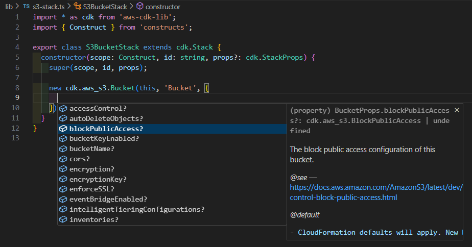
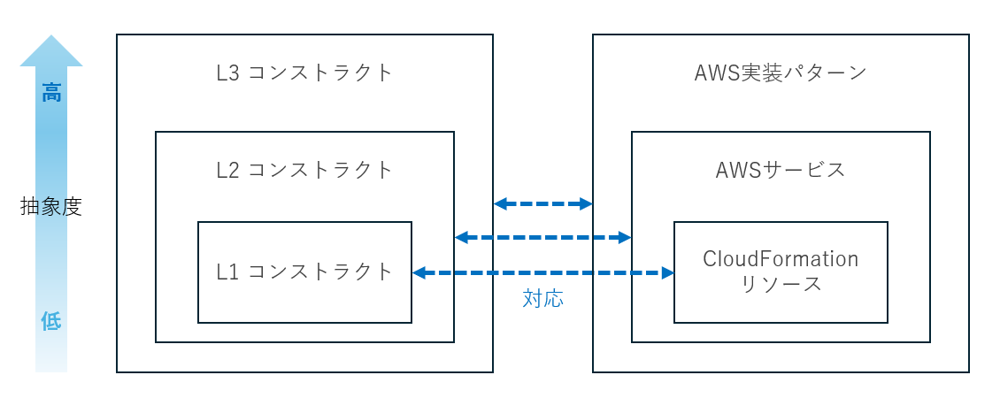
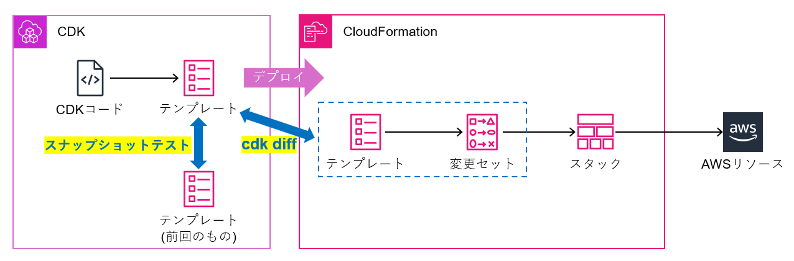
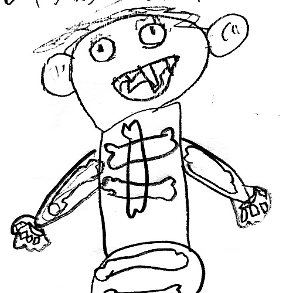

# CDKを始めてみよう

ikngm

 
CDKは、プログラミング言語でAWSリソースを定義し、CloudFormationを通じてプロビジョニングを行うオープンソースのフレームワークです。わたしは元々インフラ系のエンジニアであったということもあり、プログラミングが必要という点でCDKに少し心理的ハードルを感じていましたが、いざ使い始めてみると、素晴らしいツールであると感じるようになりました。そこで、特に下記のような方が初めの一歩を踏み出せるように、個人的な推しポイントをご紹介できればと思います。 
 

* IaCに興味があるけど使ったことは無い
* CloudFormationは使ったことがあるけど、CDKは使ったことが無い
* プログラミングに不安あり

なお本記事では下記のバージョンを前提としています。

| パッケージ | バージョン |
| --- | --- |
| aws-cdk | 2.1012.0 |
| aws-cdk-lib | 2.190.0 |

## 推しポイント3点

### 1. 開発者体験が良い

CloudFormationテンプレートを作成する場合、下記のような事態に遭遇することがよくありました。

* リファレンスとテンプレート編集画面の行き来が面倒
* ちょっとしたタイプミスに気づけず時間を浪費

CDKの開発では、IDEやTypeScriptの恩恵を存分に受けることができます。下図のように、コード入力が補完され、IDE上でヘルプ情報の参照もできてしまいます。これはCloudFormationテンプレートを直接作成することに比べてとても楽で、タイピングする範囲が減るので正確性も上がります。

### 2. ユースケースに応じて抽象度レベルを選択できる

CDKの基本的な構成要素であるコンストラクトには3つのレベルの抽象度があり、レベルが上がるにつれて抽象度が上がります。各レベルのコンストラクトは、利用者がユースケースに合わせて自由に選択または組み合わせて使うことができます。（L2.5というレベルも存在しますが割愛します）

**レベル1 (通称 L1)** 

L1コンストラクトはCloudFormationリソースと1対1で対応します。例えば、`CfnBucket`コンストラクトはCloudFormationの`AWS::S3::Bucket`リソースと対応しています。コンストラクト名が`Cfn`で始まるものがL1コンストラクトです。

**レベル2 (通称 L2)** 

おそらく最も多く利用されるレベルのコンストラクトではないかと思います。AWSベストプラクティスに沿ったデフォルト値が定義されていたり、アクセス許可やリソース間の連携をシンプルに定義するためのメソッドがあったり、L1と比較すると良い感じに抽象化されています。基本的には、L2コンストラクトはAWSサービスと1対1で対応していますが、中には同一サービスでも用途ごとにコンストラクトが分かれているものがあったりします。

**レベル3 (通称 L3)** 

最も抽象度が高く、その代わり汎用性は薄れますが、複数のAWSサービスを組み合わせることで、特定のユースケースを満たすAWSの実装パターンが一括で作成できます。

コンストラクトの関係性を図にすると下記のようなイメージになります。

抽象化はCDK最大の魅力の一つです。すべてを明示的に定義しなくても、CDKがAWSのベストプラクティスを加味して裏でうまいことやってくれます。これは大変ありがたいことですが、特にインフラ系業務に従事されている方の中には、インフラのパラメータは隅から隅まで正確に定義したい方もいると思います（わたしもどちらかというとその傾向があります）。
そのような場合はL1を選択することで、開発者体験の良さ（推しポイント1）を享受しつつ正確性も追及することができます。（意図した設計になっているかどうかの確認という点では、アサーションテストというものを活用することもできます）

### 3. diffとスナップショットテストで心理的安全性を高める

デプロイすることで実環境にどのような変化が生じるか、できるかぎり事前に確認して安心したいものだと思います。抽象度の高いL2以上のCDKコンストラクトを使う場合はなおさらです。そんなときの強い味方が下記の2つです。

**スナップショットテスト**

CDKが出力するCloudFormationテンプレートを毎回スナップショットとして保管しておき、前回のスナップショットと比較することで、CDKコードの変更による実環境への影響をCloudFormationテンプレートとして確認できます。実環境に影響を与えることなく、CDKを実行する環境内で完結する処理であるため、気軽に変更点を確認できる点がメリットです。

**cdk diff**

CDKが出力するCloudFormationテンプレートと、CloudFormationでデプロイ済みのテンプレートを比較することができます。diffコマンドの動作内でCloudFormation変更セットが実際に作成されるため、リソースの置換が実際に起こるかどうかを正確に確認することができます（オプション指定により変更セット作成しない動作とすることも可能）。

それぞれ図で表現すると下記のようなイメージです。

## 入門者向けお勧めコンテンツ3選

最後にCDK入門者にお勧めのコンテンツをご紹介します。

1. Black Belt (`CDK`で検索), https://aws.amazon.com/jp/events/aws-event-resource/archive/

    AWSサービスについて知りたくなったときはまずこれだと思います。概要を掴むには最適です。

1. 「TypeScript の基礎から始める AWS CDK 開発入門」, https://catalog.workshops.aws/typescript-and-cdk-for-beginner/ja-JP

    入門者向けのワークショップです。TypeScript基礎の解説から始まり、その後CDK入門編へと入っていく流れになっているため、TypeScript未経験の方にお勧めです。

1. JAWS-UG CDK支部, https://jawsug-cdk.connpass.com/

    初心者向けの内容から玄人向けまで幅広く最新のCDK活用方法について知ることができます。当日参加できなくても後から動画や資料を参照することもできるため、大変ありがたい存在です。

CDKは入門者向けコンテンツが充実しており、入門のハードルは比較的低いと思います。さらに最近では生成AIの発展も相まってコードの記述がより楽になってきています。 
まずはここからCDKを始めてみませんか？

### 著者紹介

---

    
    

        

            <b>池ノ上 寿志</b>
        

    

独立系SIer所属。ここ数年はCCoE支援をしています。

