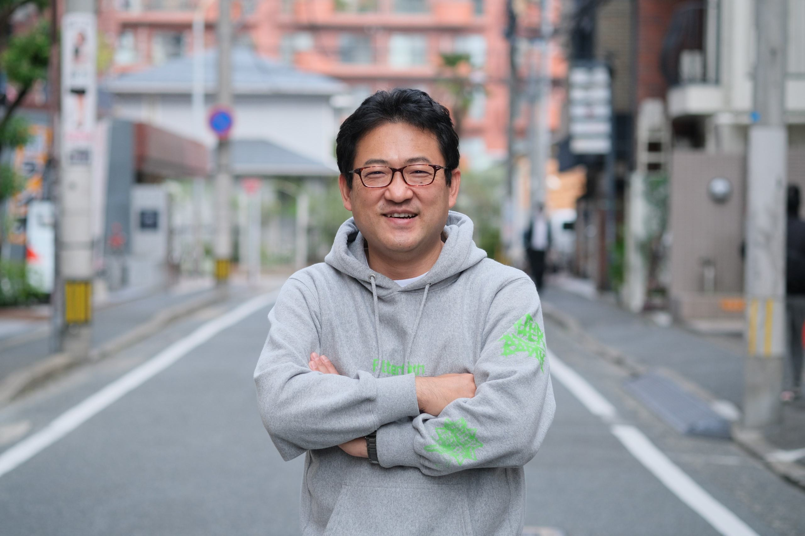

# 地方のつながりが世界を変える

木村健一郎 @show_m001

## JAWS-UG福岡と九州の各支部

最初に、私が運営メンバーとして参加しているJAWS-UG福岡、そして九州の他の支部について紹介します。

JAWS-UG福岡は、AWS User Group Japan(JAWS-UG)の地方支部として、福岡県を中心に活動しています。設立は2010年で、JAWS-UGの中でも最も古い支部のひとつです。
主な活動は年に4～5回程度のオフラインでの勉強会と、毎週木曜日21時からオンラインで実施しているもくもく会です。

2015年に「いい大人が、昼間からお酒を飲みながら、大好きなAWSについてちょっと濃いめに語り合う、乾杯から始まる勉強会」というユニークなコンセプトでリブートし、10年間一貫してこのコンセプトの元に活動しています。

私自身は初めて参加したのが2014年、その後、2016年から運営メンバーに誘っていただき今に至ります。

また、九州地方には現在活動中の支部が以下のようにあります(2025年5月現在)。

- JAWS-UG福岡
- JAWS-UG佐賀
- JAWS-UG大分
- JAWS-UG熊本
- JAWS-UG長崎

宮崎/鹿児島は休眠中です。北九州支部は休眠中ですが、現在は福岡支部の活動の一部として調整しています。

沖縄支部をここに含めていいのかは沖縄支部の方に了承を頂いていないので本記事では含めておりませんが、「九州・沖縄地方」という言い方で、JAWS-UGの活動を広げていけたらなと思っています。

## 九州のつながり

九州の支部は、相互のつながりが非常に強いです。その理由として、いくつか思い当たることを挙げてみます。

- 運営に古参の、JAWS-UGの活動を長く支えてきたメンバーが多い。例えば<a href="https://x.com/fm609hr">大分の平野さん @fm609hr</a>や佐賀の<a href="https://x.com/sugimisu">みすずねーさん @sugimisu</a>、熊本の山ノ内さんなど
- 九州新幹線が開通したことで、移動時間が短縮された。長距離バスなども多く、比較的安価に移動できる
- 上記の移動の事もあり、職場が隣の県というケースも多い。そのため、職場の県のイベントと居住地の県のイベントの両方に参加したり、両方の支部の運営をやることもある
- <a href="https://jft2015.jaws-ug.jp/">2015年</a>と<a href="https://jft2023.jaws-ug.jp/">2023年</a>にJAWS Festaを開催し、その際に九州の支部のメンバーが集まって運営を行った。特に2023年は「九州全県の事例を集める」など、九州が一体となるような取り組みを行った

そして福岡支部の立役者である藤崎さんの存在。彼の人柄がこの一体感を生んだと個人的には思っていますが、彼について語り始めると長くなるので、また別の機会にお話できればと思います。

## コロナ禍と新世代の台頭

本節は、筆者の私見が大いに含まれますので異論も多くあるかもしれませんが、「まぁそういうこともあるかもね」くらいに思っていただければと思います。

福岡支部も含め、全ての(と敢えてここでは言いきります)九州の支部は、2010年代後半は共通の課題を抱えていました。それは「新しいメンバー、特に運営メンバーが増えない」「運営メンバーが多忙になり、活動が停滞する」というものです。これは他の地方支部や、JAWS-UG以外の多くのコミュニティで少なからず直面している問題ではないでしょうか。特に地方では、そもそもAWSを実務で使っている人が東京や大阪・名古屋などに比べて少ないのでそもそもの参加者が少ないという問題もあります。

各支部のメンバーが年に一度開催されるJAWS-UG総会や他のイベントで顔を合わせては角突き合わせて議論し、どうやって新しいメンバーを増やすか、どうやって運営メンバーを増やすか、どうやって活動を活性化するかを話し合っていましたが、なかなか解決策が見つからないままでした。

そんな中、2020年にコロナ禍が発生しました。多くのコミュニティは活動を停止せざるを得ず、JAWS-UGも例外ではありませんでした。しかし、JAWS-UGは比較的早期にオンラインイベントでの開催が活発になり、その中で多くの知見が蓄積されていきました。JAWS-UG配信支部も立ち上がりました。そして、全国規模、世界規模のイベントをオンラインで開催できるようになりました。

オンライン開催で地理的な制約がなくなったことで、各支部の横のつながりが強化されました。地方支部が抱えていた「そもそも地方に参加者がいない」という問題の影響が小さくなったのです。ただし、その反面、全国どこのイベントにも参加できる中で、地方支部の名前を掲げてイベントを行う意味があるのか？という別の課題も生まれました。

そして、オンライン開催になったことでもう1つ大きな変化がありました。それは「イベント開催のハードルが下がった」ということです。オフラインのイベントの場合、ネックになるのは会場の確保と準備です。特に地方の場合、会場の確保が難しいことが多く、それが開催のハードルになるケースも少なくありません。オンラインの場合は、例えばZoomのアカウントさえあればものの数分で場所は確保できます。

もう一つは登壇者の確保です。地方支部では先述のようにそもそもAWSを実務で使っている人が少ないので、登壇者の確保が難しいことが多いです。多地域の人に登壇を依頼するとしても、そのスケジュールの調整や交通費の問題などがあります。しかし、オンラインの場合、全国どこからでも登壇者を募ることができます。交通費はゼロであり、スケジュールの調整も移動を伴わないのであればより気軽に行えます。これにより、地方支部でも全国規模のイベントと同じような内容のイベントを開催することができるようになりました。

このように開催のハードルが下がることで、開催回数を増やすことができるとともに、新しい運営メンバーを増やすことができました。運営メンバーに求められるスキルが減るとともに、運営メンバーとして参加する際の心理的障壁が下がったのです。
これが、全国の運営メンバー、とりわけ若いメンバーの増加に繋がったと感じています。彼ら/彼女らはオンラインで培った運営スキルと繋がった人脈を活かし、復活したオフラインイベントの運営でも活躍しています。

なお、決して「コロナがあってよかった」と言っているのではないという点だけは最後に強調させてください。筆者は口が裂けてもそんなことを言うつもりはなく、あくまでもオンラインイベントの開催が新しいメンバーの増加に繋がった、という側面があったのではないかということだけを述べたに過ぎません。もし不快に思われる読者の方がいらっしゃいましたら、表現が至らずご不快にさせてしまったことをお詫び申し上げます。

## 地方のつながりを1つの形として体現した、JAWS Festa 2023 in 九州

JAWS Festaは、2019年の札幌開催を最後に、コロナ禍では開催が停止していました。これが2023年に復活する、という話を筆者が聞いたのは2022年の秋頃でした。福岡も開催地に立候補しよう、久しぶりのオフラインイベントだから、九州の支部が一体となって盛大なイベントにしよう、という話が持ち上がりました。というか、筆者が若い子(<a href="https://x.com/east_takumi">あべたく @east_takumi</a>)を一方的に煽りました。あべたくは前節でお話しした、2020年以降にきら星のように現れたニューヒーロー達の1人です。彼はJAWS Festa 2023の実行委員長を務め、九州の支部のメンバーとともに、JAWS Festa 2023を見事に成功に導きました。

この辺りの経緯は<a href="https://showm001.hatenablog.com/entry/2023/12/16/104014">こちら</a>に詳しく書いていますので、興味のある方はぜひご覧ください。

JAWS Festa 2023は、JAWSのイベントとしては久しぶりに開催される大規模なオフラインイベントでした。コロナ禍前のイベントに参加していた筆者達の世代は久しぶりの再会を楽しみ、コロナ禍以降の新しい世代のメンバーは、オンラインで会っていた人達とリアルで初めて会う、という新しい出会いを楽しみました。

九州の支部が一体となって運営を行ったイベントであり、九州の支部のメンバーが一堂に会する機会でもありました。そして、九州から参加した多くの人に「地元九州にもAWSやってる人がこんなに沢山いる」「みんな熱量を持って活動している」ということを感じてもらえました。これが、停滞していた各支部の活動の活性化や、新しいメンバーの増加に繋がるのではないかと期待していました。

## Festaの後の九州

そして、JAWS Festa 2023の後、九州の支部はどうなったのでしょうか。あべたくが、僕らが夢見た未来が少しずつ実現しつつあります。

Festaで繋がった縁のまま、九州の支部のメンバーはいまも相互に交流し、お互いの支部の勉強会を行き来しています。Festaで出会ったメンバーが新しく各支部の運営に参加し、活動が活性化しています。色々なイベントに行ったときに「自分もあのFestaに参加してて、九州でも活動してるのを知って参加するようになった」と言われることもあります。

そして、その中から、熊本支部がリブートしました。鹿児島も、リブートしたいという声が聞こえてきています。

そんな中、2025年の1月から2月にかけて、毎週土曜日に九州の各支部がイベントを開催しました。実はこれ、誰も示し合わせていなかったのです。各支部がそれぞれのタイミングで「そろそろイベントやりたいな」と思って、開催日を決めたら、たまたま全ての日程が重ならずに毎週開催になっていたんです。そして、最後の沖縄支部の開催の翌週がJAWS DAYS 2025。すごくないですか？どれだけおまえら仲いいんだよと思いましたが、このつながりの強さがあればこのくらいの奇跡は起こっても不思議ではないかも知れません。

筆者が面白がって、勝手に「九州キャラバン - Road to JAWS DAYS 2025 -」と名前を付けたのですが、この1回で終わらすのはもったいないので、6月のAWS Summitに向けて「九州キャラバン - Road to AWS Summit 2025 -」をぶち上げました。すぐに皆のってきてイベント準備してくれました。皆最高。大好きだ。

前節で、Festaが大きくなりすぎたかな、という話をちょっとしました。その一方で、Festaとは別に多少小規模でもいいので九州が一体となるようなイベントを毎年やるのもいいね、という話もしています。四国で毎年「クラウドお遍路」というイベントをやっているのですが、あれはすごくいいなと思っています。九州でも、毎年各支部が持ち回りで開催するようなイベントができたらいいなと思っています。そうすると、きっとその中から、Festaと同じように新しい出会いが生まれると信じています。

## これから地方支部を活性化させたい方へ

振り返ってみると、これは地方支部を活性化させる一つのモデルケースなのではないか、と思います。単独での活動が難しく行き詰まっている地方支部が、他の支部と連携して活動することで、より大きな活動を行うことができるようになる。地方が一体となって1つのイベントをやることで参加者の交流を生み、そこから新しいメンバーが増え、運営メンバーが増え、活動が活性化する。JAWS Festa 2023は、まさにその一つの形を体現したイベントだったと感じています。

イベントの運営ノウハウがなくても、いまはオンラインで繋がって全国の人達が手伝ってくれます。そのための下地がこのコロナ禍で培われています。もしご自身が住んでいる地方でコミュニティが停滞している、これを盛り上げたい、と思ったのであれば、ぜひまずは他の支部のイベントやFesta/DAYSなどの大きなイベントに一度参加してみてください。そして、「自分の地方も盛り上げたいと思った」と話してみてください。きっと力になってくれる人がいるはずです。

実際に始めてみると大変な時もあるでしょう。自分だけがやってて誰も乗ってくれない、参加者が増えないということで心が折れそうになることもあるでしょう。そんなときはオンラインでやっているイベントなどを使って他の支部のメンバーにも会ってみてください。きっと応援してくれる人がいるはずです。何かのヒントをもらえるはずです。

そして、自分が何のためにコミュニティに参加したい、自分の地域でも開催したいと思ったのか、その原点を思い出してください。それは人によって形は違うかも知れませんが、楽しく皆と大好きな技術の話をしたい、そして自分も成長したい、そういう気持ちは共通しているのではないでしょうか。そこがぶれていなければ、きっと大丈夫です。

## まとめ

ここでは、JAWS-UG福岡と九州の支部の活動を振り返りながら、地方支部の活性化についてお話ししました。筆者の経験と独断でお話ししている部分も多いですが、少しでも参考になれば幸いです。

願わくば、あなたのコミュニティ活動が幸せで楽しいものになりますように。

#### 著者紹介
---

    
    

        

            <b>木村健一郎</b>
			<a href="https://x.com/show_m001">@show_m001</a>
        

        

            zenn: <a href="https://zenn.dev/showm001">https://zenn.dev/showm001</a> 
            はてな: <a href="https://showm001.hatenablog.com/">てんめも</a>
        

    

福岡市内のスタートアップ企業で20年に渡って自社サービスの開発・運用に携わっていたが、縁あって2020年1月に(株)オルターブースにジョイン。
2014年頃からIoTやサーバレスの世界に魅せられ、コミュニティ関連はJAWS-UG福岡とSORACOM UG九州を中心に活動中。
家に帰ると7歳の娘と戯れる日々。 
 
受賞歴:
- AWS Samurai 2019(JAWS-UG福岡支部として)
- APJ Community Leaders Award 2023(Ownership)
- SORACOM MVC 2021,2023

