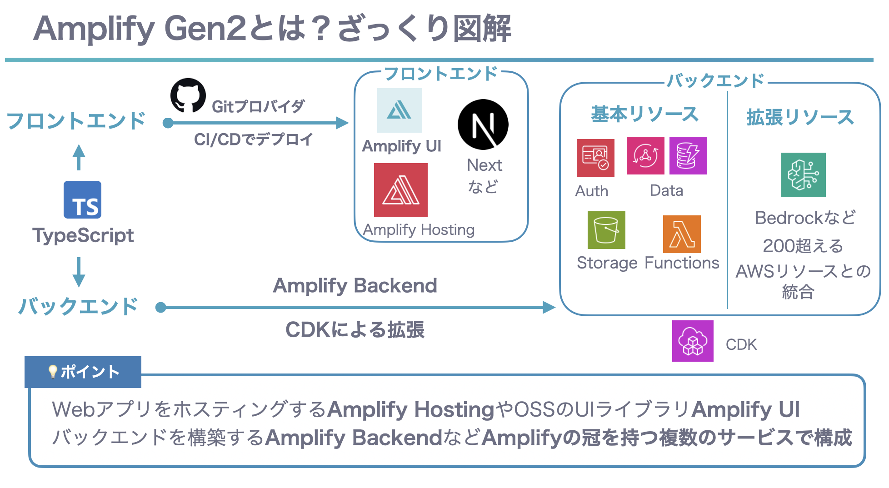

# Amplify Gen2の魅力~Gen1に魔法をかけられて~

<div class="flush-right">
桒原 政睦 @mkdev_10
</div>

## Amplifyって何？

みなさんAmplifyはご存知ですか？サービスは使ったことないけど名前は知っている。聞いたことはある。そのような方は多いと思います。

AmplifyはAWS上でWebアプリやモバイルアプリを爆速で開発することを支援するサービスです。Amplifyは2017年の11月にリリースされ、2024年の5月にGen2に進化しました。

私がはじめて触れたAWSサービスもAmplifyです。私はAmplifyの魅力に取り憑かれ、AWSにどハマりしました。そんなAmplifyの魅力、推しポイントついてAmplifyとの出会いを振り返りながら語ります。

## 魔法のようなGen1との出会い

私がAmplifyと出会ったのは2020年でした。当時はコロナ禍、急遽課せられたミッションで、リモートで操作できる業務アプリケーションを迅速に開発する必要がありました。

Amplifyはプロジェクトにぴったりで、AWSの知見が乏しい状態でも魔法のようにリソースを構築し、WEBアプリを作成することができ、ミッションを達成できました。

しかしながらアプリの改良を続けていく中で「魔法のように」という表現そのものがアプリ開発の障害となりました。

## 魔法をかけられていたことに気がついた

初期のAmplifyを今ではGen1と呼びます。Gen1はCLIをベースにリソースを定義することができます。例えばアプリにログイン機能を実装しようとした場合はamplifyコマンドを実行します。

```bash
amplify add auth
```

すると魔法のようにCognitoのリソースが誕生します。

データを保存するAPIを作成する場合もCLIで定義します。

```bash
amplify add api
```

手軽に実装できる反面、どのような構成なのかは隠蔽されており、ユーザー側でコアなカスタマイズをすることはできません。

まるで魔法にかけられているようで、AWSのリソースの理解が必要な段階、追加の要件に対応する場合に対応に時間を要し、急に魔法が解けたように感じました。

## Gen2の登場によるAmplifyの変化
ある日 Gen2という新しいAmplifyがリリースされていることを知りました。なんとリソースをCDKで定義できるようになっています。ちょうどCDKを取り入れようと考えていた矢先のことでした。

調べているとAmplify Gen2の本当の魅力はCDKでバックエンドが定義できるだけでないということに気がつきました。

### Amplify Gen2の全体像


Amplify Gen2はCLIベースではなく、TypeScriptをベースとしたコードファーストへと変化していました。CLIにてデプロイしていたリソースはAmplify Backendで簡単にデプロイでき、Gitプロバイダをベースとした新たなホスティング機能をもったAmplify Hostingなど複数のサービスで構成されています。

BackendはCDKで拡張でき、透明性があり柔軟な拡張が可能となりました

### Amplify Gen2の真の魅力 コードファースト

Amplify Gen2はTypeScriptをベースとしたコードファーストによって開発者体験を向上させています。バックエンドをTypeScriptで定義することで、その型定義をフロントエンドに継承できます。またsandboxという開発者ごとに払い出される環境を自動的に作成でき、バックエンドの定義を変更するとホットスワップによって高速にデプロイされます。

### Gen2は利用者を魔法使いにするツール

コードで明示的にリソースを定義することができ、基本的なリソースであれば最小限の記述でデプロイできます。

例えば認証は次のように定義します。
```typescript
import { defineAuth } from "@aws-amplify/backend"

export const auth = defineAuth({
  loginWith: {
    email: true,
  },
})
```
カスタマイズが必要になってもCDKで拡張できます。
例えばAmazon Bedrockと連携する場合は次のようになります。

```typescript
import { defineBackend } from "@aws-amplify/backend";
import { auth } from "./auth/resource";
import { data, MODEL_ID, generateHaikuFunction } from "./data/resource";
import { Effect, PolicyStatement } from "aws-cdk-lib/aws-iam";

export const backend = defineBackend({
  auth,
  data,
  generateHaikuFunction,
});

backend.generateHaikuFunction.resources.lambda.addToRolePolicy(
  new PolicyStatement({
    effect: Effect.ALLOW,
    actions: ["bedrock:InvokeModel"],
    resources: [
      `arn:aws:bedrock:*::foundation-model/${MODEL_ID}`,
    ],
  })
);
```
コードファーストによってリソースが宣言的に定義でき、透明性が上がっていますね。Gen1では魔法をかけられていましたが、Gen2ではまるで魔法使いになったように開発することができます。

## 最後に
AmplifyはGen2になり進化を続けています。生成AIアプリの開発を支援するAI KitやWAFが統合されるなど今後の進化も楽しみです。私自身Amplifyの魅力に取り憑かれ現在ではAmplify Japan User Groupの運営として活動しています。Amplifyを一緒に盛り上げてくれる仲間が一人でも増えることを願っています。

#### 著者紹介

---

<div class="author-profile">
    
    <div>
        <div>
            <b>桒原 政睦（Masachika Kuwabara）</b>
            <a href="https://twitter.com/mkdev_10">X@mkdev_10</a>
        </div>
        <div>
            所属：<a href="https://aws-amplify-jp.github.io/">Amplify Japan User Group</a>
        </div>
    </div>
</div>
<p style="margin-top: 0.5em; margin-bottom: 2em;">
大阪の老舗製造業で内製システム開発に従事。AmplifyをきっかけにAWSにどハマりし、社内でAWS導入を推進。関西でもAmplifyを盛り上げたい。<br>
・AWS Community Builder<br>
・Amplify Japan User Group運営<br>
・Top Japanese Pre-Release Contributor for Adobe Illustrator 2019,2020,2022
</p>