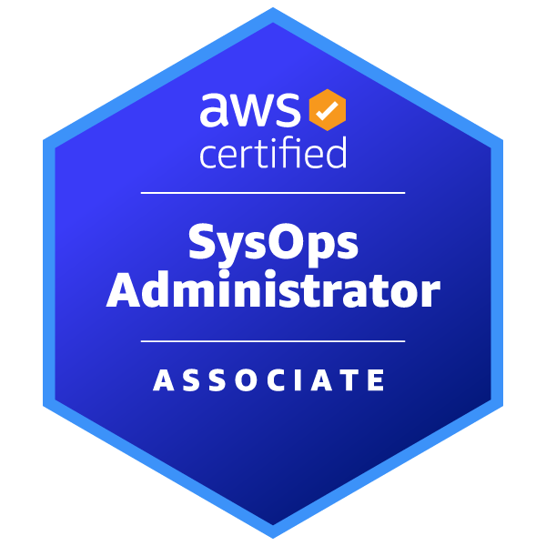

# AWS Certified Solutions Architect - Associate　～～AWSサービス運用の登竜門～～

奥田 雅基 @mob_engineer

私自身、今年4月にAWS資格全冠（12種類）を達成しました。
そのうえで、JAWSに積極的に参加し始めてから取得した10種についてまとめていきたいと思います。
**※順番については私が資格取得した順番とします。**

最初は**AWS Certified Solutions Architect - Associate**について執筆したいと思います。

## どういった資格なのか？

公式サイトには以下の通り示されています。

>AWS Certified SysOps Administrator - Associate は、AWS ワークロードのモニタリングと保守、セキュリティコントロールとネットワーク概念の実装、事業継続手順の実行、およびコストとパフォーマンスの最適化の実施におけるスキルと知識を検証します。

<figure><figcaption>出典：<a href="https://aws.amazon.com/jp/certification/certified-solutions-architect-associate/"> AWS Certified Solutions Architect - Associate ( https://aws.amazon.com/jp/certification/certified-solutions-architect-associate/ )</a>より抜粋</figcaption></figure>

私が試験勉強を通じて感じた所感ですが**EC2インスタンス異常終了時のリカバリ対応やCloudWatchを用いた影響分析**に関するスキルを求められていた印象でした。

## 試験を通じて変わったこと

試験勉強を通じて大きく変わったこととして、**AWSサービスを用いた運用保守の考え**が深まった印象を持ちました。
今まで、**CloudWatch=アラート設定アプリ**といった認識しかありませんでした。しかし、試験勉強を行っていくことで、**CloudWatchを用いて障害分析やアラームに応じた自動復旧処理**といったサービスへの理解を深めることができました。

## まとめ

試験難易度自体はそこまで高くないですが、AWSサービスを網羅的に学ぶ必要があります。
**AWSサービスの最適化に関する知識をキャッチアップしたい方**にはピッタリの資格だと思います。

本内容を読んで、資格チャレンジする人がひとりでも増えれば幸いです。

#### 著者紹介

---

    
    

        

            <b>奥田 雅基</b>
            <a href="https://x.com/mob_engineer">@mob_engineer</a>
        

        

            JAWS-UG 彩の国埼玉支部
        

    

LT芸人・ブログ芸人を目指している一般人。2016年にインフラ運用保守からキャリアスタートし、PMO・ネットワークエンジニアの経験を積み、現在社内プロダクトPJにてインフラ・Web開発を担当。2025年はアウトプット活動（特にAWS）を頑張っていきたいと思っています！！

