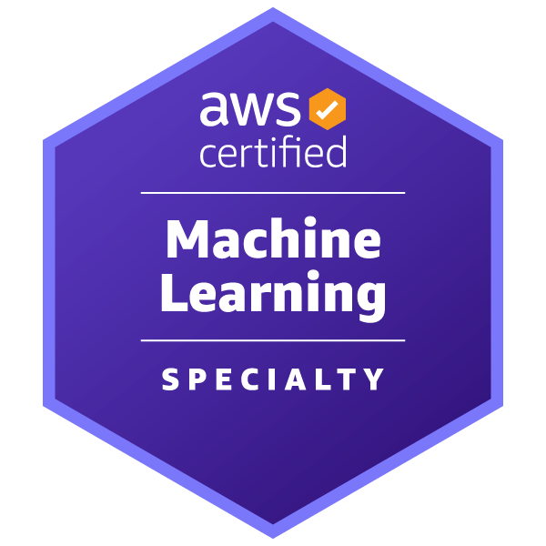

# AWS Certified Machine Learning - Specialty　～～機械学習の専門家になるための登竜門～～

奥田 雅基 @mob_engineer

## 前置き

**AWS Certified AI Practitioner**から続いて第3弾となります。
今回はAWS専門資格の一つである**AWS Certified Machine Learning - Specialty**について執筆したいと思います。

## どういった資格なのか？

公式サイトには以下の通り示されています。

>この資格は、組織がクラウドイニシアチブを実装するための重要なスキルを持つ人材を特定して育成するのに役立ちます。AWS Certified Machine Learning - Specialty を取得すると、AWS で機械学習 (ML) モデルの構築、トレーニング、チューニングおよびデプロイに関する専門知識を認定します。

<figure><figcaption>出典：<a href="https://aws.amazon.com/jp/certification/certified-machine-learning-specialty/"> AWS Certified Machine Learning - Specialty ( https://aws.amazon.com/jp/certification/certified-machine-learning-specialty/ )</a>より抜粋</figcaption></figure>

第2弾で執筆した**AWS Certified AI Practitioner**より古くからある試験のため学習リソースは揃っています。ただし、**線形学習や回帰などの機械学習に関する専門知識**が問われるため、G検定等で知識をキャッチアップしてから臨んだほうが良いかと思います。

## 試験を通じて変わったこと

AWSのMLサービスをうまく利用するために**どのような知識が必要なのか、トラブル時にはどのような対処が必要なのか**を考えることができました。また、機械学習を行ううえで、**学習を効果的に進めるための勘所**を少しながらキャッチアップできたと思いました。ただし、MLサービスがAWSの他サービスと比較して高価なため、ハンズオンを通じた学習が行えなかったのが悔いだと思いました。

## まとめ

**AWSサービスを用いて機械学習を行いたい**といった方はぜひチャレンジしてみることをおススメします。普段、業務の中で機械学習に携わっていない方であっても、試験勉強を行うことで**AWSのMLサービスのより良い利用方法**をキャッチアップできると考えています。

本内容を読んで、資格チャレンジする人がひとりでも増えれば幸いです。

#### 著者紹介

---

    
    

        

            <b>奥田 雅基</b>
            <a href="https://x.com/mob_engineer">@mob_engineer</a>
        

        

            サークル名：JAWS-UG 彩の国埼玉支部
        

    

LT芸人・ブログ芸人を目指している一般人。2016年にインフラ運用保守からキャリアスタートし、PMO・ネットワークエンジニアの経験を積み、現在社内プロダクトPJにてインフラ・Web開発を担当。2025年はアウトプット活動（特にAWS）を頑張っていきたいと思っています！！

