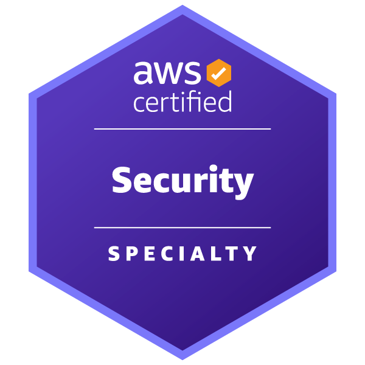

# AWS Certified Security - Specialty　～～安全なAWS利用を実現するために～～

奥田 雅基 @mob_engineer

## 前置き

**AWS Certified Machine Learning Engineer - Associate**から続いて第5弾となります。
今回はAWS専門資格の一つである**AWS Certified Security - Specialty**について執筆したいと思います。

## どういった資格なのか？

公式サイトには以下の通り示されています。

>AWS クラウドにおけるセキュリティソリューションの作成と実装に関する知識を検証します。この認定では、専門的なデータ分類と AWS のデータ保護メカニズム、データ暗号化方法とそれらを実装するための AWS メカニズム、および安全なインターネットプロトコルとそれらを実装するための AWS メカニズムについての理解も検証されます。

<figure><figcaption>出典：<a href="https://aws.amazon.com/jp/certification/certified-security-specialty/"> AWS Certified Security - Specialty ( https://aws.amazon.com/jp/certification/certified-security-specialty/ )</a>より抜粋</figcaption></figure>

**最小権限を維持してIAMポリシーの実装**や**Security Hubなどのセキュリティ対策に役立つサービスを組み合わせて、安全なアプリケーションを提供する**に役立つ知識を身につけることできます。ただし、専門試験ですので**複数のサービスを考慮したセキュリティ対策**が問われるため、**AWSサービスそのものを正しく理解する**必要があると考えています。

## 試験を通じて変わったこと

試験を通じて、**AWSが提供しているセキュリティサービスに対して理解を深めることができる**と思いました。そのうえで、**IAMポリシー設定**について真剣に考えるようになったと考えています。そのうえで、**セキュリティに特化したハンズオンが少ない**ため、今後ハンズオン記事を増やしていきたいと思いました。

## まとめ

専門試験の中では一番とっつきやすい試験だと思いますので、**AWSを用いたサービス開発に携わっている方**であれば取得して損はない資格だと思います。そのうえで、**セキュリティを完全に理解するために幅広い知識が必要**です。そのため、試験で問われる内容以外についてもハンズオンなどを通じてキャッチアップしてみると良いと個人的に思っています。

本内容を読んで、資格チャレンジする人がひとりでも増えれば幸いです。

### 著者紹介

---

    
    

        

            <b>奥田 雅基</b>
            <a href="https://x.com/mob_engineer">@mob_engineer</a>
        

        

            サークル名：JAWS-UG 彩の国埼玉支部
        

    

LT芸人・ブログ芸人を目指している一般人。2016年にインフラ運用保守からキャリアスタートし、PMO・ネットワークエンジニアの経験を積み、現在社内プロダクトPJにてインフラ・Web開発を担当。2025年はアウトプット活動（特にAWS）を頑張っていきたいと思っています！！

