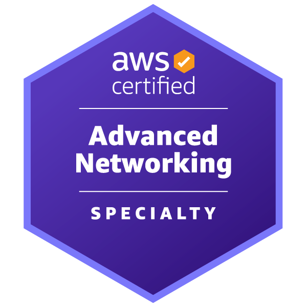

# AWS Certified Advanced Networking - Specialty　～～オンプレ↔AWSのネットワーク設計を実現するために～～

奥田 雅基 @mob_engineer

## 前置き

**AWS Certified Security - Specialty**から続いて第6弾となります。
今回は**AWS Certified Advanced Networking - Specialty**について執筆したいと思います。

## どういった資格なのか？

公式サイトには以下の通り示されています。

>この資格は、組織がクラウドイニシアティブを実施するための重要なスキルを持つ人材を特定して育成するのに役立ちます。AWS Certified Advanced Networking - Specialty は、幅広い AWS のサービスに対応するネットワークアーキテクチャの設計と維持に関する専門知識を認定します。

<figure><figcaption>出典：<a href="https://aws.amazon.com/jp/certification/certified-advanced-networking-specialty/"> AWS Certified Advanced Networking - Specialty ( https://aws.amazon.com/jp/certification/certified-advanced-networking-specialty/ )</a>より抜粋</figcaption></figure>

本試験では**AWS内部で閉じるネットワーク**だけでなく**オンプレ環境を考慮したネットワーク**についても問われます。そのため、**AWSのネットワークサービスへの理解に加えて一般的なネットワーク知識**も求められている印象を持ちました。世間一般では**AWS 最難関試験**と言われていますが、**CCNAレベルのネットワーク知識**を持っていればすんなりキャッチアップできると思います。

## 試験を通じて変わったこと

試験を通じて、**AWSとオンプレミス環境をうまく繋げるためのネットワーク設計の考え方**をキャッチアップできたと思います。ただし、他試験以上に試験で問われるサービス（CloudWAN、Trangit Gatewayなど）のハンズオンを行うのが難しいです。そのため、**ホワイトペーパーやAWSから公開されている導入事例**をもとに**この構成の場合、ネットワーク設計はどうするのが正しいのか**を考える癖をつけるのが大切だと思います。

また、AWS公式でもTrangit Gatewayハンズオンイベントを開催している場合もあります。ネットワーク関連のハンズオン情報を見つけたら参加してみるのも一つの手だと思います。

## まとめ

受験者の属性によって難易度が大幅に変わる試験ですが、ネットワークエンジニアだけでなくソリューションアーキテクトであっても試験で問われる知識は必要だと考えています。**ネットワークに対して苦手意識を持っている方**はいきなり試験を受けるのではなく、**CCNAレベルのネットワーク基礎知識をキャッチアップ**したほうが実務で利用できる知識になると思います。

本内容を読んで、資格チャレンジする人がひとりでも増えれば幸いです。

#### 著者紹介

---

    
    

        

            <b>奥田 雅基</b>
            <a href="https://x.com/mob_engineer">@mob_engineer</a>
        

        

            サークル名：JAWS-UG 彩の国埼玉支部
        

    

LT芸人・ブログ芸人を目指している一般人。2016年にインフラ運用保守からキャリアスタートし、PMO・ネットワークエンジニアの経験を積み、現在社内プロダクトPJにてインフラ・Web開発を担当。2025年はアウトプット活動（特にAWS）を頑張っていきたいと思っています！！

