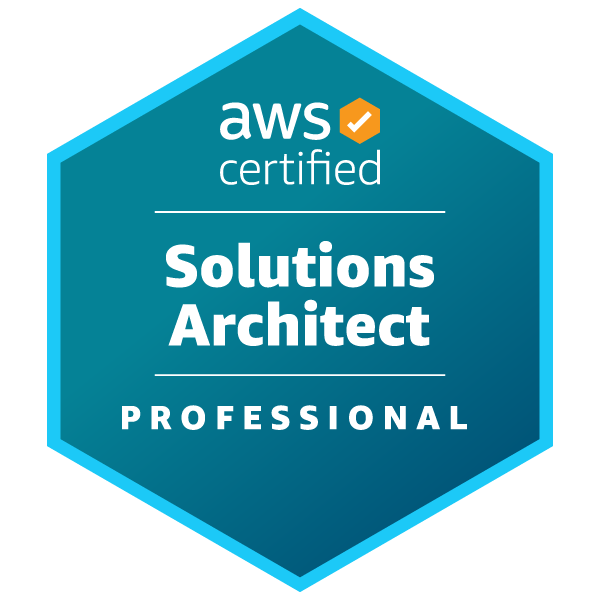

# AWS Certified Solutions Architect - Professional　～～適切なクラウドリフト・シフトを実現するために～～

奥田 雅基 @mob_engineer

## 前置き

**AWS Certified Advanced Networking - Specialty**から続いて第7弾となります。
今回は**AWS Certified Solutions Architect - Professional**について執筆したいと思います。

## どういった資格なのか？

公式サイトには以下の通り示されています。

>AWS 認定ソリューションアーキテクト – プロフェッショナルは、認定を受けた個人が、複雑な問題に対する複雑なソリューションの提供、セキュリティ、コスト、パフォーマンスの最適化、および手動プロセスの自動化における高度な知識とスキルを証明するために役立ちます。この認定は、組織がクラウドイニシアティブを実施するための重要なスキルを備えた人材を特定して育成するための手段です。

<figure><figcaption>出典：<a href="https://aws.amazon.com/jp/certification/certified-solutions-architect-professional/"> AWS 認定ソリューションアーキテクト – プロフェッショナル ( https://aws.amazon.com/jp/certification/certified-solutions-architect-professional/ )</a>より抜粋</figcaption></figure>

本試験では、**オンプレ環境からAWS環境へクラウドリフト/シフトするためのマイグレーション戦略**を問われます。また、第5弾、第6弾で取り上げた**AWS Certified Security - Specialty**、**AWS Certified Advanced Networking - Specialty**の知識も問われるため、**AWS試験の総合格闘技**といった側面もあると考えています。

## 試験を通じて変わったこと

試験を通じて、**ユースケースに応じたマイグレーションサービスの使い分け**を理解できるようになりました。ただし、ハンズオンに関しても個人環境では実施が難しい場合が多数ある＋AWSで実施しているハンズオンイベントも少ない印象があるため、**触りながら学習しづらい**側面はあると考えています。

そのため、AWS導入事例の記事を読んで**なぜ、この事例では○○のマイグレーションサービスを利用したのだろうか**といった考える癖を身に着けるのが大切だと思います。

## まとめ

個人的に**AWS試験最難関**だと思いますが、試験勉強を行うことで得られる知見は多くあると考えております。特に、**マイグレーションサービスの使い分け**は勉強会でも取り上げているケースが少ないため、学ぶ機会として有効だと考えています。そのうえで、私の目標として**マイグレーションに関する簡単なハンズオン記事の執筆**を行っていきたいと考えています。

本内容を読んで、資格チャレンジする人がひとりでも増えれば幸いです。

#### 著者紹介

---

    
    

        

            <b>奥田 雅基</b>
            <a href="https://x.com/mob_engineer">@mob_engineer</a>
        

        

            サークル名：JAWS-UG 彩の国埼玉支部
        

    

LT芸人・ブログ芸人を目指している一般人。2016年にインフラ運用保守からキャリアスタートし、PMO・ネットワークエンジニアの経験を積み、現在社内プロダクトPJにてインフラ・Web開発を担当。2025年はアウトプット活動（特にAWS）を頑張っていきたいと思っています！！

