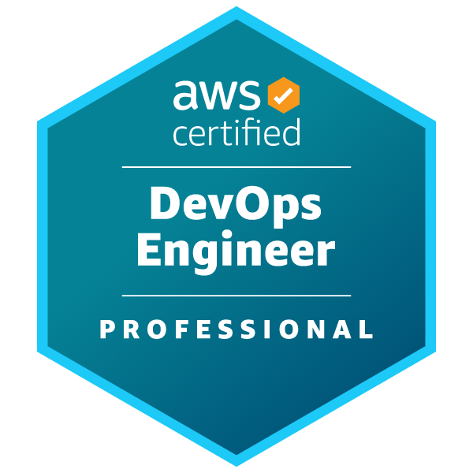

# AWS Certified DevOps Engineer - Professional　～～効率的なデプロイを実現するために～～

奥田 雅基 @mob_engineer

**AWS Certified Solutions Architect - Professional**から続いて第8弾となります。

今回は**AWS Certified DevOps Engineer - Professional**について執筆したいと思います。

## どういった資格なのか？

公式サイトには以下の通り示されています。

>プロフェッショナルは、AWS 上の分散アプリケーションシステムのプロビジョニング、運用、管理に関する高度な専門知識を示し、仲間や関係者、同僚からの信頼と信用を強化するものです。これらの適格なプロフェッショナルがいる組織は、安全でコンプライアンスに準拠した、高い可用性とスケーラビリティを持つシステムを迅速に提供することができます。

<figure><figcaption>出典：<a href="https://aws.amazon.com/jp/certification/certified-devops-engineer-professional/"> AWS 認定 DevOps エンジニア – プロフェッショナル ( https://aws.amazon.com/jp/certification/certified-devops-engineer-professional/ )</a>より抜粋</figcaption></figure>

本試験では、**Code Build、Code Deploy、Code Pipelineを用いたCI/CDの実装**や**Step Functionを用いた複数サービス連携**といった知識を求められます。また、パイプライン運用に関する知識を問う試験のため**サービス単体の知識**が問われることは少ないです。個人的にはSRE担当の方に役立つ資格だと考えています。

## 試験を通じて変わったこと

試験を通じて、**パイプラインを実装するうえでどのサービスを利用するのが最適なのか**を検討できるようになりました。また、CDKやCloudFormationに関しても試験で問われるため、**CDKを利用したほうがいいパターン・CloudFormationを利用したほうがいいパターン**を考えられるようになりました。

## まとめ

試験に関しては**普段から開発している方であればすんなり学習できる内容**かと思います。ただし、パイプライン運用の経験が浅い方は、**AWS Certified Developer - Associate**を通じて基礎固めを行ってからの方が身につくと思います。また、CDK自体、現在バズっている技術トレンドですので**AWSを用いた複雑なデプロイ戦略を行ってみたい**と思う方はチャレンジしてみて損はないと思います。

本内容を読んで、資格チャレンジする人がひとりでも増えれば幸いです。

#### 著者紹介

---

    
    

        

            <b>奥田 雅基</b>
            <a href="https://x.com/mob_engineer">@mob_engineer</a>
        

        

            JAWS-UG 彩の国埼玉支部
        

    

LT芸人・ブログ芸人を目指している一般人。2016年にインフラ運用保守からキャリアスタートし、PMO・ネットワークエンジニアの経験を積み、現在社内プロダクトPJにてインフラ・Web開発を担当。2025年はアウトプット活動（特にAWS）を頑張っていきたいと思っています！！

