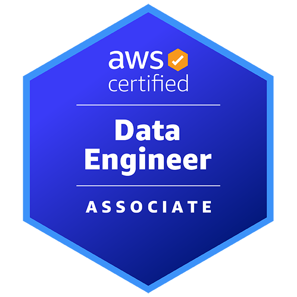

# AWS Certified Data Engineer - Associate　～～AWSサービスを用いたデータ分析を実現するために～～

奥田 雅基 @mob_engineer

**AWS Certified DevOps Engineer - Professional**から続いて第9弾となります。

今回は**AWS Certified Data Engineer - Associate**について執筆したいと思います。

## どういった資格なのか？

公式サイトには以下の通り示されています。

>AWS Certified Data Engineer - Associate は、コアデータ関連の AWS サービスに関するスキルと知識や、データの取り込みと変換、プログラミングの概念を適用しながらのデータパイプラインのオーケストレート、データモデルの設計、データライフサイクルの管理、データ品質の確保といった能力を検証します。

<figure><figcaption>出典：<a href="https://aws.amazon.com/jp/certification/certified-data-engineer-associate/"> AWS Certified Data Engineer - Associate ( https://aws.amazon.com/jp/certification/certified-data-engineer-associate/ )</a>より抜粋</figcaption></figure>

本試験は、2024年1月に登場した比較的新しい試験です。**データベース運用、クエリ処理やAWS Glueを用いたパイプライン運用**などデータ分析に特化した試験内容となっております。試験で問われる内容についても、データベースを普段から触っていない方でもスッと理解できるレベル感と思っております。個人的には、**データ分析に関する基礎試験**といった印象を持ちました。

## 試験を通じて変わったこと

試験を通じて、**AWSデータベース系サービスが向いている処理・向いていない処理を判断できる**ようになったと考えています。データベース系サービスについては、他試験でも知識として問われますが**データベースそのものの利用方法**を問うケースは少ないです。そのため、**AWSでデータベースを取り扱う方法をキャッチアップしたい**と思う方はチャレンジしてみても良いと思います。

## まとめ

個人的には、**AWS Certified Machine Learning Engineer - Associate**との親和性が高いため、並行して学習することで**AWSでのデータ分析・機械学習運用のより良い進め方**をキャッチアップできると思います。ただし、本試験がデータベース系サービスを全て網羅しているわけではありません。ハンズオンや事例調査などを行って、**データベースサービスへの理解を深める**こと行うことおススメします。

本内容を読んで、資格チャレンジする人がひとりでも増えれば幸いです。

#### 著者紹介

---

    
    

        

            <b>奥田 雅基</b>
            <a href="https://x.com/mob_engineer">@mob_engineer</a>
        

        

            JAWS-UG 彩の国埼玉支部
        

    

LT芸人・ブログ芸人を目指している一般人。2016年にインフラ運用保守からキャリアスタートし、PMO・ネットワークエンジニアの経験を積み、現在社内プロダクトPJにてインフラ・Web開発を担当。2025年はアウトプット活動（特にAWS）を頑張っていきたいと思っています！！

