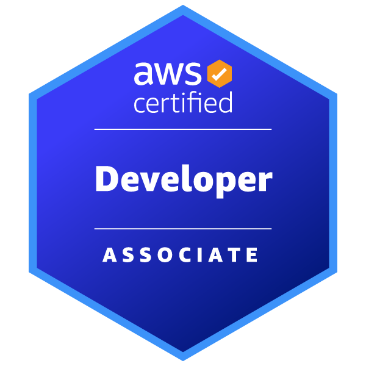

# AWS Certified Developer - Associate　～～AWSを用いた開発者の登竜門的試験～～

奥田 雅基 @mob_engineer

## 前置き

**AWS Certified Data Engineer - Associate**から続いて第10弾となります。
本シリーズの最後として**AWS Certified Developer - Associate**について執筆したいと思います。

## どういった資格なのか？

公式サイトには以下の通り示されています。

>AWS Certified Developer - Associate は、アプリケーションの開発、最適化、パッケージ化、デプロイに加えて、CI/CD ワークフローの使用、およびアプリケーション問題の特定と解決におけるスキルと知識を実証します。この認定は、IT またはクラウド開発の職務に携わる個人が AWS 認定ジャーニーを開始するための最適な出発点になります。

<figure><figcaption>出典：<a href="https://aws.amazon.com/jp/certification/certified-developer-associate/"> AWS 認定デベロッパー – アソシエイト ( https://aws.amazon.com/jp/certification/certified-developer-associate/ )</a>より抜粋</figcaption></figure>

本試験は、**AWSを用いた開発に携わっている方が習得する必要があるサーバーレス・コンテナ知識**について問われます。また、第8弾で紹介した**AWS Certified DevOps Engineer - Professional**と比較して範囲が狭いため、とっつきやすい印象を持ちました。

## 試験を通じて変わったこと

本試験を通じて、**AWSを用いた開発を行うために注意しなくてはいけないポイントを意識する**ようになったと思います。本試験受験前に上位資格である**AWS Certified DevOps Engineer - Professional**は合格していましたが、本試験の方が開発に特化した知識（特にECR・Lambda）を得ることができました。ただし、Git以外の開発ツール（Jiraなど）との連携は試験では問われないため、試験勉強に加え**ハンズオンによる学習**も大切だと思います。

## まとめ

**AWS開発者向けの試験**といった建付けですが、個人的には開発担当以外の方にもチャレンジしてもらいたい試験だと思います。特に、本試験の学習を行うことで**より良いLambdaの利用方法**を学ぶことができると思います。そのうえで、知識インプットだけでなく、**ハンズオンを通じた実践知識の獲得**も並行して行うことをおススメします。

本内容を読んで、資格チャレンジする人がひとりでも増えれば幸いです。

### 著者紹介

---

    
    

        

            <b>奥田 雅基</b>
            <a href="https://x.com/mob_engineer">@mob_engineer</a>
        

        

            サークル名：JAWS-UG 彩の国埼玉支部
        

    

LT芸人・ブログ芸人を目指している一般人。2016年にインフラ運用保守からキャリアスタートし、PMO・ネットワークエンジニアの経験を積み、現在社内プロダクトPJにてインフラ・Web開発を担当。2025年はアウトプット活動（特にAWS）を頑張っていきたいと思っています！！

