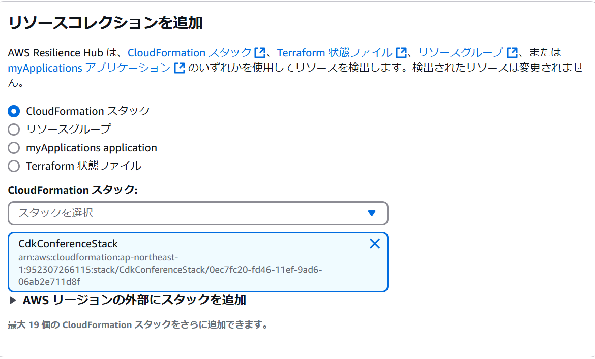
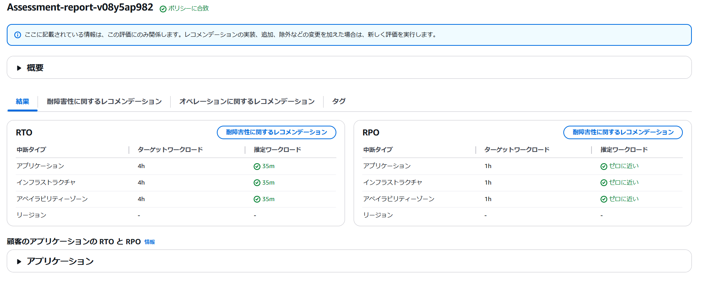

# 本書の書き方(それぞれの著者向け)

モブエンジニア

# AWS Resilience Hub

## 前置き

AWSを触っていく中で「とりあえず、AWSサービスを組み合わせてアプリケーションを開発してみたい」といった想いは誰しもが抱えていると思います。

そのうえで、アプリ開発を行う中で「このアプリケーションで障害が発生した時の復旧時間ってどうなんだろうか？」や「復旧時にネックとなっているサービスやより早く回復させる方法を知りたい」とったモチベーションが生まれると思います。

私個人もAWSの耐障害性について興味関心を持っていたので、いろいろサービスを調べていったところ「AWS Resilience Hub」なる興味深いサービスを見つけましたので、紹介したいと思います。

## AWS Resilience Hubとは

ユーザーガイドを見ると以下の通り示されています。

>AWS Resilience Hub は、AWS 上のアプリケーションの復元力体制を管理および改善するための中心的な場所です。AWS Resilience Hub を使用すると、復元力の目標を定義し、その目標に照らして復元力体制を評価し、AWS Well-Architected フレームワークに基づいて改善のための推奨事項を実装できます。AWS Resilience Hub 内では、AWS Fault Injection Service 実験を作成して実行することもできます。この実験では、アプリケーションに対する実際の障害を模倣することで、依存関係をより深く理解し、潜在的な弱点を明らかにすることができます。AWS Resilience Hub は、復元力体制を継続的に強化するために必要なすべての AWS のサービスとツールを一元的に提供する場所です。AWS Resilience Hub は他のサービスと連携して推奨事項を提供し、アプリケーションリソースの管理を支援します。

<figure><figcaption>出典：<a href="https://docs.aws.amazon.com/resilience-hub/latest/userguide/what-is.html"> What is AWS Resilience Hub? ( https://docs.aws.amazon.com/resilience-hub/latest/userguide/what-is.html )</a>より抜粋</figcaption></figure>

凄くざっくり言えば、**AWSのサービスを組み合わせて作った自作サービスがどれくらいで復旧できるのか統合的に分析できる機能**と思っていただければ分かりやすいかと思います。

## 私の推しポイント

### その1：幅広いリソースをフォローしている

AWS Resilience Hubの設定画面を見てみると**CloudFormation**だけでなくアプリケーションやTerraform設定ファイルに関してもレジリエンスを分析することができます。

近年、Terraformによるリソース管理も主流となっていますので、Terraform設定ファイルをサポートしているのはうれしいポイントだと感じました。

### その2 らくらく設定

耐障害性を確認したいリソースを選択してあげるだけで、**耐障害性を向上させるためにどのような構成に変えればいいか**や**運用オペレーションを向上させるための方法**についても概要を示してくれます。

### その3：学習リソースが揃っている

Skill BuilderやユーザーガイドにもAWS Resilience Hubについて分かりやすく説明が記載されているため、**初心者が学びやすい環境**は揃っているように見えます。

## まとめ

個人開発を行っている方で、**自作アプリケーションの耐障害性改善をきちんと理解したい**と思っている方に取って本サービスは有用だと考えています。

そのうえで、利用料金について「最初の3つのアプリケーションまでは6か月間無料で利用可能だが、それ以降は月額15ドルかかる」と示されているため、**利用方法を慎重に考えないと予期せぬクラウド課金**につながる可能性があります。

>AWS Resilience Hub は、最初の 3 つのアプリケーションまで 6 か月間無料でお試しいただけます。その後は、AWS Resilience Hub の料金はアプリケーション 1 つにつき月額 15.00 ドルとなります。アプリケーションの計測は、AWS Resilience Hub で対象のアプリケーションの最初の耐障害性評価を実行した時点から開始されます。このアプリケーションを削除すると、計測は停止されます。

<figure><figcaption>出典：<a href="https://aws.amazon.com/jp/resilience-hub/pricing/?refid=3b998ccc-2a3e-4e22-8114-263de972ccfc"> AWS Resilience Hub の料金 ( https://aws.amazon.com/jp/resilience-hub/pricing/?refid=3b998ccc-2a3e-4e22-8114-263de972ccfc )</a>より抜粋</figcaption></figure>

ぜひ、皆さんも耐障害性につながるAWSサービスを使って**より良いAWS開発ライフ**を楽しんでみましょう！！

### 著者紹介

---

    
    

        

            <b>モブエンジニア </b>
            <a href="https://x.com/mob_engineer">X@mob_engineer</a>
        

        

            サークル名：JAWS-UG 彩の国埼玉支部
        

    

LT芸人・ブログ芸人を目指している一般人。2016年にインフラ運用保守からキャリアスタートし、PMO・ネットワークエンジニアの経験を積み、現在社内プロダクトPJにてインフラ・Web開発を担当。2025年はアウトプット（特にAWS）頑張っていきたいと思っているエンジニア。一応AWS全冠も達成しています。

