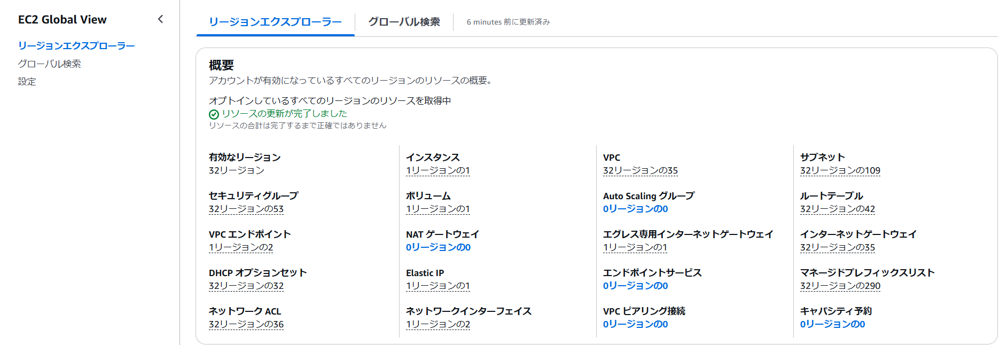
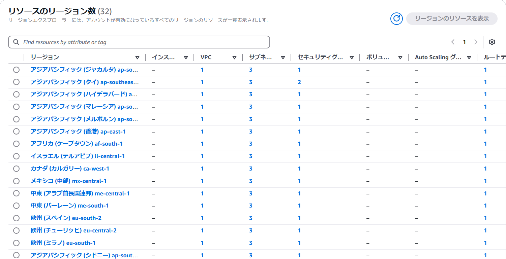

# EC2グローバルリージョンでリージョン移動の手間が省ける（？）

奥田 雅基 @mob_engineer

## はじめに

AWSを利用しているなかで頭を抱える課題として、**予期せぬリージョンに勝手にリソース残存し続けている**があるかと思います。
特に、EC2インスタンスに関しては業務でAWSを触っている方であれば毎日どこかしらのリージョンにEC2を生やしたり消したりしているため、管理が難しいと思います。

そのうえで、EC2グローバルリージョンを活用することでEC2インスタンスの管理が楽になるかと思います。

## EC2グローバルリージョンとは

EC２グローバルリージョンはEC2インスタンスのトップ画面から立ち上げ可能です。

EC2グローバルリージョンのトップ画面を立ち上げると次のような画面が立ち上がります。

画面をスクロールすれば各リージョンごとに**EC2関連のリソースをどのくらい生やしているか**を確認することも可能です。

有効なリージョン情報やEC2インスタンス数をダッシュボード形式で確認することができます。

それ以外にもグローバル検索機能を利用することで、各リージョンに生えているリソース情報をCSVで抜き出すことも可能です。

## ちょっとした難点

利用するうえでいくつか難点があります。

- EC2グローバルリージョンを立ち上げるのに時間がかかる（ほとんどリソースを構築していなくても1分ほどかかる）
- グローバル検索で抜き出せるリソース情報は限定的

## まとめ

EC2グローバルリージョンを活用してみることで、**予期せぬリージョンに勝手にリソース残存し続けている**といった課題解決を行えるかと思います。ただし、ECインスタンスのコンソール画面から取得できる情報よりは少ないため、補助的に活用するのをおススメします。

### 著者紹介

---

    
    

        

            <b>奥田 雅基</b>
            <a href="https://x.com/mob_engineer">@mob_engineer</a>
        

        

            サークル名：JAWS-UG 彩の国埼玉支部
        

    

LT芸人・ブログ芸人を目指している一般人。2016年にインフラ運用保守からキャリアスタートし、PMO・ネットワークエンジニアの経験を積み、現在社内プロダクトPJにてインフラ・Web開発を担当。2025年はアウトプット活動（特にAWS）を頑張っていきたいと思っています！！

