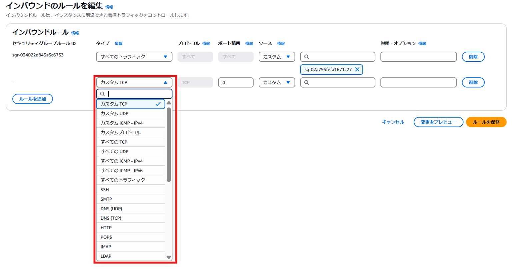

# ちょっとマニアックなセキュリティグループの話

奥田 雅基 @mob_engineer

## はじめに

EC2インスタンスのネットワークセキュリティ対策として**セキュリティグループ**を利用されるかと思います。主な使用例として、**特定のポート番号のみ許可する**があるかと思います。そのうえで、**セキュリティグループのタイプ**を活用してみると設定が少し楽になります。

## 設定イメージ

セキュリティグループの設定画面から**タイプ**をクリックすると次のようなメニューが開きます。

例えば、**指定したIPアドレスからのSSHのみ受け付ける**設定であれば**SSH**のタイプを設定してあげればポート番号を入力する手間は省けます。

##　考えたほうがいいポイント

タイプで特定サービスのポート番号を許可する場合、ポート番号はあらかじめ決められています。そのため、SSHサービスを解放したいがポート番号は独自番号を採用している場合だと利用できません。

## まとめ

セキュリティグループの設定1つ取っても、考える要素が多数あります。今後のアーキテクチャ設計の一助として活用してもらえるとありがたいです。

#### 著者紹介

---

    
    

        

            <b>奥田 雅基</b>
            <a href="https://x.com/mob_engineer">@mob_engineer</a>
        

        

            サークル名：JAWS-UG 彩の国埼玉支部
        

    

LT芸人・ブログ芸人を目指している一般人。2016年にインフラ運用保守からキャリアスタートし、PMO・ネットワークエンジニアの経験を積み、現在社内プロダクトPJにてインフラ・Web開発を担当。2025年はアウトプット活動（特にAWS）を頑張っていきたいと思っています！！

