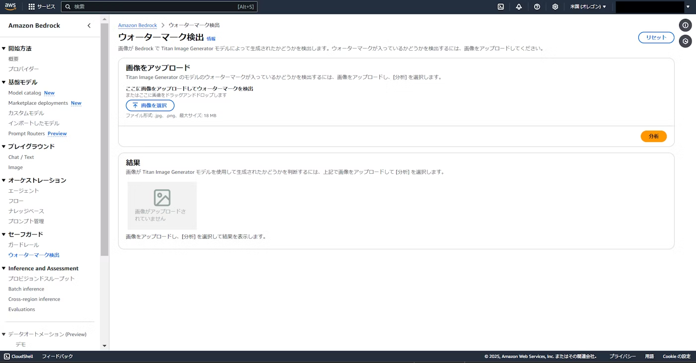
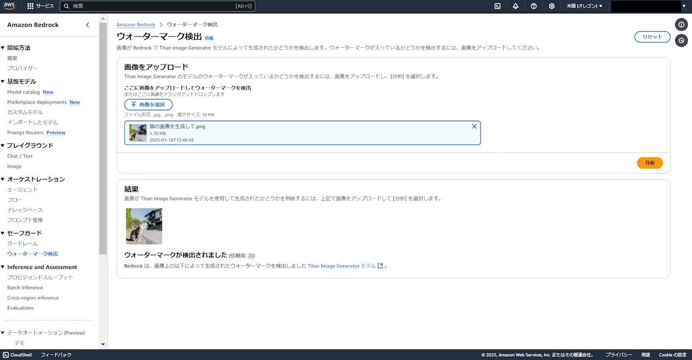

# ウォーターマーク検出でAIで生成した画像かどうか判断できる

奥田 雅基 @mob_engineer

## はじめに

近年の生成AIブーム凄いですね！！

特にAmazon Bedrockは多くのAWS利用者の間で活用されている印象を持っています。そのうえで、生成AIから生成した画像がどうか判別するための機能がBedrock内にもあるので紹介してみたいと思います。

## ウォーターマーク検出とは

一言で言えば**指定した画像を取り込んで、生成AIで作成した画像かどうか判別する機能**となります。

ウォーターマーク検出クリック時の画面として次の通りです。

例えば、Titanシリーズで作成した画像を取り込んだ場合、次のような結果になります。

## ちょっとした難点

生成AIから作成した画像かどうかを検出した機能として凄く使い勝手は良いのですが、現時点で**Titanシリーズのみ対応**という状況です。

そのため、Novaシリーズで作成した画像や他社モデルで作成した画像では検出できません。

## まとめ

責任あるAIを実現するためにウォーターマーク検出機能について知っておいて損はないと思います。もし、実務でTitanシリーズを利用して画像生成を行っている方は活用してみても良いかと思います。

#### 著者紹介

---

    
    

        

            <b>奥田 雅基</b>
            <a href="https://x.com/mob_engineer">@mob_engineer</a>
        

        

            サークル名：JAWS-UG 彩の国埼玉支部
        

    

LT芸人・ブログ芸人を目指している一般人。2016年にインフラ運用保守からキャリアスタートし、PMO・ネットワークエンジニアの経験を積み、現在社内プロダクトPJにてインフラ・Web開発を担当。2025年はアウトプット活動（特にAWS）を頑張っていきたいと思っています！！

