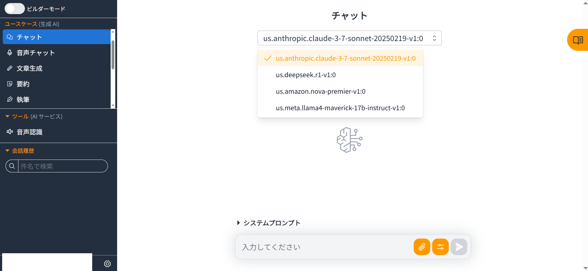
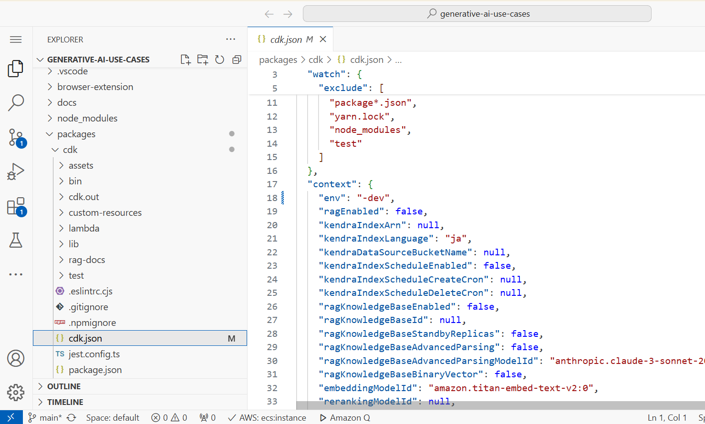
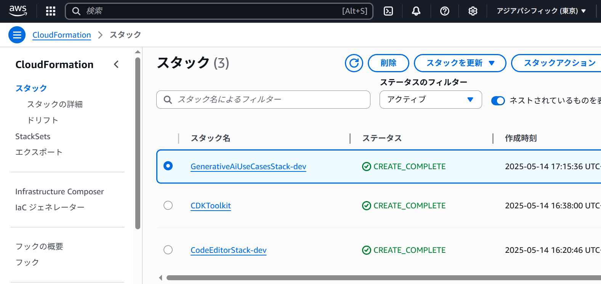
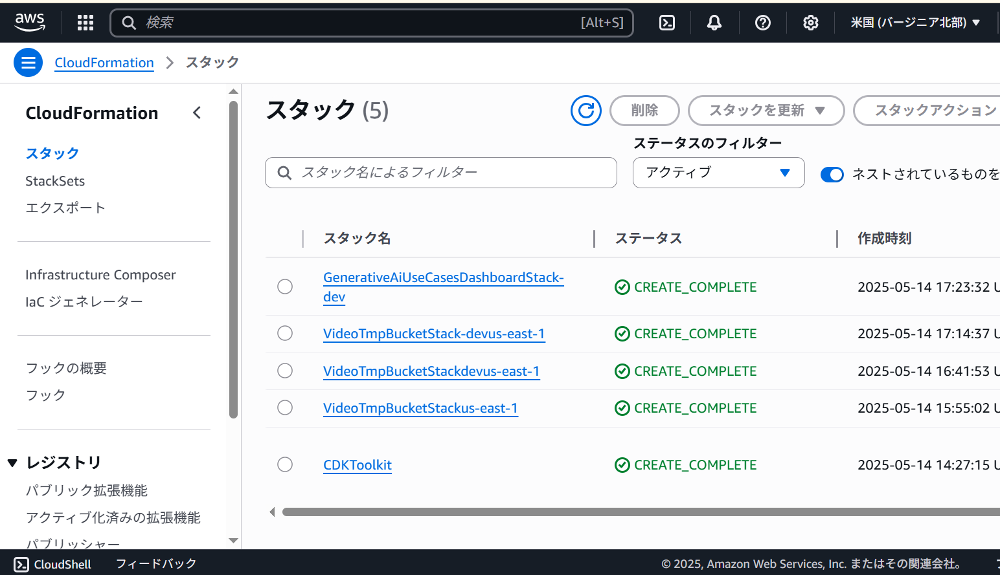

# 中小企業にこそお勧めのGenU(Generative AI Use Cases)

長田英幸

Bedrockerの皆さん、こんにちは。

AWSの生成AI界隈の方には「親の顔より見た」と言われている、GenUについて紹介させてください。

[Generative AI Use Cases (GenU)のGitHub](https://github.com/aws-samples/generative-ai-use-cases)

## 従量課金なので初期投資が少なく始められる社内生成AI基盤
GenUは、AWS Japanの有志の方を中心に開発された生成AIが利用できるWebシステムです。クラウドの特徴の一つである「従量課金」で始められるので、中小企業でも社内に生成AI基盤を導入できます。取扱説明書など業務で必要なドキュメントを生成AIで参照するRAG(検索拡張生成)をすぐに試せる環境が手に入ります。
デプロイはCloudFormationから初めて、削除したい場合も構築したCloudFormationなどを削除すればいいので、気軽に試せます。
なお、Amazon Kendraは非常に高額なので、使用可能にする設定には十分に注意してください(経験者は語る)。

## 活発な開発
Amazon Bedrockに新しい基盤モデル (FM) がリリースされると、数日でアップデートが準備され利用可能にしてくださっています。Amazon Nova Premierの時も早かったです。OSSなのに非常にありがたい事です。画像生成AIはもちろんのこと、動画生成AIも2種類試せる生成AI基盤はなかなか珍しいと思います。

## 簡素だが、気が利く設定項目
会社で利用する場合、クラウドでも日本国内に留めたいという要望があると思います。
「東京リージョンを優先しつつ、バージニア北部リージョン・オレゴンリージョンの最新のモデルも使いたい場合」という設定も出来るように設計されているので、大変便利です。次のURLを参照して、会社に生成AIを導入する際のハードルを乗り越えてください。

[デプロイオプション](https://github.com/aws-samples/generative-ai-use-cases/blob/main/docs/ja/DEPLOY_OPTION.md)

## デプロイ時のTips
GenUはユーザー毎に利用できる生成AIやRAGを制限したりすることはまだ出来ません。そのため本番環境用、STG環境用などのように一つのAWSアカウントに、複数のGenUをデプロイしたくなると思います。でも安心してください。次のように packages/cdk/cdk.json を編集すれば大丈夫です。

※ 東京リージョン、大阪リージョンそれぞれにデプロイする事は可能なのですが、動画生成AIやダッシュボードを可とすると作成されるCloudFormationのスタック名が重複するので、初めから環境名を指定するほうが良いと思います。

    // cdk.json
    {
      "context": {
        "env": "-dev"
      }
    }

スタック名に「-dev」が次のように反映されます。

動画生成AIのCloudFormationのスタック名は、VideoTmpBucketStack(環境名)(リージョン名)で出力されます。

社内展開前に、どのリージョンのどの生成AIを使えるようにするか検討し、あらかじめ複数環境をデプロイする事をお勧めします。

## まとめ
PoC環境として、実現したい事に集中できて、会社内の方にすぐに使ってもらえるので非常にお勧めです。
著者は機能追加のプルリクエストは経験がないので、今まで利用させていただいた分、お返しできればと思っています。

#### 著者紹介
---

    
    

            <b>長田英幸</b>
            <a href="https://x.com/nagata_hideyuki">https://x.com/nagata_hideyuki</a>
            <a href="https://note.com/hideyukinagata">https://note.com/hideyukinagata</a>
    

大阪の印刷系中小企業でWebプログラマとして働いています。 
趣味でAmazon Alexaスキルを個人開発した切っ掛けでAWSを知りました。昨年からJAWS-UG AI/ML 支部運営メンバーです。 
生成AIに夢中になっていたら、AI EngineeringカテゴリーでAWS Community Builderに認定いただきました。

