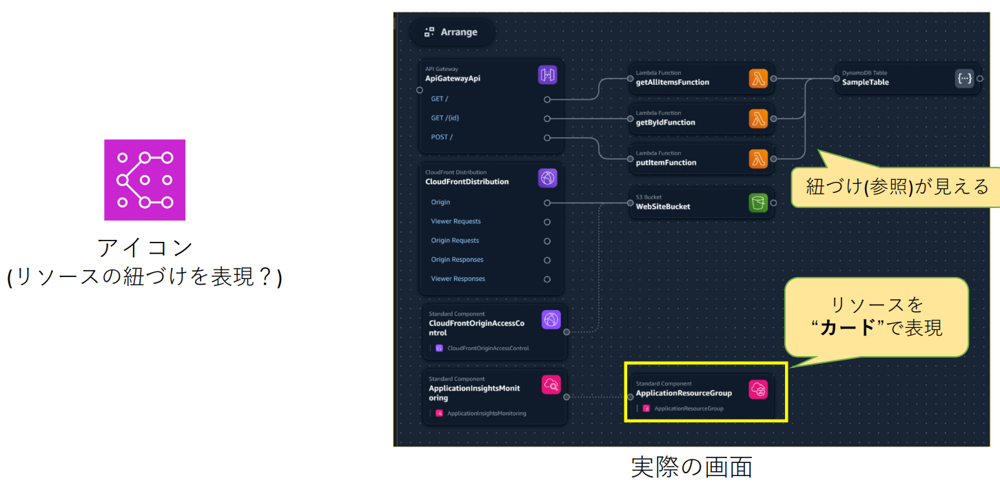
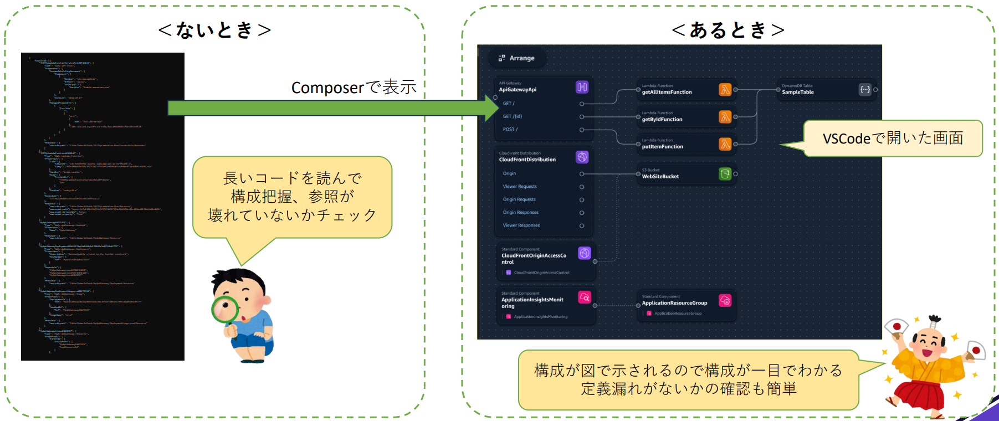
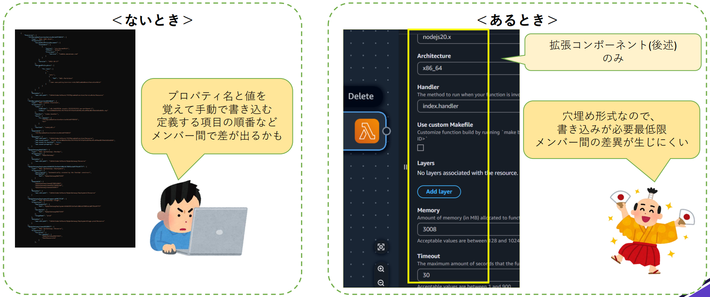
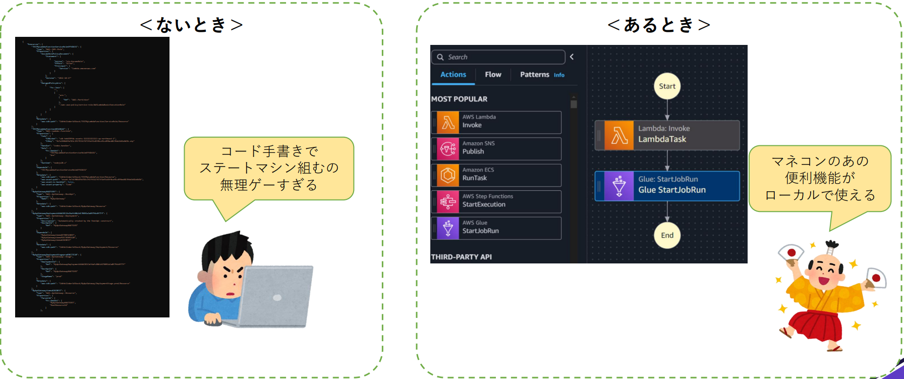
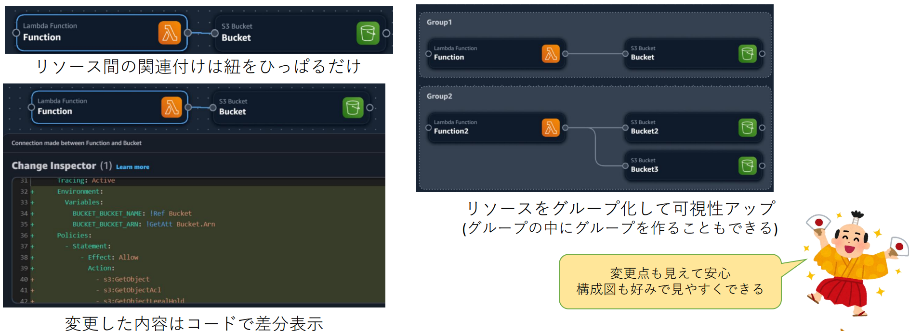

# Infrastructure Composer の推しポイント

山本 直弥（Nao）

## はじめに

2025年にDevTools領域のAWS Community Buildersに選出されました。
そこから、CDKをはじめとするDevToolsの良さを伝えるためにLT会の登壇やブログで情報発信を行っています。

今回の記事ではDevToolsの中でも
AWS Infrastructure Composer(旧：AWS Application Composer)
についてお伝えしていきます

## AWS Infrastructure Composer とは？
GUI操作でCfnテンプレートを作成/編集/構成の視覚化ができるツールです。
CloudFormationテンプレート内のリソース定義が"カード"と呼ばれる単位で管理され、リソース間の関連付けも可視化されるため、CloudFormationテンプレートがアーキテクチャ図や構成図のような形で視覚化できます

## 推しポイント１：既存のCloudFormationテンプレートを構成図のように視覚化できる

#### <ないとき>
- CloudFormationテンプレート内の長いIaCコードを読み解くことによって何が定義されているか、リソース間の依存関係がどのようになっているか整理して理解する必要があります。
- CDKなど抽象化されたIaCコードではなく、行数が多くなりがちなCloudFormationテンプレートのIaCコードの各行を目視で読み解いて理解するのは大変な作業です。

#### <あるとき>
- CloudFormationテンプレートの内容が構成図として可視化されるため、定義されているリソースの種類や依存関係が一目で理解できます
- 表示されたリソースのカードを選択することで、そのリソースのプロパティ定義もリソースごとに確認することが可能です

## 推しポイント２：穴埋め形式でリソースのプロパティ定義が可能

#### <ないとき>
- リソースの種類ごとにどのようなプロパティ名があり、どのような値を設定すべきかを覚えて、手動で書き込む必要があります。
- リソースの定義すべきプロパティを検索して手動で定義を書き込む作業の往復は大変な作業です。

#### <あるとき>
- 拡張コンポーネントと呼ばれるリソースの種類の定義のみに限りますが、穴埋め方式でプロパティの定義が可能です
- 定義すべきプロパティの種類が提示されているため、プロパティ定義が非常に楽になります。

## 推しポイント３：StepFunctions Workflow Studioがローカル(VSCode上)でも動かせる

#### <ないとき>
- StepFunctionsのステートマシンを作成する際に、事前に定義したリソースを組み合わせて複雑なフローを定義する必要があります。
- 既存のリソースを参照してエラーやループ、分岐などのフローを手動でコードを書いて定義するのは大変な作業です。

#### <あるとき>
- StepFunctions Workflow Studioを使用してGUI操作でステートマシンが定義できるため、定義が非常に楽になります。

## そのほかの推しポイント

### リソース間の関連付けが簡単
- リソース間の紐づけをGUI操作で紐を引っ張るような操作のみで行うことができます
- 必要なポリシーの追加も自動で行われます

### 変更されたコード差分を表示可能
- GUI操作で自動的にIaCコードが追加されますが、その変更内容はGUI操作している画面上で確認可能です

### リソース(カード)のグループ化が可能
- 管理するリソースが多くなったり、複数の機能の分類を含むテンプレートの場合、どのリソースがどの分類で管理されるかが可視化できた方が管理しやすい場合があります。
- グループ化すると構成図上でグループが表示され、リソースの管理が容易になります

## 使用時の注意点

#### 拡張コンポーネントと標準コンポーネントの違い
#### <拡張コンポーネント>

- サーバレス系の14種類のリソース
- 穴埋め形式でのプロパティ定義など、Infrastructure Composerの機能を最大限に活かすことができます

#### <標準コンポーネント>
- CloudFormationが対応している1,374種類(2025年4月時点)のリソース
- 穴埋め形式の定義はできませんが、AmazonQによるワンクリックコード提案が利用可能です

#### ワンクリックコード提案は雛形や参考程度に

- 標準コンポーネントで利用できるワンクリックコード提案は選択中のリソースに関するプロパティ定義の例を提案してくれる機能になっています
- そのため、実際のプロジェクトに必ずしも適しているプロパティ定義ではありません
- あくまで雛形や参考程度に利用して、提案されたコードに対してプロジェクトに合う形にコードを編集する必要があります。

#### 自動で作成されるポリシー設定に注意

- リソース間の紐づけはGUI操作で簡単に設定でき、この時ポリシーも自動で設定されます。
- 手動コード定義が不要で便利ですが、ポリシー設定は必要以上に多くのアクションを許可している可能性があります。
- 必要最低限のポリシー設定が求められる場合はここからリソースの紐づけをGUI操作で作成した後で、不要なポリシーを削除する対応が必要になります。

## さいごに

今回はInfrastructureComposerについて紹介しました
CloudFormationテンプレートを構成図のように可視化できて、プロパティ定義も参照できるので、たとえばプロジェクトの新メンバーに対して、設計資料を読んでもらう時にCloudFormationテンプレートをInfrastructureComposerで見てもらって実際の構成や定義内容を理解してもらうにも利用できるのではないかと思いました。

これからも様々なツール(主にDevTools)の紹介をして、皆さんにツールへの興味を持ってもらい、開発や運用の効率化に貢献できるように頑張ります

### 著者紹介

---

    
    

        

            <b>山本 直弥 ( Nao )</b>  
            X：<a href="https://x.com/nananaonana7">https://x.com/nananaonana7</a>  
            Qiita：<a href="https://qiita.com/Nana_777">https://qiita.com/Nana_777</a>  
            lit.link：<a href="https://qiita.com/Nana_777">https://lit.link/nao777nanaarchitect</a>  
            所属：<a href="https://jawsug-nagoya.connpass.com/">JAWS-UG 名古屋支部</a>
        

    

2025~ AWS Community Builder (DevTools)   
2023~ AWS All Certifications Engineer   
今力を入れてること：技術アウトプット(LT登壇、ブログ投稿など)   
すきなもの：バーチャルおばあちゃん、ながの（ちいかわ）、真勇者ルーサー、神田伯山さん   

