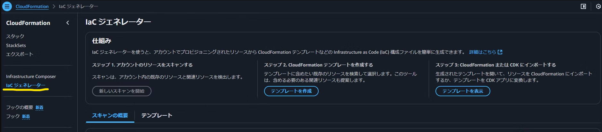
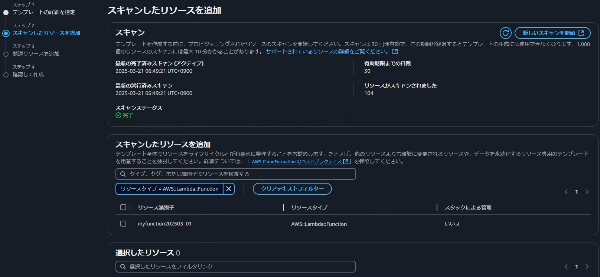
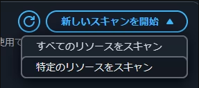
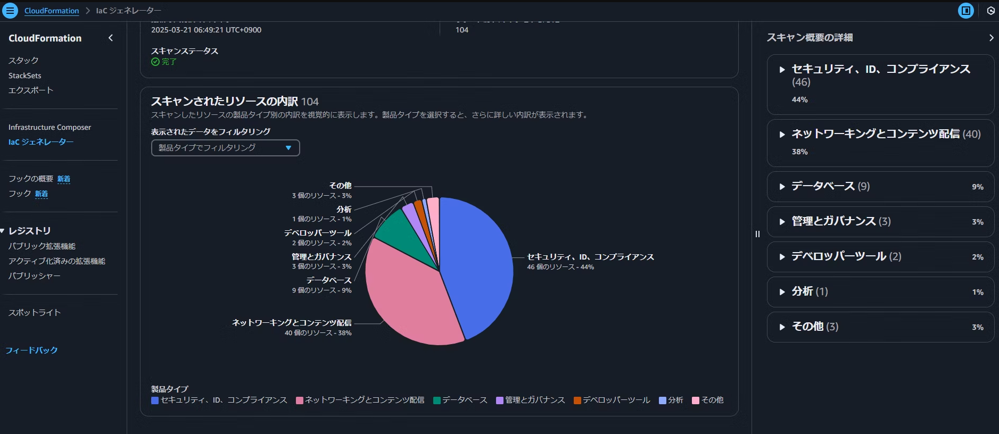
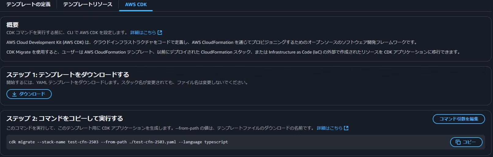

# マネコン開発派でも安心！IaCジェネレーターの推しポイント

山本 直弥（Nao）

## はじめに
AWSマネージメントコンソール(マネコン)はGUI操作で簡単にかつ直感的にリソースを定義できる素晴らしいツールです。ただ、それと同時にインフラの構成や設定はコードで管理すべきであるといういわゆるIaC(Infrastructure as Code)という考え方もあります。

すでにマネコンで開発が進んでしまった後で、ゼロからIaCコードを起こさなけらばならなかったとき、より簡単にIaC管理に移行するにはどのようにすればよいでしょうか？
今回はそんな時にオススメしたいツール「IaCジェネレーター」を紹介します。

## IaCジェネレーターとは？
マネコンのCloudFormationから選択できる機能であり、既存のAWSアカウントの環境定義されたリソースからIaCコード(CloudFormationテンプレート)が作成できます。

## 推しポイント１：操作は全てGUI操作
既存環境からIaCコードを生成する際に、複雑な設定やコーディングは不要です。
画面からボタンをポチポチ押すだけでIaCコードが生成されます。これは操作が簡単で安心。

1. IaCジェネレータ機能を選択する 

2. テンプレート作成を選択する 

3. スキャン結果からリソースを選択してテンプレートを作る 

## 推しポイント２：スキャン範囲を選択できる
既存環境をスキャンすることで既存リソースの一覧を作りますが、全体スキャンの他に特定のリソースのみを対象にしてスキャンすることができます。
そのため、初回で全体をスキャンしたい場合と変更したLambda関数の定義だけスキャンしたい場合など使い分けが可能です。
スキャン時間はおよそ1,000リソースごとに約10分ほどなので、特定のリソースに絞ってスキャンすることで待ち時間の削減にもなります。

↓スキャン方法を選択 

## 推しポイント３：スキャン結果が見やすい
既存環境をスキャンすることで既存リソースの一覧を作り、そのリソースから必要なものを選択してIaCコードを作成しますが、このスキャンの結果は円グラフやリソースの種類ごとの一覧で表示されます。
そのため、既存アカウントのリソース構成比率が確認でき、目視で既存環境のリソース定義を確認する場合と比較してリソースの見逃しを防ぐことができます。

↓スキャン結果

## 推しポイント４：CDKアプリケーションへの変換手順も紹介されていてやさしい
IaCジェネレーターによって入手できるIaCコードはCloudFormationテンプレートですが、プロジェクトでCDKを使う方針の場合でも手順が示されていて安心です。
CloudFormationテンプレートから変換されるCDKアプリケーションのコードはL1コンストラクトのため、CDKの抽象化などの少ないコードで管理できるメリットを享受するには手動でのL2コンストラクトへの変換が必要ですが、既存環境のリソースを自動でCDKのL1コンストラクトまで出力できれば、0からCDKコードを作るよりも定義漏れなどの心配がすくなく効率的な場合もあるのではないかと思います。

↓CDKアプリケーション変換手順 

## さいごに
いままでマネコン開発をしていた人に対しても救いのあるツールがあるというのは素晴らしいと思います。

CDKに慣れた方であればIaCジェネレーターを利用することなく、0からCDKアプリケーションを作った方が早い人もいらっしゃると思いますがIaCジェネレータを使うことでCDKに慣れていない人でも簡単にCDKアプリケーションを作れるため、チームのCDKの熟練度等と合わせて利用を検討してみてください。 

### 著者紹介

---

    
    

        

            <b>山本 直弥 ( Nao )</b>  
            X：<a href="https://x.com/nananaonana7">https://x.com/nananaonana7</a>  
            Qiita：<a href="https://qiita.com/Nana_777">https://qiita.com/Nana_777</a>  
            lit.link：<a href="https://qiita.com/Nana_777">https://lit.link/nao777nanaarchitect</a>  
            所属：<a href="https://jawsug-nagoya.connpass.com/">JAWS-UG 名古屋支部</a>
        

    

2025~ AWS Community Builder (DevTools)   
2023~ AWS All Certifications Engineer   
今力を入れてること：技術アウトプット(LT登壇、ブログ投稿など)   
すきなもの：バーチャルおばあちゃん、ながの（ちいかわ）、真勇者ルーサー、神田伯山さん   

