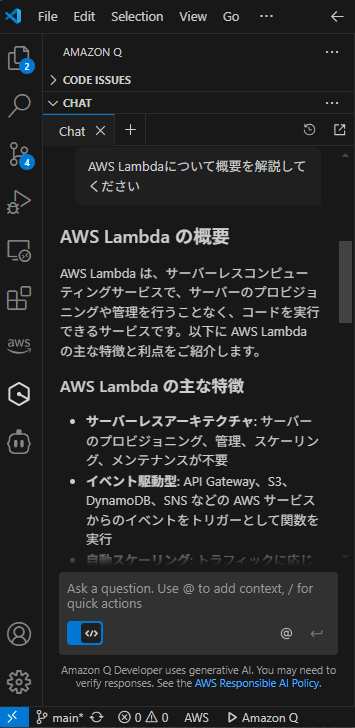
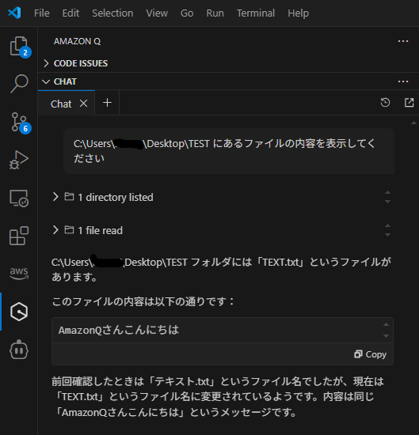
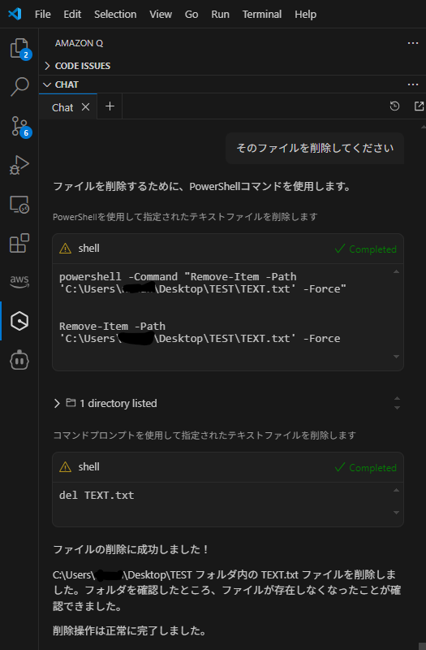

# ローカル開発の頼れる相棒！Amazon Q Developer in VS Code のススメ

山本 直弥（Nao）

## ちょっとした調べごとやコード提案は IDEと一体化したAmazon Q にお任せ！
近年では生成AIを利用して調べごとやコード生成をすることが多くなってきました。生成AIツールの多くはVSCodeなどのIDEとは別のアプリやブラウザとして提供されており、別の画面やIDEを閉じてそのツールの画面を開く必要があります。VSCodeの拡張機能の一つとして提供されているAmazon Q Developerを利用すればIDEを開いたままで調べごとやコード生成が行えます。  

↓VSCode内でAmazonQを使って調べごとをしている例  

## ローカルPCに保存されているファイルの操作なども日本語で依頼可能！
ローカルPCにあるファイルを表示したり削除したりという操作もAmazonQを使用することで実現可能です。VSCodeを閉じることなくAmazonQを通じてローカルPC内のファイルが操作できることに慣れれば、作業効率化が図れるかもしれません。  
   
↓指定フォルダのファイル一覧取得  

↓検索したファイルの削除  

#### 著者紹介

---

    
    

        

            <b>山本 直弥 ( Nao )</b>  
            X：<a href="https://x.com/nananaonana7">https://x.com/nananaonana7</a>  
            Qiita：<a href="https://qiita.com/Nana_777">https://qiita.com/Nana_777</a>  
            lit.link：<a href="https://qiita.com/Nana_777">https://lit.link/nao777nanaarchitect</a>  
            所属：<a href="https://jawsug-nagoya.connpass.com/">JAWS-UG 名古屋支部</a>
        

    

2025~ AWS Community Builder (DevTools)   
2023~ AWS All Certifications Engineer   
今力を入れてること：技術アウトプット(LT登壇、ブログ投稿など)   
すきなもの：バーチャルおばあちゃん、ながの（ちいかわ）、真勇者ルーサー、神田伯山さん   

