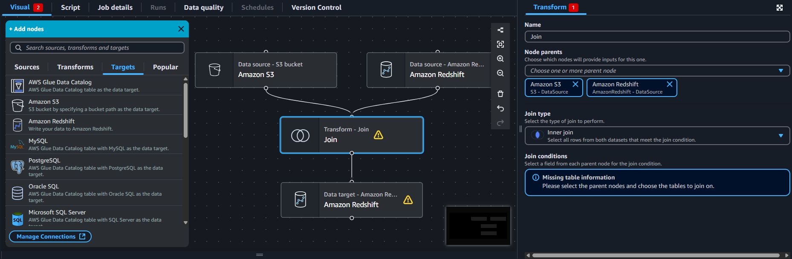
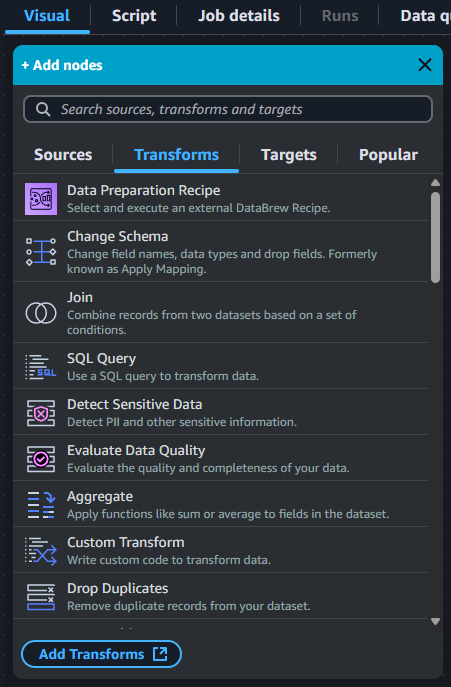

# Glue Job をGUIで開発！Glue Studio Visual ETL のススメ

山本 直弥（Nao）

## Visual ETL を利用することで直感的に Glue Job を開発できる！
ETL処理を大雑把に説明するとデータソースからデータを取得し、データを変換してターゲットデータストレージに保存する処理です。この各ステップごとに事前定義されたノードと呼ばれる処理やAWSサービスの種類を選択して組み合わせ、つなぎ合わせることで直感的にETL処理を行うGlueJobを開発できます  

↓画面イメージ  

## ETL処理で利用するデータ変換パターンが事前定義のノードとして提供されている！
データ変換処理に関するノードは任意のSQLを記載できる「SQL Query」ノードの他、複数のデータソースのデータをJOINする「Join」ノード、nullの項目を取り除く「Drop Null Fields」などよく使われるデータ変換パターンのノードが用意されており、SQLを書くよりも少ない設定で目的の処理を実現できます。  

↓データ変換に関するノード例  

### 著者紹介

---

    
    

        

            <b>山本 直弥 ( Nao )</b>  
            X：<a href="https://x.com/nananaonana7">https://x.com/nananaonana7</a>  
            Qiita：<a href="https://qiita.com/Nana_777">https://qiita.com/Nana_777</a>  
            lit.link：<a href="https://qiita.com/Nana_777">https://lit.link/nao777nanaarchitect</a>  
            所属：<a href="https://jawsug-nagoya.connpass.com/">JAWS-UG 名古屋支部</a>
        

    

2025~ AWS Community Builder (DevTools)   
2023~ AWS All Certifications Engineer   
今力を入れてること：技術アウトプット(LT登壇、ブログ投稿など)   
すきなもの：バーチャルおばあちゃん、ながの（ちいかわ）、真勇者ルーサー、神田伯山さん   

