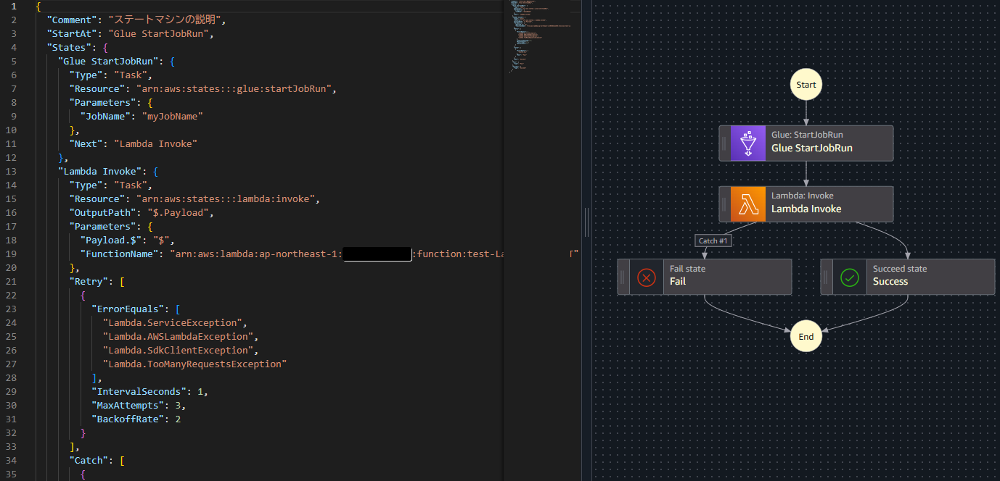

# ステートマシンをGUIで開発！Step Functions Workflow Studio のススメ

山本 直弥（Nao）

## ワークフロースタジオを利用することで直感的にステートマシンを開発できる！
StepFunctionsワークフロースタジオを利用すると、ステートマシンの各状態を左メニューから選択してドラッグアンドドロップで右側のキャンバスに配置して組み合わせることで簡単にフローの定義が可能です。AWSサービスを組み合わせるだけではなく、エラーが発生した時にエラー通知を発行するために状態をFailの状態にすることや、Lambdaファンクションを並行実行、並列実行させるParallelやMapなども基本的に左メニューから選ぶ形で直感的な操作で定義することができます。  

↓ワークフロースタジオのイメージ  

## ステートマシンの定義情報はJson形式でも表示できるので、別環境への移行も簡単！
ワークフロースタジオで定義したステートマシンはJson形式で表示することも可能です。アカウントIDは固定文字列で定義されているの変更は必要ですが、同じリソース構成を持つ別環境でステートマシンを再定義したい場合は、このJson形式の定義をコピーアンドペーストすれば同じ定義のステートマシンがすぐに定義できます。Json形式で定義を作った後や編集した後でも、その続きからまた状態のカードを選択して組み合わせる形でのステートマシンの編集を行うことが可能です。  

↓Json形式で表示した例  

### 著者紹介

---

    
    

        

            <b>山本 直弥 ( Nao )</b>  
            X：<a href="https://x.com/nananaonana7">https://x.com/nananaonana7</a>  
            Qiita：<a href="https://qiita.com/Nana_777">https://qiita.com/Nana_777</a>  
            lit.link：<a href="https://qiita.com/Nana_777">https://lit.link/nao777nanaarchitect</a>  
            所属：<a href="https://jawsug-nagoya.connpass.com/">JAWS-UG 名古屋支部</a>
        

    

2025~ AWS Community Builder (DevTools)   
2023~ AWS All Certifications Engineer   
今力を入れてること：技術アウトプット(LT登壇、ブログ投稿など)   
すきなもの：バーチャルおばあちゃん、ながの（ちいかわ）、真勇者ルーサー、神田伯山さん   

