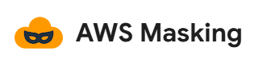
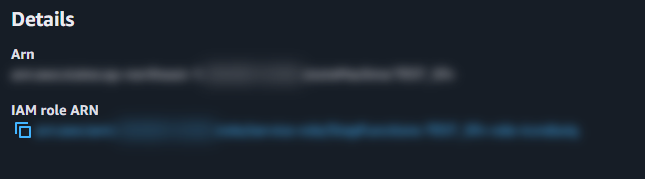
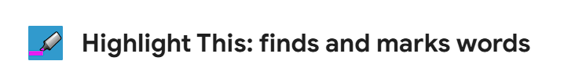
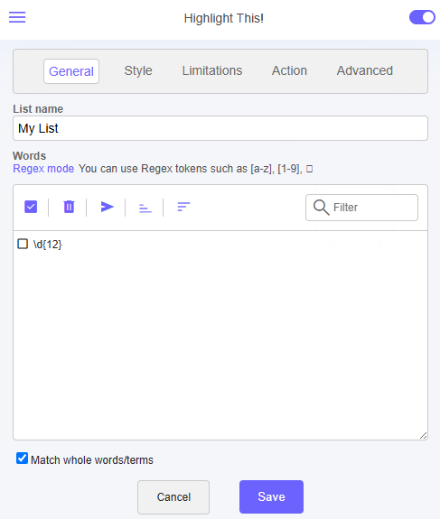
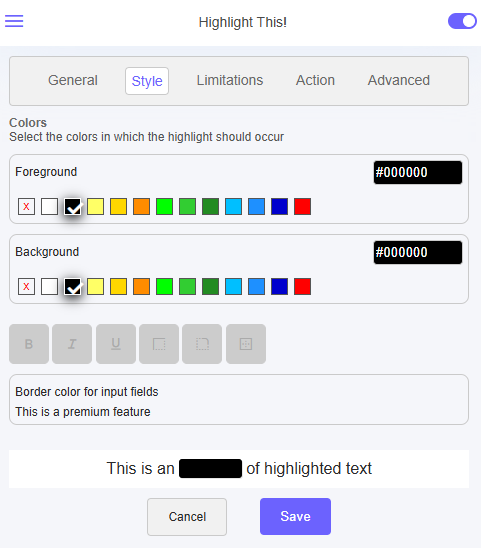
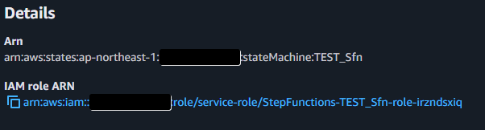
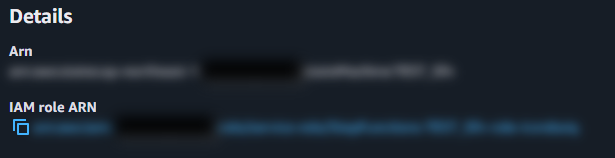

# 会議中にAWSマネコン画面を共有しても安心！機密情報保護拡張機能のススメ

山本 直弥（Nao）

## はじめに
AWSサービスと直接関係はないですが、Chromeの拡張機能を利用することでAWSに関する業務の一部を効率化できる場面もあります。例えば、会議中に画面共有をして第三者にAWSマネジメントコンソールの画面を見せる場合、アカウントIDなど他の人には知られたくない情報がどうしても画面に表示されてしまいます。今回はこの機密情報を自動でマスキングしてくれる拡張機能を紹介します。

### AWSの機密情報を自動でマスキング！「AWS Masking」
自動でモザイク風のマスキングをしてくれるツールが「AWS Masking」。特に設定不要でARNやアカウントID、アクセスキーなどをマスキングしてくれます。  

↓拡張機能「AWS Masking」のアイコン  

↓マスキング結果  
  

### 任意の機密情報をマスキング！ハイライトも可能「Highlight This」
「Highlight This」を使えば、任意のパターンについてマスキングが可能です。マスキング対象の文字列は直接文字を指定するか、正規表現で文字列の構造を指定するとそのパターンに一致した文字列の背景と文字の色を変更します。例えば背景と文字の色をどちらも黒色にすれば、その文字列はマスキングされたような表示になります。  

↓拡張機能「Highlight This」のアイコン  
  

↓設定画面1。正規表現でマスク対象を定義する  
  
↓設定画面2。背景と文字の色を同じにするとマスキングされたような見た目になる    
  

↓マスキング結果  
  

## さいごに
ちなみに両方の拡張機能を同時に有効にすることも可能です。その場合、「Highlight This」で黒色になった上に「AWS Masking」でモザイクがかかったような表示になります。また、自分の画面で見ている状態ではわかりませんが、Teamsなどで画面共有していると、その共有画面を見ている相手の画面ではスクロールが発生した際に一瞬だけ「Highlight This」のマスクが外れる場合があるようです。そのため、どちらかというと「AWS Masking」を使っておく方が安心かもしれません。  

↓両方の拡張機能を有効化した結果  
  

### 著者紹介

---

    
    

        

            <b>山本 直弥 ( Nao )</b>  
            X：<a href="https://x.com/nananaonana7">https://x.com/nananaonana7</a>  
            Qiita：<a href="https://qiita.com/Nana_777">https://qiita.com/Nana_777</a>  
            lit.link：<a href="https://qiita.com/Nana_777">https://lit.link/nao777nanaarchitect</a>  
            所属：<a href="https://jawsug-nagoya.connpass.com/">JAWS-UG 名古屋支部</a>
        

    

2025~ AWS Community Builder (DevTools)   
2023~ AWS All Certifications Engineer   
今力を入れてること：技術アウトプット(LT登壇、ブログ投稿など)   
すきなもの：バーチャルおばあちゃん、ながの（ちいかわ）、真勇者ルーサー、神田伯山さん   

