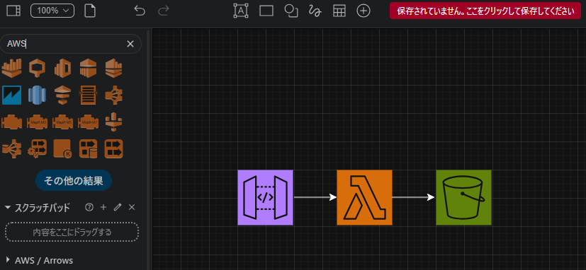
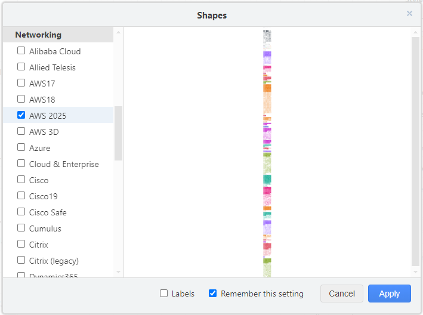

# AWSアーキテクチャ図を作ろう！Draw.ioのススメ

山本 直弥（Nao）

AWSのアーキテクチャ図を作るとき、パワーポイントやExcelの図形と画像を使って作るのも良いですが、アーキテクチャ図のみをXML形式で出力したい場合があります。この記事ではそんな時に使えるツールを紹介します。

## ブラウザ版Draw.ioでAWSのアーキテクチャ図が作れる！
ブラウザでDraw.io編集画面を開くことができ、そこでアーキテクチャ図を作成することができます。特定のアプリをインストールする手間がないため、すぐに利用することができます。

ブラウザ版Draw.io：https://app.diagrams.net/?splash=0&libs=aws4

  

## VSCode拡張機能版Draw.ioでAWSのアーキテクチャ図が作れる！
VSCodeの拡張機能としてもDraw.ioのエディタが提供されています。拡張機能「Draw.io Integration」を使用することでVSCode内でDraw.ioを使ってAWSのアーキテクチャ図を作れます。AWSのアイコン画像がデフォルトの図形の選択肢にない場合は「More Shapes」ボタンから追加アイコン画像設定画面に遷移できるのでそこからAWSアイコンセットを選択して、アーキテクチャ図を作るためのアイコンの選択肢に追加します。  

↓VSCodeの拡張機能「Draw.io Integration」  
  
↓Draw.io IntegrationでAWSのアイコンを使えるようにする  
  

#### 著者紹介

---

    
    

        

            <b>山本 直弥 ( Nao )</b>  
            X：<a href="https://x.com/nananaonana7">https://x.com/nananaonana7</a>  
            Qiita：<a href="https://qiita.com/Nana_777">https://qiita.com/Nana_777</a>  
            lit.link：<a href="https://qiita.com/Nana_777">https://lit.link/nao777nanaarchitect</a>  
            所属：<a href="https://jawsug-nagoya.connpass.com/">JAWS-UG 名古屋支部</a>
        

    

2025~ AWS Community Builder (DevTools)   
2023~ AWS All Certifications Engineer   
今力を入れてること：技術アウトプット(LT登壇、ブログ投稿など)   
すきなもの：バーチャルおばあちゃん、ながの（ちいかわ）、真勇者ルーサー、神田伯山さん   

