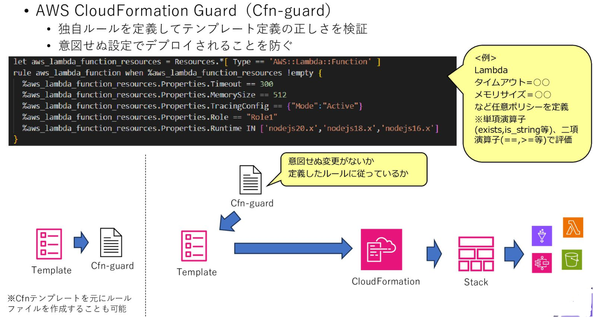

# CloudFormationのリソース定義を独自ルールで検証！AWS CloudFormation Guard のススメ

山本 直弥（Nao）

## Policy as Code (PaC) は大事！
IaCコードでリソース定義を行うにしても、その定義がルール通りに行われているかは検証する必要があります。この検証を目視で行うのも良いですが、IaCコードが長い場合や検証の頻度が多い場合は目視での確認は非効率になる場合があります。インフラの構成をコードで定義して自動で一括反映するのがIaCであれば、IaCに対する検証ルールもコードで定義して自動で一括検証したいものです。この検証内容のポリシーをコード化することをPolicy as Code(PaC)と呼びますが、この記事では特にCloudFormationのPaCであるCloudFormation Guard を紹介します。  

AWS CloudFormation Guard：https://docs.aws.amazon.com/ja_jp/cfn-guard/latest/ug/what-is-guard.html

## 独自ルールも設定可能！AWS CloudFormation Guard でスタック作成前に内容チェック！
AWS CloudFormation Guard を使用することでCloudFormationテンプレートに定義されている内容が、要件定義や設計で事前に取り決めたルール通りに定義できているかをチェックすることができます。チェック項目は例えばAWS Lambda では「タイムアウト設定を〇秒に設定すること」や、「ランタイムのバージョンは〇か〇にすること」「メモリサイズは〇以上にすること」などの定義をルールファイルに記載し、このルールファイルを使ってCloudFormationテンプレートがルール通りかチェックすることができます。  

↓CloudFormation Guard の動作イメージ  
  
  

【IaCにおけるPaC導入のメリット】  
- 設計とIaCコードの整合性が確保される
- メンバー間で定義ルールの認識合わせができる
- 不正な設定内容がデプロイされることを防ぐことができる
- デプロイ後のテスト工数や問題発生の懸念の低減が図れる

#### 著者紹介

---

    
    

        

            <b>山本 直弥 ( Nao )</b>  
            X：<a href="https://x.com/nananaonana7">https://x.com/nananaonana7</a>  
            Qiita：<a href="https://qiita.com/Nana_777">https://qiita.com/Nana_777</a>  
            lit.link：<a href="https://qiita.com/Nana_777">https://lit.link/nao777nanaarchitect</a>  
            所属：<a href="https://jawsug-nagoya.connpass.com/">JAWS-UG 名古屋支部</a>
        

    

2025~ AWS Community Builder (DevTools)   
2023~ AWS All Certifications Engineer   
今力を入れてること：技術アウトプット(LT登壇、ブログ投稿など)   
すきなもの：バーチャルおばあちゃん、ながの（ちいかわ）、真勇者ルーサー、神田伯山さん   

