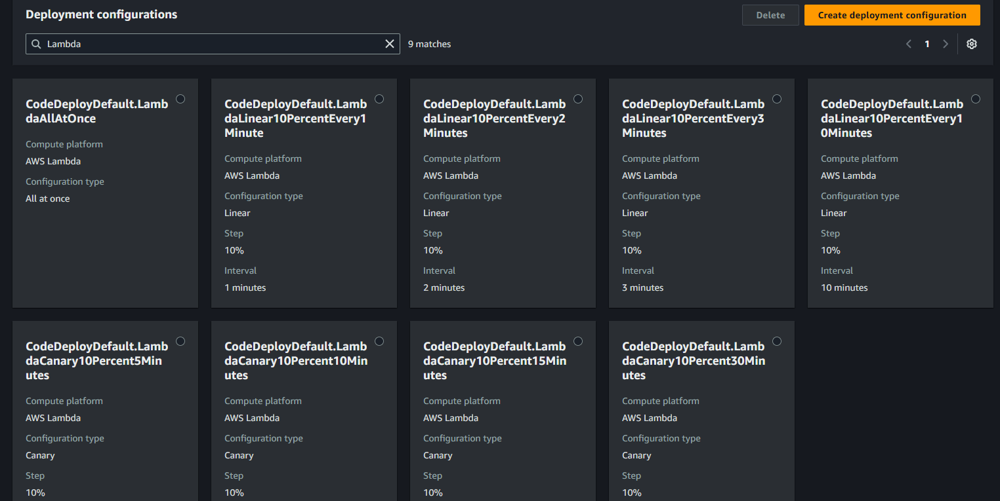
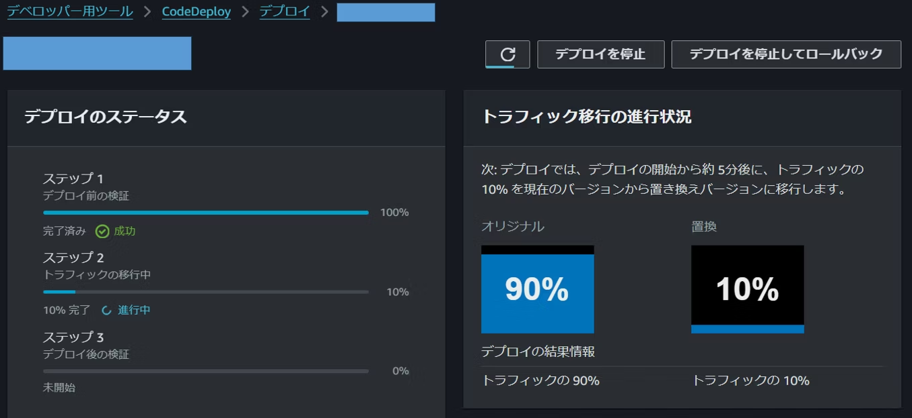
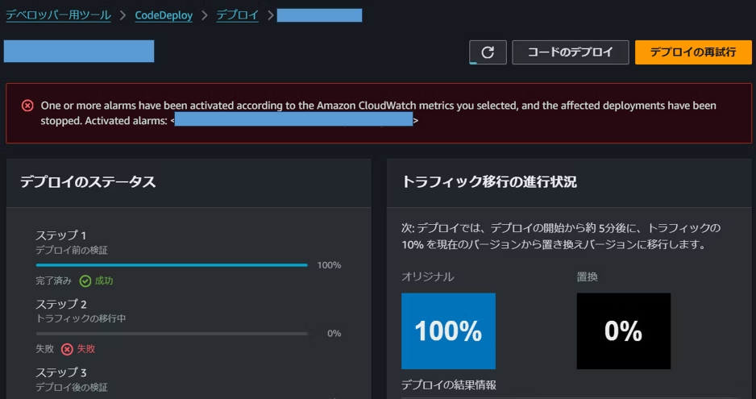

# リリース失敗の影響を最小限に！AWS CodeDeployで実現するデプロイ戦略のススメ

山本 直弥（Nao）

## デプロイリスクを把握しよう！
既存の機能やシステム構成を新しい機能や構成に変更する際に、既存のシステムを一括で新しいものに置き換えることは一見素早くリリース作業を完了できて新システムを全てのユーザーに提供できるので良いことのように思います。しかし、もしそのデプロイ内容にバグが潜んでいたら、改善された新機能ではなくバグのある機能が全ユーザーに提供されてしまいます。さらに悪いことにそのバグの対応方法が決まっていなければ、より長い時間ユーザーをそのバグで苦しめることになります。新機能や構成をデプロイする際には以下のような内容を検討したデプロイ戦略を計画しましょう。  

【デプロイ戦略で検討する内容の例】  
- デプロイした新バージョンにアクセスできるユーザーをどの程度制限するか
- 問題発生の検知はどのように行うか、問題の監視はどの程度の期間行うか
- デプロイ後に問題が発生した際にどのように対処するか(前バージョンに戻すのか、どのレベルなら許容するか、バグを修正するのか、誰にエスカレーションするかなど)

## デプロイ戦略は多種多様。システムやプロジェクトの特徴を踏まえて選択しよう！
どのシステム、どのプロジェクトにもベストなデプロイ方法はありません。デプロイ戦略の種類と特徴、システムとプロジェクトの特徴を考慮してベストな選択を行ってください。  

【デプロイ戦略の例】  
- カナリアデプロイ
  - ごく少数のユーザーだけ新バージョンにアクセスさせ、問題があれば元に戻す、なければ全ユーザーを新バージョンにアクセスさせるなどの2段階でデプロイする
- リニアデプロイ
  - 最初の10分は10%のユーザー、問題がなければ次の10分は20%のユーザーに新バージョンにアクセスさせるなど一定の間隔、一定の割合で新バージョンにアクセスできるユーザーを増やすことで段階的にデプロイする
- ブルー/グリーンデプロイ
  - 新バージョンと旧バージョンそれぞれ別の環境で同時に起動する。一度に100％のユーザーを新バージョンにアクセスさせ、問題が検知されたら即時旧バージョンにアクセスを切り替える

## AWS CodeDeploy ならデプロイ戦略の実現が簡単！
デプロイ戦略を簡単に実現するための選択肢の1つがAWS CodeDeployです。CodeDeployにはAWSサービスごとにデプロイ戦略を実現する設定が事前にされており、これを選択していくつかの設定を行うことで必要なデプロイ戦略を実現できます。  
  

## もちろんデプロイ失敗時の自動戻し作業もお任せ！
AWS CodeDeploy によるデプロイは戻し作業まで自動で行うことが可能です。これにより、問題のあるバージョンを利用するユーザーを限定するだけではなく、問題が検知された後、ユーザーが問題のあるバージョンにアクセスする期間を最小限にすることができます。  

↓カナリアデプロイで10％のユーザだけ新バージョンにアクセスさせている  
  

↓新バージョンでエラーが発生しCloudWatchアラートを検知してデプロイ前の状態に戻された  
  

## さいごに
もちろん、AWS CodeDeploy を使用せずCloudFormationなどで一括デプロイして、人が動作確認して問題があれば戻すことや、ユーザーの影響を最小限にするために深夜にリリース作業を行うなどの運用もプロジェクトの特性や制約次第では有りな選択肢です。最も重要なことは、そのデプロイ内容やリリース作業によって発生する課題や影響範囲、問題発生時の対応方法が事前に計画されていることだと思います。この機会に再度デプロイ戦略やデプロイ戦略を実現するサービスについて是非調べてみてください。

### 著者紹介

---

    
    

        

            <b>山本 直弥 ( Nao )</b>  
            X：<a href="https://x.com/nananaonana7">https://x.com/nananaonana7</a>  
            Qiita：<a href="https://qiita.com/Nana_777">https://qiita.com/Nana_777</a>  
            lit.link：<a href="https://qiita.com/Nana_777">https://lit.link/nao777nanaarchitect</a>  
            所属：<a href="https://jawsug-nagoya.connpass.com/">JAWS-UG 名古屋支部</a>
        

    

2025~ AWS Community Builder (DevTools)   
2023~ AWS All Certifications Engineer   
今力を入れてること：技術アウトプット(LT登壇、ブログ投稿など)   
すきなもの：バーチャルおばあちゃん、ながの（ちいかわ）、真勇者ルーサー、神田伯山さん   

