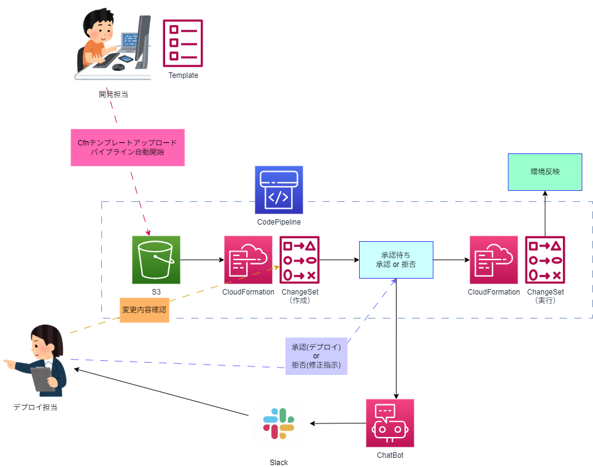
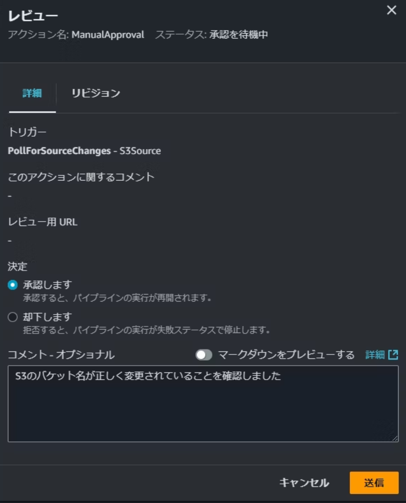
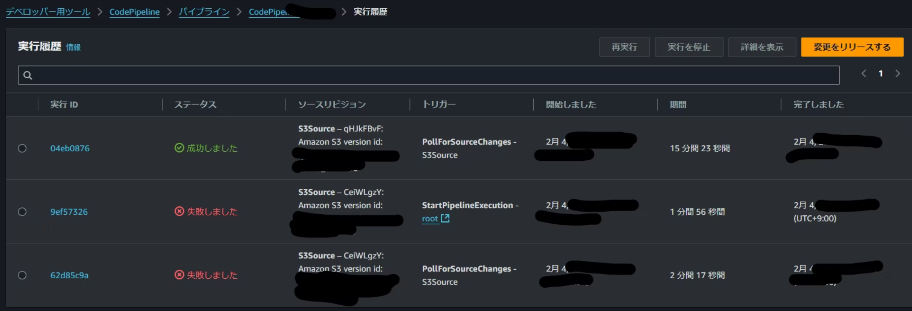

# リリース作業を効率化！AWS CodePipeline によるリリースのススメ

山本 直弥（Nao）

## リリース作業の工程は多種多様
一言にリリース作業と言ってもプログラムを置き換えるだけではありません。プログラムをGitリポジトリや専用のストレージに配置してリリース前のテストを行い、時にはCloudFormationの変更セットを作成して、時にはリリース担当者の確認と承認を得て、問題が見つかれば最初からリリース作業を行い、問題がなければ環境に反映してリリース作業を完了させるなど、一連のリリース作業には多くのステップがあり、そのステップはプロジェクトや所属する組織によって様々な形があります。  

## AWS CodePipeline ならリリース作業の各ステップを自由に定義して自動化できる！
例として、CloudFormationテンプレートをデプロイする際に開発者がS3にテンプレートを配置した後に変更セットを作成して、変更セットの内容をデプロイ担当者が確認して承認が得られれば変更セットを実行してリリース作業を完了する工程をCodePipelineで実現したイメージ図を下図に掲載します。  

  

この工程を人手のみで実施しようとすると多くの手動作業が発生して手間がかかります。AWS CodePipeline を使用することで他のサービスとの連携も必要なこの一連のリリース手順を、トリガー(この例ではS3にテンプレートがアップロードされる)を検知して自動実行されるパイプラインとして定義することが可能です。もちろんこの例以外の様々なリリース手順のニーズに対応する形でパイプラインをカスタマイズして管理することも可能です。  

## 自動で実行されるだけではなく、人の確認を待つことも可能！
AWS CodePipeline は自動で処理が実行されるだけではなく、人のレビューと承認を待つことができ、その際に承認ではなく却下されれば途中まで進んだリリース工程を元の状態に戻すことも可能です。  
↓レビュー待ちの状態のパイプラインの工程  
  

## 過去の実行履歴も参照可能！
パイプラインの実行履歴は参照可能です。いつリリース作業が行われて、失敗やレビューが拒否された場合はその原因やデプロイ担当者のコメントなどを確認することが可能です。手動でのリリース作業で懸念されるような、過去にどんなリリース作業をしたか忘れるなどの心配はありません。  

↓レビュー待ちの状態のパイプラインの工程  
  

#### 著者紹介

---

    
    

        

            <b>山本 直弥 ( Nao )</b>  
            X：<a href="https://x.com/nananaonana7">https://x.com/nananaonana7</a>  
            Qiita：<a href="https://qiita.com/Nana_777">https://qiita.com/Nana_777</a>  
            lit.link：<a href="https://qiita.com/Nana_777">https://lit.link/nao777nanaarchitect</a>  
            所属：<a href="https://jawsug-nagoya.connpass.com/">JAWS-UG 名古屋支部</a>
        

    

2025~ AWS Community Builder (DevTools)   
2023~ AWS All Certifications Engineer   
今力を入れてること：技術アウトプット(LT登壇、ブログ投稿など)   
すきなもの：バーチャルおばあちゃん、ながの（ちいかわ）、真勇者ルーサー、神田伯山さん   

