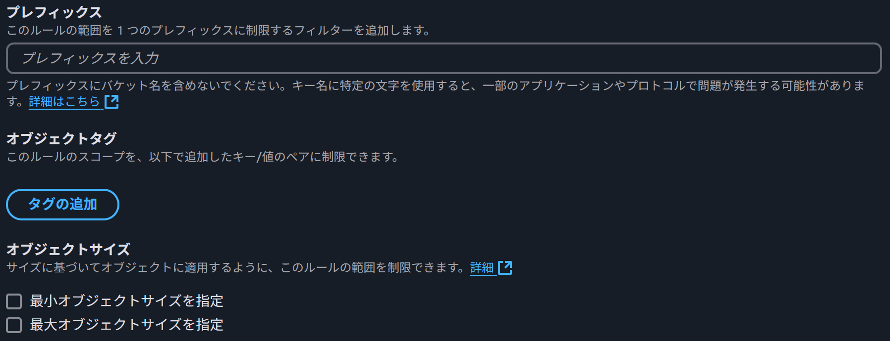
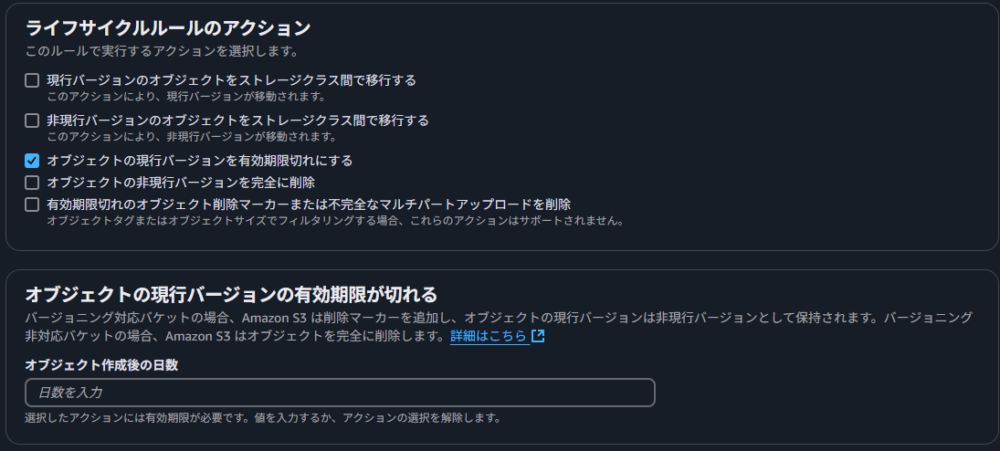
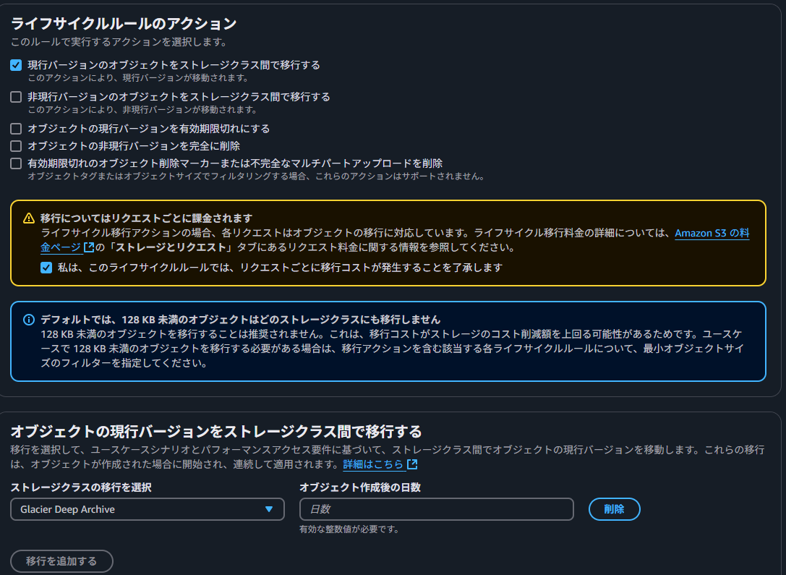

# ストレージの過剰課金を防ごう！S3ライフサイクルのススメ

山本 直弥（Nao）

## 不要なオブジェクトをストレージから自動削除！
Amazon S3 内の不要なオブジェクトがいつまでも保存されていたり、無駄に読み込まれている場合は無駄なコストが発生しています。S3のライフサイクルを設定することでオブジェクトの自動削除が実現できます。削除対象のオブジェクトは特定のプレフィックス(フォルダ)に入っているものや、特定のタグがついているもの、特定のオブジェクトサイズのものなどでフィルターが可能です。また、バージョン管理されているオブジェクトのうち現行のバージョンか非現行のバージョンかを選択できたり、何日間経過したオブジェクトを削除するかなどの条件指定も可能です。  

↓ライフサイクル設定(フィルター設定)  
  

↓ライフサイクル設定(条件設定)  
  

## 削除はしたくないオブジェクトを安いストレージに自動で移動！
Amazon S3 内のオブジェクトはどこ(どのストレージクラス)に保存されているかによって、課金の計算方法が変わります。大まかに説明すると、素早くデータを取り出しできるストレージクラスほど高額で、データの取り出しに時間がかかるストレージクラスほど低額で利用できます。例えば、ログデータのようなずっと残しておきたいがめったに参照しないようなオブジェクトはしばらく時間が経過した後でより低額なストレージコストに移行したほうが良いかもしれません。  
オブジェクトの自動削除と同じ設定画面のライフサイクルルールのアクションの設定でストレージクラス間で移行するを選択することでどこにオブジェクトを移行するかが選択できます。  

↓ライフサイクル設定(ストレージクラス移行条件)  
  

## さいごに
不要なオブジェクトの精査と削除や移行を人力でやるのはかなり大変な作業だと思います。これを簡単な設定で自動で行ってくれるのは素敵ですね。

### 著者紹介

---

    
    

        

            <b>山本 直弥 ( Nao )</b>  
            X：<a href="https://x.com/nananaonana7">https://x.com/nananaonana7</a>  
            Qiita：<a href="https://qiita.com/Nana_777">https://qiita.com/Nana_777</a>  
            lit.link：<a href="https://qiita.com/Nana_777">https://lit.link/nao777nanaarchitect</a>  
            所属：<a href="https://jawsug-nagoya.connpass.com/">JAWS-UG 名古屋支部</a>
        

    

2025~ AWS Community Builder (DevTools)   
2023~ AWS All Certifications Engineer   
今力を入れてること：技術アウトプット(LT登壇、ブログ投稿など)   
すきなもの：バーチャルおばあちゃん、ながの（ちいかわ）、真勇者ルーサー、神田伯山さん   

