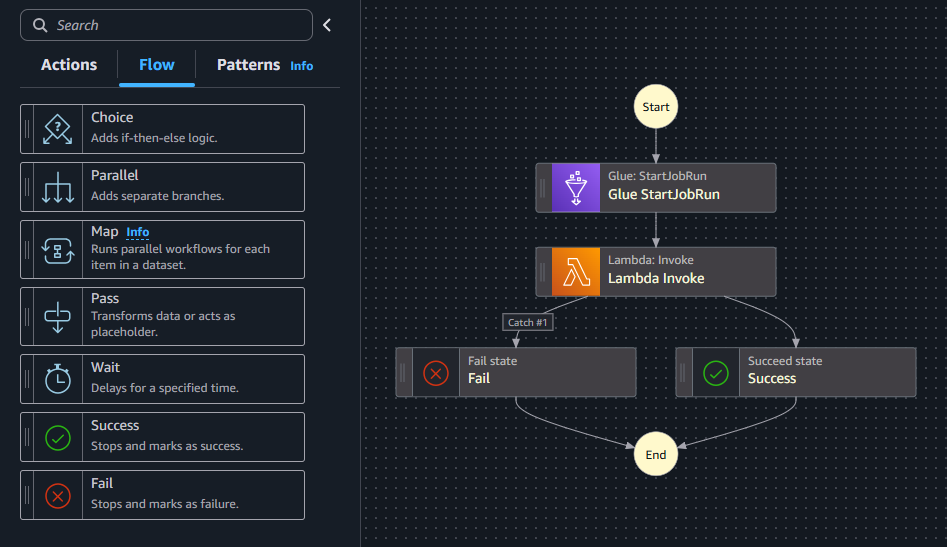
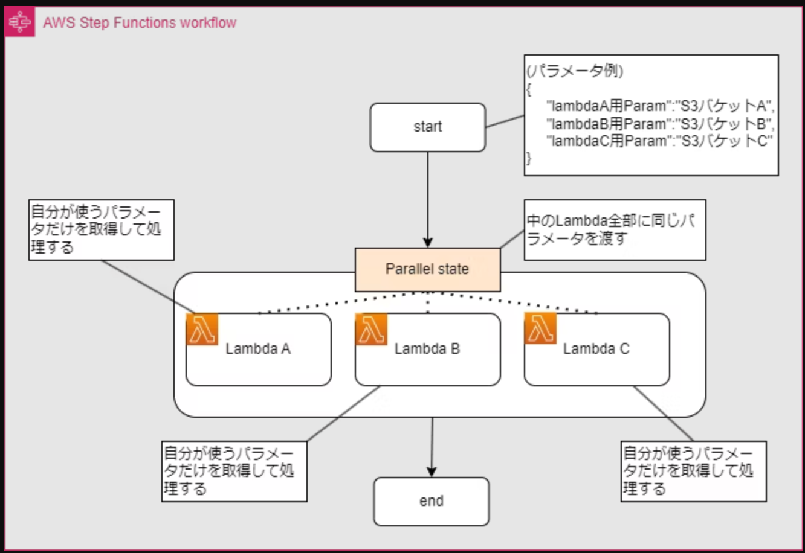
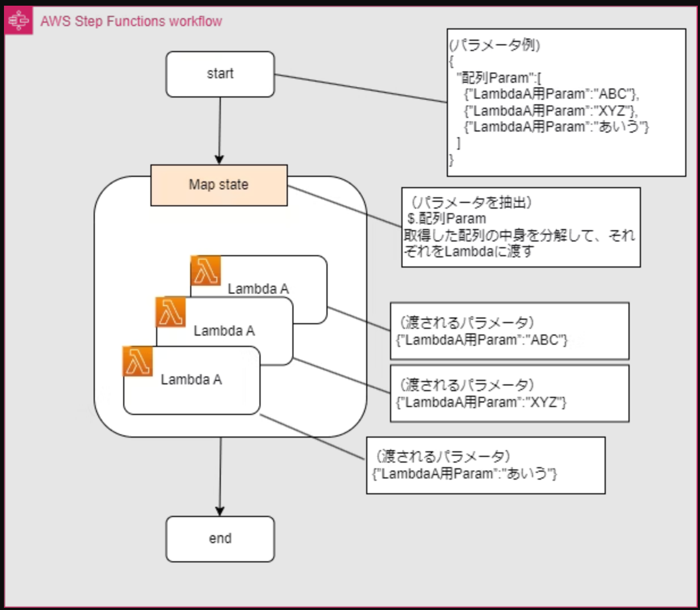

# Lambda関数のタイムアウトが心配？StepFunctionsのFlow制御のススメ

山本 直弥（Nao）

## Lambda関数のタイムアウトは最大15分の制限がある
Lambda関数は15分までしか処理を続けられません。処理するデータが多い場合など処理時間が15分以上かかってしまう場合に処理リソースを増やしたり別サービスで実装し直したりと様々な検討が行われます。今回の記事ではStepFunctionsのステートマシンを利用した方法を紹介します。  

↓ステートマシンのFlow制御アイテム  

## 異なる処理を並行実行するParallel
1つのLambda関数に多くの種類の処理を行うコードが含まれる場合、コードを分割して1つのLambda関数が担う処理を減らすことを検討してみてください。処理が分割できると同時並行で処理を行うことが実現できます。同時並行処理をStepFunctionsで実現するためには
ステートマシン作成時にParallelを選択してその内部にLambda関数を配置することで実現できます。複数の処理を同時に実行できるので全体の処理時間は短縮できます。  

↓Parallelによる並列実行のイメージ  

  

## 同じ処理を別のデータで並列実行するMap
Lambda関数のコードはこれ以上分割できないが、処理するデータ量が多い場合はLambda関数の並列実行することを検討してみてください。並列実行処理をStepFunctionsで実現するためにはステートマシン作成時にMapを選択してその内部にLambda関数を配置することで実現できます。同じ処理が異なるデータを並列で処理するため全体の処理時間は短縮できます。

↓Mapによる並列実行のイメージ  

  

## さいごに
並行処理や並列処理をプログラミングで実現するのは手間がかかると思いますが、AWSではこれをサービスの組み合わせで実現できるのは素敵ですね。

### 著者紹介

---

    
    

        

            <b>山本 直弥 ( Nao )</b>  
            X：<a href="https://x.com/nananaonana7">https://x.com/nananaonana7</a>  
            Qiita：<a href="https://qiita.com/Nana_777">https://qiita.com/Nana_777</a>  
            lit.link：<a href="https://qiita.com/Nana_777">https://lit.link/nao777nanaarchitect</a>  
            所属：<a href="https://jawsug-nagoya.connpass.com/">JAWS-UG 名古屋支部</a>
        

    

2025~ AWS Community Builder (DevTools)   
2023~ AWS All Certifications Engineer   
今力を入れてること：技術アウトプット(LT登壇、ブログ投稿など)   
すきなもの：バーチャルおばあちゃん、ながの（ちいかわ）、真勇者ルーサー、神田伯山さん   

