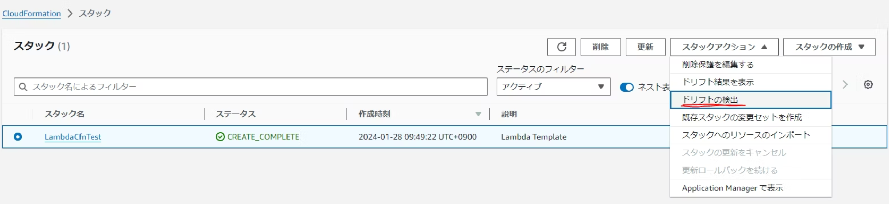
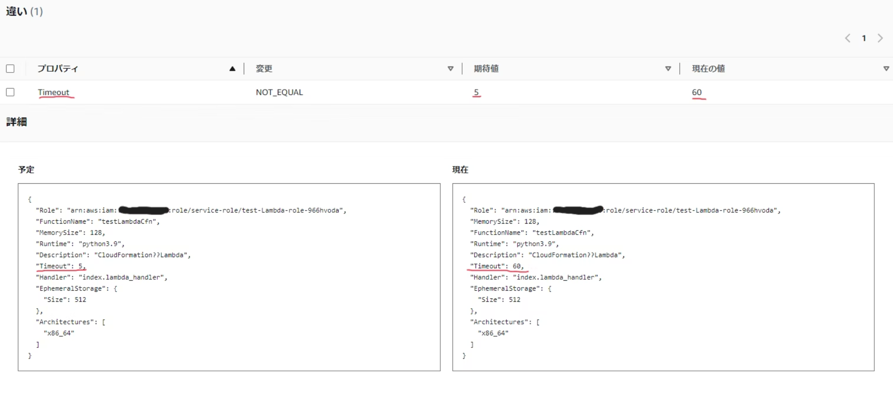
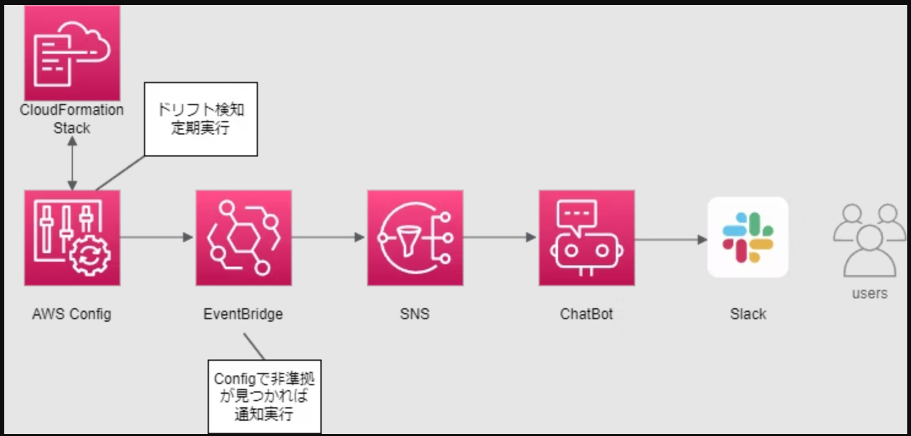

# 設定がいつの間にか変更されてない？CloudFormationドリフト検出のススメ

山本 直弥（Nao）

## CloudFormationテンプレートと実際の定義の差分確認はドリフト検出で！
CloudFormationを使ってAWSのリソース定義をIaCコードとして管理すると、Gitなどで変更差分の確認が容易になります。ただし、IaCコードで管理していてもAWSマネージメントコンソールからリソースの定義を直接変更された場合、IaCコードだけ見ていても変更されたことに気が付きません。そこで、CloudFormationと実際のAWS環境のリソース定義の差分を確認するために利用するのがCloudFormationのドリフト検出です。

## CloudFormationのコンソール画面から簡単操作！
ドリフト検出を行う方法は簡単です。CloudFormationのコンソール画面で差分を検証するスタック(テンプレートに定義されたリソース群)を選択して、「ドリフトの検出」を選択するだけ。検出結果はドリフト(差分)がない場合は「IN_SYNC」という表示がされ、ドリフトがある場合は「MODIFIED」が表示されます。ドリフトがある場合はどのような差分が発生しているかを確認することができます。  

↓CloudFormationのコンソール画面からドリフト検出を実行する  
  

↓ドリフト検出があった場合。Lambda関数のタイムアウト設定が変わっていることを確認  
  

## Cognitoを使って定期監視も可能！
ドリフト検出は毎回コンソール画面から手動チェックが必要かと言われると、そうではありません。Cognitoを利用することで定期的にドリフト検出を行うことでドリフト検出を自動化できます。検出した際にはEventBridgeなど他サービスと連携してドリフト検出されたことをユーザーに通知したり、Lambda関数を利用してCloudFormationテンプレートを再反映して自動修復するなど、任意の対応を自動で行うことができます。  

↓自動実行のドリフト検出結果をユーザーに通知するアーキテクチャ例  
  

　

　

　

　

　

#### 著者紹介

---

    
    

        

            <b>山本 直弥 ( Nao )</b>  
            X：<a href="https://x.com/nananaonana7">https://x.com/nananaonana7</a>  
            Qiita：<a href="https://qiita.com/Nana_777">https://qiita.com/Nana_777</a>  
            lit.link：<a href="https://qiita.com/Nana_777">https://lit.link/nao777nanaarchitect</a>  
            所属：<a href="https://jawsug-nagoya.connpass.com/">JAWS-UG 名古屋支部</a>
        

    

2025~ AWS Community Builder (DevTools)   
2023~ AWS All Certifications Engineer   
今力を入れてること：技術アウトプット(LT登壇、ブログ投稿など)   
すきなもの：バーチャルおばあちゃん、ながの（ちいかわ）、真勇者ルーサー、神田伯山さん   

