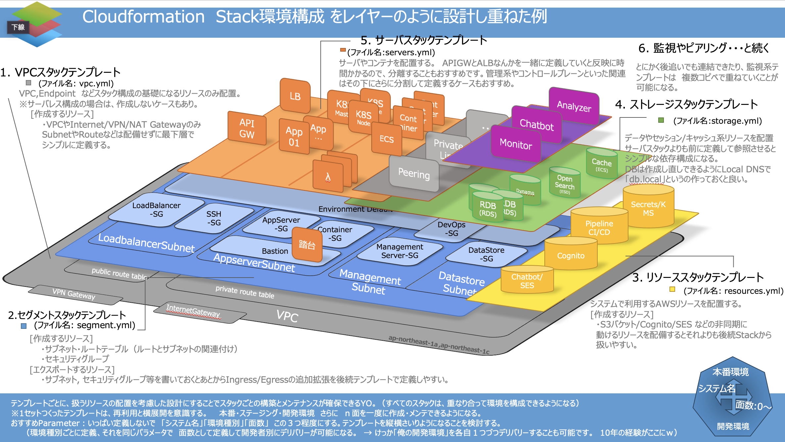

# Cloudformationをレイヤ管理しよう

<div class="flush-right">
おーつき
</div>

<br>

CFnテンプレートを活用して、Stackを重ねて管理するといいこと３つとその方法をご紹介します。

* Gitでインフラの構成を管理することができる、つまり環境構成をDiffできる。
* リソースの配置とメンテナンスがシンプルになる。
* さよならExcel、脱パラメータシート実現とステージとメンバー分縦横展開できる。

## 作り方のおすすめ
1. システム構成図をおこし、まず手作業でリソースを構築し依存しそうなポイントをメモる。

1. パラメータを最小限で定義し、Stack間で参照が後方からできるように設計をする。
    - パラメータは [システム名], [環境種別], [面数] にしぼり、リソースの命名規則を定義する。
    - 物理名はパラメータを利用したもので構成する（例:　CFSystemName-d1-rds-RDS010)
        ```
        !Join [ '', [ !Ref SystemName, '-',!FindInMap [StackConfig,EnvLabel,!Ref EnvType], !Ref Mensu, "-rds-", !FindInMap [ RDB010, NameSuffix, !Ref EnvType ] ] ]
        ```    
1. Stackを分割し、レイヤーを重ねて１つのシステムを構成する
１枚のイメージにしました。詳細は、Blog「CloudFormationをおぼえよう」で解説しています。

<br>



## お勧めコンテンツ3選
1. 「Cloudformtion をおぼえよう」紹介しきれなかったTipや貯めたナレッジを共有しています。
    - https://qiita.com/plustick/items/8a6c78b6aad7135e53b1
1. Black Belt (`Cloudformation`で基礎と抑えるポイントがとても参考になります)
    - https://pages.awscloud.com/rs/112-TZM-766/images/AWS-Black-Belt_2023_AWS-CloudFormation-Dev-Test-Deploy_1231_v1.pdf

*それでは良い！　DevOpsライフをお送りください。*<br>

### 著者紹介
---

<div class="author-profile">
    
    <div>
            <b>おーつき</b>
            @ 大槻　剛
    </div>
</div>
<p style="margin-top: 0.5em; margin-bottom: 2em;">
某SIer会社で、クラウド&コンテナ xDevOps推進エバンジェリストとして、2024年 AWS 認定 Ambassadors 兼 AWS Japan認定Top Engineerを務めています。
アプリケーションフレームワークエンジニアとしてキャリアをスタートしクラウドやコンテナ技術とIaCに関する活動やパブリックイベントで皆の技術力底力アップを推進中です。
</p>