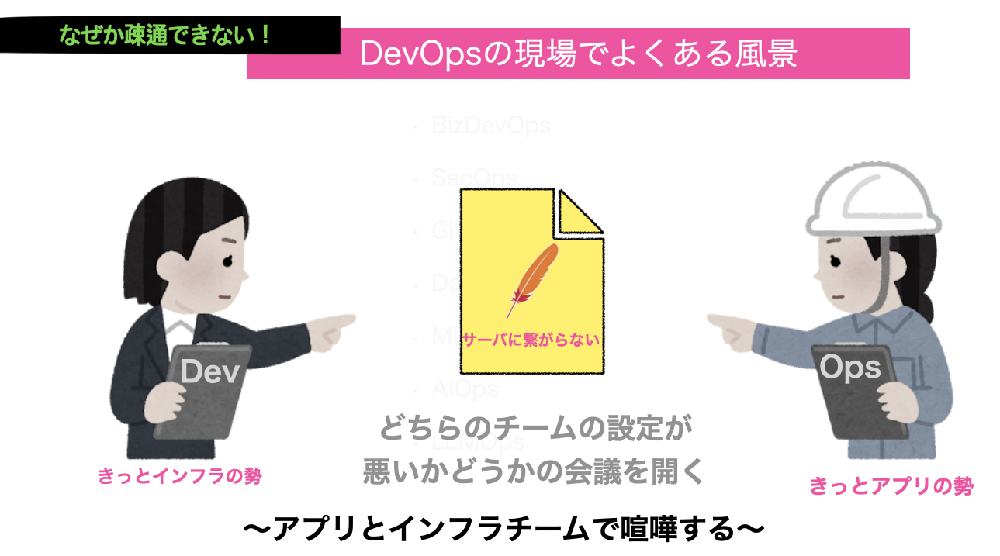
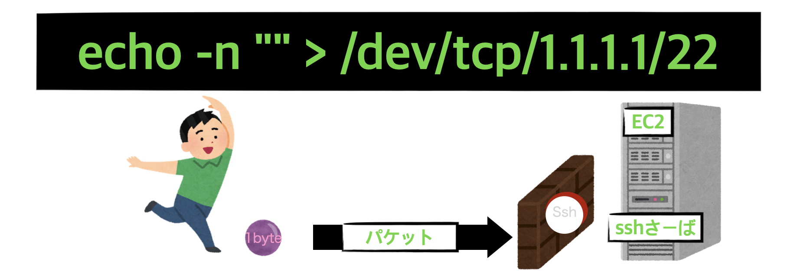
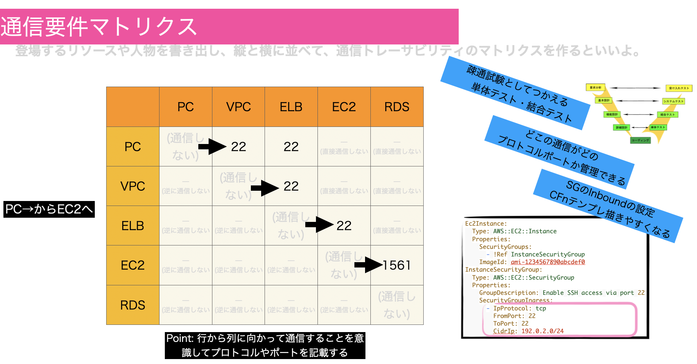

# みんなではじめる疎通試験

<div class="flush-right">
おーつき
</div>
システム構築したら最初にすること「疎通試験！」<br>
「インフラ設定しくじってない？アプリの設定が悪いんじゃないの？」なんてDevOps現場によくある光景。真のDevOpsエンジニアは、ツールを使いこなしみんなで仲良く案件をこなし、目の前にある問題をバサバサ倒すのが本当の目的です。そのために日々１００本ノックを読みこなし、ばっちコイするのにおすすめはNetworkManagerを使う・・・ですが、AWS大好き芸人おーつき、Bashさえあれば疎通ができる一歩もみんなに共有したいとおもいます！
<p>
    
</p>


## これ覚えておいて！　
- 疎通試験をするときみなさんはさまざまなツールを利用すると思います。ただ、クライアントアプリの設定が必要だったり、リソース間の疎通をダンプから読み解くには辛すぎる、案件上勝手にツールを入れられないなんて時のために以下のコマンド覚えて帰ってください！　

```
## 例) awsサイトの HTTPs サーバが生きてるか確認（aws.amazon.com はサンプルです悪用厳禁）
echo -n "" > /dev/tcp/aws.amazon.com/443
```

## コマンドの結果からわかる疎通状態３つ

| 実行結果(プロンプトが)                                 | 考えられる症状                                                             | 疑うべき箇所                                                               | 
| -------------------------------------------- | -------------------------------------------------------------------------- | -------------------------------------------------------------------------- | 
| 即戻ってくる                     | 対象のサーバや経路・ポートまで到達できている                               | アプリケーションもしくはOSのミドルウェアを再確認                           | 
| タイムアウトする                 | 外部もしくは経路のどこか設定に問題がある                                   | インフラ関係SG、OSの設定などで何か不備がないか再確認                       | 
| プロンプトが戻るが拒否・警告メッセージが出る | 経路的には到達できてるけど、サービスがストールしてたり制限をかけてたりする | Firewallやミドルウェアで制限、クライアント側の呼び出しに不備がないか再確認 | 

## IPとポートが分かれば　SSH疎通試験も、DBクライアントも不要です！

### どういうことか？  
解説：　一行のコマンドをワンライナーなんて呼びますが、こんなイメージです。
1. ``` echo -n "" ``` は、改行を含まない1byteの空文字を作るを意味します。つまりは１パケットと考えることができます。
1. ``` > ``` は、　リダイレクトで、右側に１パケットを投げて送出を意味します。
1. ``` /dev/tcp/{ホスト or IP}/{ポート番号}```　は、BashやLinuxは　搭載するデバイスをファイルとして考え設計されていることから、仮想デバイスTCP（NIC）に対して、フォルダ階層の考え方を利用して「対象のサーバ」と「そのポート」を　階層定義することで１パケットをサーバのポートに送り込めるかトライする




### 今日覚えて、お母さんに自慢できるワンライナーフォーマットはこれ！
対象のホスト（IPか名前解決できるホストの指定が可能）で開通しているはずのポートまで疎通できるかは、以下のフォーマットを覚えておくと確認できちゃいます。 正確にはTCPもUDPもできるんですが、UDPは投げっぱなしなのでTCPに有効です。おまけで ```timeout -s 30``` や ``` && echo "OK" || echo "NG" ``` なんてのも付け加えると色々と捗ります。

```
## 疎通試験するなら覚えておくべきコマンドワンライナー（Macの場合はbash を起動すると動きます）
echo -n "" > /dev/tcp/{IPもしくはホスト}/{対象のポート}
```

## 通信要件マトリクスを覚えると、単体試験から結合試験まで覚えられるYo

- オブジェクト指向アプリエンジニアな僕が最初に覚えた、インフラエンジニアってこうやって設計してテストするのかの基礎は以下を覚えると、小規模から大規模なんでもこいってなれます。

1. 相手のシステムに必要な情報としてのお話を聞く
1. システム構成図をおこす
1. リソース間の通信要件マトリクスを書いてポートの疎通状態を定義する
　　※一方通行の通信を行うことを前提に行列に同じリソースを配置して、交差する部分に通信ポートを記載する。
　　（必要なポートとSecurityGroupの設計網羅性や疎通試験の確認に使えるよ）
1. テスト項目書を単体レベルとして書く。結合テストも、総合試験でも使える手順書として以下を記載していけば良くなる
    - 「行リソース　から　列リソースへ、ポートXが疎通できる」ことを確認する。
    - テスト「手順は、以下のコマンドを実行する」（ここでさっきの echo ~ を記載する）
    - 結果が 即時プロンプトが戻ることできたら"OK"疎通成功とする。
1. Cloudformationを書き起こし、サーバはAnsible、テストはServerspec と　今回のコマンドをひたすら「僕はLambdaだ！テストをこなすStepFunctionなんだ！」と思ってテストする。

<p>
    
     
</p>

それでは良い！　DevOpsライフをお送りください。

### 著者紹介

---

<div class="author-profile">
    
    <div>
            <b>おーつき</b>
            @ 大槻　剛
    </div>
</div>
<p style="margin-top: 0.5em; margin-bottom: 2em;">
某SIer会社で、クラウド&コンテナ xDevOps推進エバンジェリストとして、2024年 AWS 認定 Ambassadors 兼 AWS Japan認定Top Engineerを務めています。
JAWS-UG 彩の国埼玉支部 に登壇できたので１００本ノック記事にしてみました。
</p>