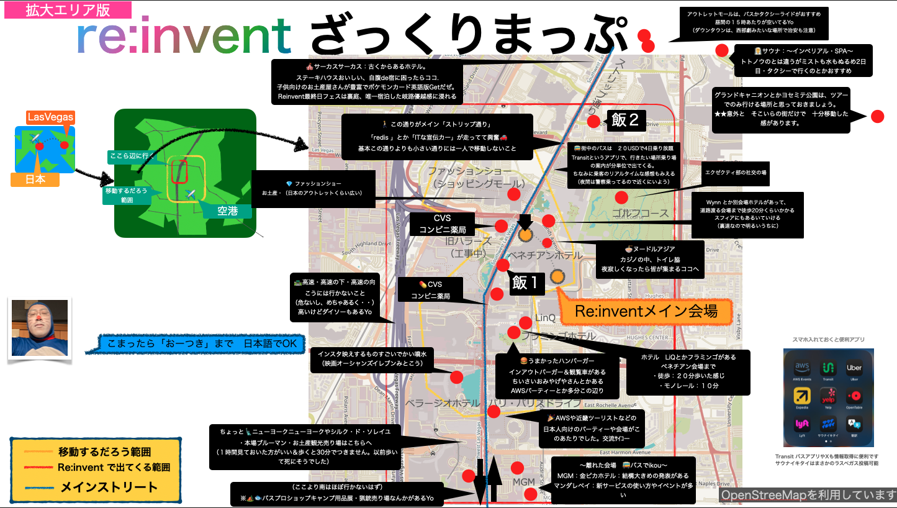

# それでもいきたいre:invent & 歩き方

おーつき

## Share My Lesson
今回、re:Invent2024に　自腹で行ってみました。行ったことによって得られた経験、得られた繋がり、得られた知識、生まれたパッションは、大きかったなと思いました。
巨大なAWSの祭典であり、世界中のクラウド技術者が集まる一大イベント。実際に参加してみると規模・臨場感に圧倒されつつ、自分の技術的知見を広げ、世界中のエンジニアと交流できる貴重な体験となった。この経験を通じて得た知識と刺激は、自身のキャリアと技術力の大きな飛躍につながっています。
- 準備から得られた成長と渡航準備で培われたスキル、re:Inventカンファレンスのチケット予約は複雑か？
    - 複雑ではなかったです。re:Inventサイトにログインしてクレジットカードを使うことで。　ここは 2,000 USD をポチれる踏ん切りです。　
- reinvent・飛行機、ホテルチケットをおさえる感動の一週間Blogに紹介いたします。（年末に向けまた更新していこうと思います）, https://qiita.com/plustick/items/abee4839e89a05511932

### We love aws!
* システム構成図は世界共有言語：英語？僕ら、システム構成図とAWSアイコンは世界共通言語話せるから現地で通じ合えます。「OhAreYouDevOpsエンジニア,MeToo。I LOVE CLOUD FORMATION,いってQ〜」で大丈夫！
* 移動と冒険：Transitというバスアプリと4日乗り放題パスをがおすすめ。メインストリートの範囲で薄暗い場所には行かない・不安な時はタクシーで。行動の幅広がります。
* スマホを持ち歩けば、セッション＆KeyNoteほぼこなせます。困ったら現地でキーボード買うか悩むくらいで十分です。
---
- （紹介は別ページでもしてるので割愛します）

## Building and map....現地はこんな感じ
   

| 現地で         | おすすめ                                                                                                                                                                                                                   | 
| -------------- | -------------------------------------------------------------------------------------------------------------------------------------------------------------------------------------------------------------------------- | 
| コンビニ＆薬局 | 水、ビール、お菓子やおつまみ、軽食、薬、下着衣類はCVSというコンビニで。大体何でも売っている、発熱・腹痛・二日酔いのお薬も買えますミネラルウォーター５００ｍｌ１０個パックとか買って部屋置いておくといい。                  | 
| 飯             | 朝昼：ベネチアン会場で朝食６時起き、昼食ランチボックスあり！ 夜：ホテル・コンビニやYelpでレストラン、ヌードルアジアへ 食べ逃したら：地図の「飯」あたりチャイナエクスプレス、ピザ、デニーズ、マクドナルドがある | 
| お金           | ・100USD 換金で十分（ホテルベッドチップ、カジノゲーム） ・Visa,Masterのカード（JCBはつかえない）                                                                                                                        | 
| 寝る時         | ・喉ヌールマスクしてねるのおすすめです ・下着：すてて帰れるようにおふるで。 ・わさびやエバラ・味噌汁もいらなかった５日間、ご飯楽しみましょう                                                                        | 
| 洋服：     | いる：ウィンドブレーカー、履き慣れたスニーカー、フリース 現地調達：シャツ、暖かいジャンパーはAWSロゴ入り 不要：スーツ、革靴はエクゼクティブになるまでは不要。 　　　ビジネスカジュアル襟あるといい        | 
| バッグ         | ・カバン：半分くらい開けてこよう・SWAGとお土産持ち帰るため ・サコッシュ：ちょこっと出歩く時、夜のパーティは軽装で ・バッグ：軽いせいぜいパソコンとタオル、水、ケーブル入る程度                                       | 
