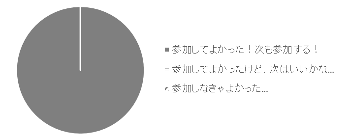
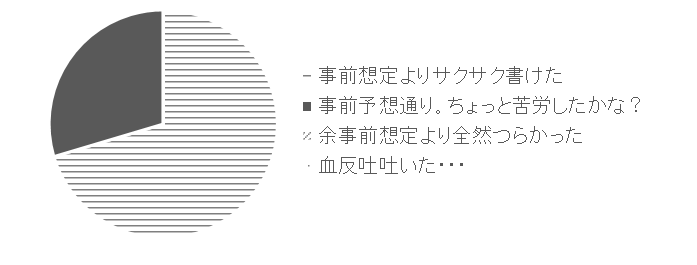
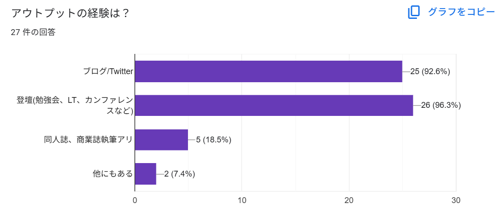
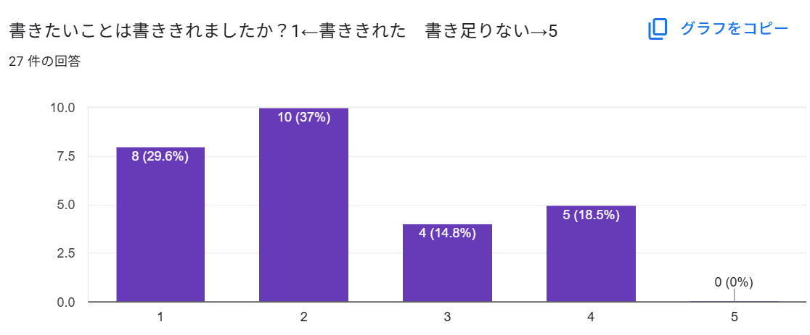

# 執筆振り返りアンケートまとめ

おやかた@oyakta2438

みなさん、執筆お疲れさまでした。

この本自体が、コミュニティを体現するものになりましたね。

本章は、執筆者の皆さんへのアンケートを整理しつつ、本書のふりかえりをしましょうか。

ぜんぶで27名の方に回答していただきました。

## 参加してよかった？

参加してよかったか？という質問に対しては、全員から「参加してよかった！」の満場一致の回答！

ありがとうございます。企画してよかった！

## 執筆は大変でしたか？

選択肢は4つ。

* 事前想定よりサクサク書けた　29.6%
* 事前想定通り。ちょっと苦労したかな？　70.4%
* 事前想定より全然つらかった　0%
* 血反吐吐いた　0%

嫌になるほど苦労した人はいなかったようです。良かった…

是非アウトプットはしてほしいし、アウトぷっとの価値は知ってほしいものの、嫌な思いをするのもまた違うと思いますので、
ちょうどよいレベルのアウトプットだったのかな、と考えます。

## アウトプットの経験は？

アウトプットをしている人は書きやすいのかしら？また、どんなアウトプット経験があるんだろうか？という観点での質問です。

* ブログ/Twitter　25人(92.6％)
* 登壇(勉強会、LT、カンファレンス)　26人(96.3%)
* 同人誌・商業誌執筆アリ　5人(18.5%)
* 他にもある　2人(7.4%)

さすがの登壇率。ほぼ皆さん登壇経験あるようですね。

書籍(商業誌、同人誌)の執筆経験ある人も2割弱。他にもある、という人も二人いましたが、「他」って何でしょうね。
チャンスがあれば聞いてみたいものです。

## 書きたいことは書ききれましたか？

書きたいことは書ききれましたか？

3くらいまではポジティブとみてよいですかね。数名の方がちょっと書き足りない印象だったようで、時間制約がきつかったせいか、企画編集側でのフォローが足りなかったからネタ出しに苦労して時間が無くなってしまったとかかな？と反省してみる次第です。

次回に向けてはもう少し時間を取りたいところですが、人間というものは一般に締め切り駆動なので、締切がないと動けないですよね…

## 参加してよかったこと。

* 技術書の執筆は初めてでしたのでいい経験になりました！
* 今年の目標の一つに書籍を書くことがありました。例えばZennなどで。そんな思いのなか実行できずにいましたが素晴らしい企画に出会い、参加できて本当に感謝してます。ありがとうございました。
* 書籍として私のアウトプット活動を残すことができたこと
* なかなか発信する機会のないテーマだったので、言いたいことが言えてスッキリしました
* 貴重な機会をいただき、ありがとうございました！どんどん増えていく推し記事を見て、これはすごいぞ・・・と感じました！
* 書籍執筆は初めてなので勝手にハードル高いなと感じていました。でも、少しずつをみんなで書くことでそのハードルを越えられたかなと思います。
* 自分も役に立つことあるんだなという気持ち。ページの収めること=読みたいことかを改めて学びました
* 書きたいことが色々出てきて良かった。
* 技術同人誌の執筆に関わるのは今回が初めてでした。1人では絶対に踏み出せなかった一歩を踏み出すきっかけをいただけてとても嬉しいです。
* 新しい方向のアウトプットを経験できました、ありがとうございます
* 初めて本執筆に貢献できたこと
* 印刷された本への寄稿は久しぶりなので楽しかった！執筆環境もよく出来ててとても勉強になりました。
* みなさんとワイワイしながら執筆するのが楽しかったです。
* 執筆という貴重など経験をさせていただき感謝しております。
* 単純な技術的な事と違って、想定よりも全然書けなくて難しかった。
* 元々ブログ執筆などは Markdown で書いていたのですが、以前から気になっていた Vivliostyle を活用できたことがとても有益でした。個人でどこかのタイミングで試してみたりしていただろうとは想像するものの、実際に出版する流れまで（横目で）拝見することができて参考になりました。
* 厚い本に参加するの久しぶりなので嬉しいな～って気持ちです
* 文章にまとめることで自分の中の「推し」に関わる考えが整理された
* 本を書くということへのハードルが下がりました
* ブログを書くチャンスは多いが本の出版にかかわるチャンスはほとんどないので貴重な機会を得られて光栄だった
* 初めての執筆をここでできたので、次回に向けての精神的なハードルが下がったと思います。
* 初めての同人誌制作への参加だったので、Vivliostyleでの執筆の流れを体験できて良かったです！
* 自分の体験が本になるってちょっとうれしい
* git使うの初めてだったので勉強になりました。1人を本を書くとなるととんでもないハードルがあると思いますが、今回は書くことに集中でき良かったです。
* こういうアンソロに参加することが少ないので、楽しい。
* さまざまな方面からのAWSの触れ方わかって、興味深かったです
* ほかの寄稿者さんの書き方や、着眼点が参考になった。
* GitHubの使い方を勉強できた
* 思い出になった
* 企画ありがとうございました！他の人が書いた記事を読めて良かったです

## 次回への改善点(編集、執筆環境、レス状況、レビューなどなど)
* いろんなバックグラウンドの方がいてGithubでの原稿管理が初めての方もいらっしゃると思いますので、fork→ブランチ追加→執筆→ローカルでのチェック→プルリクエスト→マージの手順を丁寧に解説してあげても良いかと思います！
* 組版の仕組みやビルドまでの工程が自動化されていて感動しました。中身も研究したくなりました。
* vivliostyle.config.jsを手動追加した場合、コンフリクトを起こすリスクがありそうだなぁと思いました。（CI/CDで自動追加したほうが安全？）
* 特に不都合は感じませんでした。ありがとうございます
* 特にありません。参加するハードルが低くてありがたかったです。
* vivliostyle.config.jsのentryでコンフリクトが発生することが多いので、特定フォルダ配下のMarkdownファイルを読み込むなどでコンフリクトが発生しづらい仕組みなどがあるといいかもしれないと思います。
*  横レイアウト、贅沢いえばコマ割り／組版を自分は学んだ方がいいなと思いました
* 締め切り駆動で書き始めて自己レビューとかが十分できていないので、最終レビュー会みたいなのがあると嬉しいです。
* オンプレインフラエンジニア中心の経験のため、大人数でのgithub上での開発経験がなく、フォークからプルリクまでの流れで他の執筆者の方々に迷惑を掛けていないか不安に感じながら作業をしていました。(勉強します)時間があると思って油断していたら、あっという間に5月になっていたので勿体なかったです。
* 執筆環境を統一(例えばnpm scriptでLintをするとか)
* 同じ人が量産する形になってしまったため、そこは均等になるようにしたい。
* 皆で書くのは楽しいので、また機会あれば是非参加してみたいです。
* Slack チャンネルでの質問にも即レスしていただけて手を止めざるを得ないタイミングがほとんど発生ませんでした。
* Forkして出すの初めてだったので少し手間取りました、初歩的なとこですがGitのコントリビュータやったことないひと向けの簡易StepByStep欲しかったなと思います
* 誤字脱字チェックはAIに任せる仕組みがあってもいいかも
* 正直あまりないかもしれないですが、あえていうならビルド速度ですね。
* 自分自身が期限ギリギリに書いてしまったので（すみませんでした）、次回はもっと早く書くようにしたいと思います。
* 複数人が編集するファイル(目次ファイル:vivliostyle.config.js)でコンフリクトが起きやすかったので、もし別の方法があればと思いました。
* githunは慣れてないのでやりにくかった。
* 途中参加にも関わらず、丁寧に対応いただきありがとうございました。特にございません。
* スレッドで進捗わかりやすかったです！　Vivliostyleに慣れているので執筆も問題ありませんでした。図はレギュレーションがあるなら（みやすさとかサイズとか）、なにか指針示すといいかもです（文字が大きすぎたり、小さな過ぎたりしがちなので）
* slackを追うのが大変だったので、スケジュールやアイディアのまとめ方などは、ピンするかファイルとして分かりやすいところにおいてあると、ありがたいです。
* 一定数、githubの基本操作にも慣れていない人が執筆されていたので、間口の広さが逆に少し気になりました。AWSでいうところの、セッションレベル別の記事数を設けることも検討しても良いかも、というアイデアです。https://dev.classmethod.jp/articles/what_is_aws_seminar-level/

　

　

特に不満はない、といった回答をくださった方もありますが、やはりvivliostyle.config.jsのコンフリクトについては運用が難しいですね…新しい章が増えるたびに追加するので、ここがコンフリクトしやすいのは事実です。すべて編集長で追加します！という運用もありますが、それはそれで原稿が漏れる(本体に反映を忘れる)があるので悩ましいところ。

いろいろ説明の時間がなくて、執筆環境のフォローや手順の説明が雑になってしまったところは申し訳ないところ。次回以降はやり方の説明をピン止めしておくとか、何か分かりやすいブログでも作れるとよいですね…

レビュー体制に関するコメントや、AIを使った校正、メンバー同士のレビューなどの提案もいただきましたね。次回の企画があれば反映できるようにします！