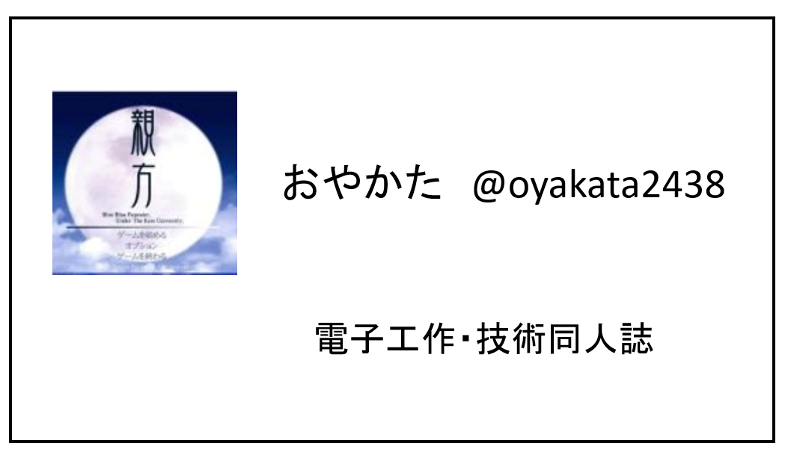

# コミュニティ用名刺を作ろう

おやかた@oyakata2438

勉強会やオフラインイベントに参加している皆さん、是非「コミュニティ向け」の名刺を作りましょう。

シンプルな名刺で、名前(ハンドル)、アイコン、SNSのID(X(旧Twitter)など)、興味ある内容などを並べるだけで充分です。

### 本業名刺があるじゃない
本業名刺があっても、SNSのIDが書いてないですよね。その結果、「xxさん、いつもSlackでお世話になってます」となるのが難しいです。もちろん対面では可能ですが、家に帰ってから、どの人だっけ…となりますよね。

また、勤務先などはそもそも機微な個人情報ですね。直ちにどうこうなることはないにせよ、ガチの競合他社だったら…しかも会社同士が仲悪かったりするとなおさら気まずい…

## 名刺ってどうやって作る？
まずは、「名刺印刷」とかでググってみましょう。たくさんの会社がヒットします。100枚で500円以下程度から作れます。

テンプレートも用意されていますし、印刷所によってはWordやPowerPoint用のテンプレートラクスル　名刺の印刷テンプレート　https://raksul.com/template/businesscard/を用意しているところもあります。Wordやパワポなら、お高いIllustratorがなくても作れます。

{scale=30%}

アイコン、名前、SNSのID,興味ある事などを適当に並べるだけでも、立派な名刺です。

デザインに悩む話ではなく、とりあえず持っていること、勉強会/懇親会で渡せることが重要です。

デザインに凝ったものが欲しければ、1箱配り終わる頃に考えましょう。

勉強会に参加するようになったら、コミュニティ向け名刺を是非とも作りましょう！

#### 著者紹介

---

    
    

        

            <b>親方 </b>
            <a href="https://twitter.com/oyakata2438">X@otakata2438</a>
        

        

            サークル名：親方Project
        

    

ワンストップ本シリーズ企画・編集（一部執筆）してます。コミケと技術書典に出没。ついに技術書同人誌博覧会（技書博）のコアスタッフとして運営側に参加。技術書イベントが増えて嬉しいけれど、イベント多すぎて外出チケットと徳が不足気味。徳を貯めるべく、家事をこなしつつ、ラボに遊びに行ったり、飲み会や懇親会で著者を新規開拓したり。著者募集はいつでもやっていますので、ぜひご参加ください。

