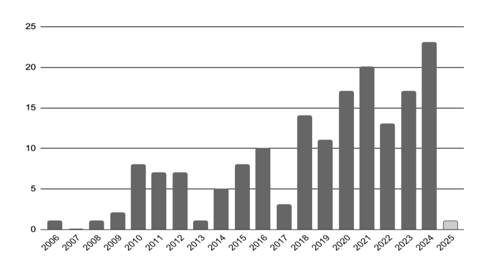
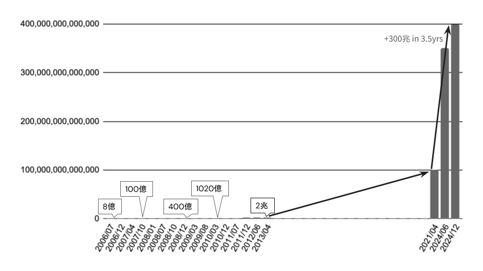

# S3のココがすごい！アマゾンの奥地に想いを馳せよう

早川 裕志@pwnp0n

Amazon S3は2006年3月14日にリリースされました。当時Amazon Simple Queue Service (SQS) がβリリースとして提供されていましたが、GAされたサービスとしてはS3が最初のサービスだったようです。S3はAWSを代表するサービスのひとつであり、リリース15周年を迎えた2021年にはS3のリリース日を円周率（π）になぞらえたPi Weekというイベントが開催されました。以降も毎年3月14日にPi Dayというイベントが開催されており、S3には多くのファンがいることがうかがえます。

AWSをお使いの方の多くがS3を利用していると思いますし、S3は多くのAWSサービスの裏側でも利用されていることから、意識せずにその恩恵を受けている方も少なくないでしょう。今回はそんなS3の推しポイントを3つ紹介したいと思います。

## 19年間弛まぬ進化

S3はリリースから19年超の時を経た今も、AWSの根幹を支えるサービスとして開発が続いています。筆者は一昨年に（幸運にも？）S3のアップデートを全て振り返る機会に恵まれて以来、アップデートの整理を続けています。一口にアップデートといっても、機能追加や料金改定、利用可能リージョンの拡大、他のサービスとの連携など様々です。また、複数の機能がまとめてアナウンスされている場合もあり、何を持って1つのアップデートとカウントするか明確な基準もありませんが、筆者は今年のPi Dayまでに累計257個のアップデート（内、機能アップデートが169個）があったと考えています。これは独自基準での分類にもとづくものですが、2024年についていうと、筆者集計で29個に対してre:Invent 2024の「 What’s new with Amazon S3 (STG212) 」というセッションで過去12ヶ月で30個と発表されていることから、累計数についても大きく外してはいないと思っています。

{width=70%}

アップデートについて特に注目すべきは、年間のアップデート総数が増加傾向にある点です。公開から19年も経てば、大きなアップデートは減ってくるというのが多くの方の見立てだと思いますが、実は2024年のアップデート総数が過去最多と今もアクティブに開発が行われています。ワークロードの性質や、ハードウェアの進化等によってソフトウェアのアーキテクチャは変化していきますが、S3はそれに適応すべく常に進化を続けています。

## クールすぎるエンジニアリング

S3に保存されているオブジェクト数は、リリース後4ヶ月で8億個、2013年4月に2兆個に到達しました。リリース後、約7年で2500倍と大きく増加したように見えますが、2021年には100兆個、2024年12月には400兆個を超えており、指数関数的に増加しています。2024年後半は、半年で50兆個も増加しました。また、S3は2023年当時で秒間平均1億回を超えるリクエストを処理しており、2024年のre:Inventでは数億回に到達していることが公表されました。

{width=70%}

このような超大模システムを扱ったことがある人は稀だと思いますが、規模によってもたらされる問題にどのように対処しているのか興味・関心を持たれる方は多いと思います。S3に限らずAWSはサービスの内部設計について多くを明らかにしておらず、まさにアマゾン奥地の秘境といったところですが、様々な公開情報を寄せ集めて紐解いてみると、超大規模スケールは問題だけでなく、多くの恩恵をもたらしているであろうことが見えてきます。

ユーザにとってストレージは高速かつ安価であることが理想です。しかし、記憶階層という言葉があるように高速な記憶媒体は高価です。あるオブジェクトのデータを1台のドライブに全て配置する場合、安価なドライブでは高速なアクセスを期待することは難しくなりますし、高価なドライブを使用してもアクセス速度はそのドライブ1台の性能に制限されてしまいます。

RAIDについてご存知の方であれば、複数のドライブを束ねてデータを分散配置することで、これらの問題に対処することを思いつかれるのではないでしょうか？安価なドライブであっても、オブジェクトを分割して複数のドライブに配置することで並列にオブジェクトを読み込むことができるようになり、オブジェクト全体を読み込むために必要な時間を短縮することができます。

S3はErasure Codingを用いてデータを分散配置しています。Erasure Codingは、データを複数のチャンクに分割し、分割したチャンクを元にパリティチャンクを生成します。そして、それぞれを複数ドライブに配置することで、一部のチャンクが消失してもデータ全体を復元できるようにする技術です。数学的関数を利用することでトラディショナルなRAIDよりも高い容量効率を確保でき、異なるストレージノードにチャンクを分散させることで耐障害性を高めることもできます。RAIDではあらかじめ決めておいたドライブ群に対してチャンクやパリティを配置しますが、Erasure Codingではチャンクを配置するストレージノードやドライブ、チャンクの複製数等を柔軟に制御することができます。

実際に行われているか定かではありませんが、アクセス頻度に応じてチャンクの複製数を増やしたり、配置を最適化してホットスポットを解消するなども行われているかもしれません。Erasure Codingのおかげで多少のブロック消失は問題なく、積極的なリロケーションやアルゴリズムの改善などもやり易い気がします。また、複製したチャンクを投機的に複数ノードに同時に読み込みに行って、早い方を使用することでテールレイテンシーを低減するなど、より高度な制御が行われている可能性もあります。

より多くのドライブを使用すると総記憶容量も大きくなります。少数のユーザやワークロードのオブジェクトだけで全容量を使い切ることは難しくなりますが、異なるユーザやワークロードのオブジェクトとドライブを共用することで容量を無駄なく使用することができます。一般に、ストレージに保存されたデータが常時アクセスされることは少なく、多くはコールドです。また、異なるユーザやワークロード間であれば、アクセスタイミングが重なる可能性も低くなります。あるチャンクを配置したドライブがビジーな場合も、Erasure Codingのおかげで別のドライブに配置したチャンクを読み取れば元データを得ることができます。このように、S3においてErasure Codingは耐障害性だけでなく性能向上にも寄与しています。

Erasure Codingに加えて重要なのが、Shuffle ShardingとPower of Two Random Choicesです。Shuffle ShardingはAWSのサービスで多く利用されているデザインパターンのようなものですが、S3においてはリクエストの相関性を排除するために使用されています。例えば、同じバケットに同じキーを指定してオブジェクトをPUTする場合も、毎回異なるドライブが選択されます。現在S3では数千万台のドライブが利用されているそうですが、その中から最適なドライブをどのように選択するのでしょうか？数千万台のドライブを全てチェックするのは非現実的ですし、ランダムにドライブを選択するとデータが特定のドライブに偏って配置される可能性があります。これを解決しているのがPower of Two Random Choicesというアルゴリズムで、数千万台のうちわずか2台のドライブをランダムに選択して比較するだけで、データ容量の分布を効果的に改善することができているそうです。

もちろん、このような負荷分散はS3の巨大なスケールがあるからこそなせるわざですが、より多くのユーザが利用し、より多くのデータを保存すればするほど、性能もコスパも高まるという好循環につながる素晴らしい設計だと思います。S3は理論だけでなく、実際のデータにもとづく分析やシミュレーションが駆使された高度なエンジニアリングの賜物であるといえるでしょう。

## 長期安定稼働と高頻度な改善の両立

S3は驚異的な成長を遂げてきましたが、最初から現在のようなスケールが想定されていたとは考えにくく、S3の内部構造はそのスケール拡大や機能追加に応じて見直しが行われてきたと考えるのが自然です。現在、S3のストレージノードではShardStoreと呼ばれているKVSが動作していることが知られています。ここでShardStoreについて解説するのは避けますが、筆者を含めShardStoreの導入に気づいたユーザはいなかったと思います。

これを実現したのもErasure CodingとShuffle Shardingだと思われます。re:Invent 2024の「Dive deep on Amazon S3 (STG302)」というセッションでは、Shuffle Shardingを用いたドライブの選択において、Erasure Codingで分割したチャンクの保存先にShardStoreを段階的に採用していったことが紹介されています。

S3はデータを保管するサービスであり、多くのサービスが依存するAWSの根幹を支えるサービスです。このような重要かつ巨大なシステムに手を加えることにはリスクが伴うため、多くの場合、頻繁なデプロイに慎重にならざるを得ません。しかし、S3はユーザに気づかれることなく秘密裏にデプロイを積み重ね、19年間で170近い機能アップデートがリリースしてきました。このような大規模システムの長期安定稼働と高頻度な改善を両立しているS3チームには驚きしかありません。

## まとめ

AWSサービスの機能をキャッチアップすることも重要ですが、たまにその歴史や内部構造に思いを馳せてみると、そのサービスをもっと好きになれるかもしれません。今回はS3について私の推しポイントを3つ紹介させてもらいましたが、S3好きの人が増えるとうれしいです。ここで紹介できなかったS3の考察等もブログに記載していますので、そちらも見ていだければ幸いです。「S3成長記録」というキーワードで検索していただければ見つかると思います。

#### 著者紹介

---

    
    

        

            <b>早川 裕志 (Hiroshi Hayakawa)</b>
            <a href="https://x.com/pwnp0n">X@pwnp0n</a>
        

        

            Zenn: <a href="https://zenn.dev/p0n">p0n</a> 
            JAWS-UG配信部
        

    

🦄（AWS GameDay）と🦈（JAWS-UG）が好きです / AWS Ambassadors / AWS Community Builders / Japan AWS Top Engineers / Japan AWS All Certifications Engineers / AWS Samurai 2024 (as a member of JAWS-UG Streamers)

