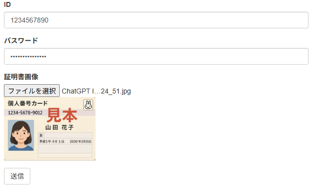
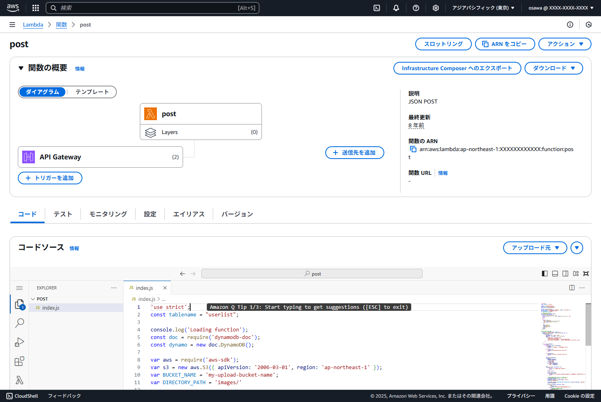

# 閑散としたシステムほど推したい「Lambda」
<div class="flush-right">
大澤文孝@sour23
</div>

## 「Lambda」ならコストダウンできる

AWSには、たくさんのサービスがありますが、僕が一番推したいのは「AWS Lambda」！

Lambdaは、サーバーレスでプログラムを動かせる環境です。

プログラムを作る必要があるので、わかりにくいサービスではあるのですが、うまく使うと、少量のプログラムで効果的に目的のITシステムを作れます。

そして使っただけの課金なので、待機が多いITシステムは大幅なコストダウンに繋がります。

だからそう、「閑散としたシステムほど、Lambdaを推したい」のです！

### Lambdaの仕組み

「Lambdaがいいよ！」と言ってみたところで、その仕組みを知らないと、その良さがわからないと思います。

そこでちょっとだけ、Lambdaについて解説します。

<br>

Lambdaは、サーバーレスと呼ばれる仕組みで動いています。

「サーバーレス」というのは、サーバーがないという意味ではなくて、サーバーをAWSが用意してくれるという意味です。

僕たちがやらなければいけないのは、「Lambda関数」と呼ばれる関数を作って、それをAWS Lambdaに登録することです。

登録すると、いわゆるスタンバイ状態になり、実行されようとしたときに、Lambdaランタイムと呼ばれる実行環境に展開され、そこで実行されます。この実行環境の準備、そして、実行そのものを都度、AWSが行ってくれるから、サーバーが必要ない、だから、サーバーレスと呼ばれています。

{width=70%}

### イベントの発生で実行される

登録済のLambda関数は、「イベント」を引き金にして実行されます。

イベントは大きく、「同期」と「非同期」があります。

<br>

同期の代表が、「Webからの呼び出し」です。HTTP（S）で接続したときにLambda関数を実行できます。いわゆる、「Webのバックエンド処理」を作るのに使えます。昔っぽく言ってしまうと、「LambdaでCGIが作れるぜ」ってことですね！

API Gatewayと組み合わせる、もしくは、Lambda単体で使えます。

{width=70%}

<br>

非同期は、AWSのさまざまなサービスと連携するものです。

代表的な連携は、Amazon S3。バケットにファイルが作成されたり、変更されたり、削除されたりしたタイミングでLambda関数を実行できます。

Lambda関数が実行されたときには、対象のオブジェクト名（ファイル名）がわかるので、そのファイルを読み取って何か処理できます。

よくある例は、「画像ファイルがアップロードされたときに、自動でサムネイル画像を作る」ような仕組みです。こうした仕組みは、S3だけでなくDynamoDBやAWS IoTなどでも使えるので、さまざまな、「ちょっとした処理のフック」によく使われます。

{width=70%}

### Lambdaの魅力

Lambdaの魅力は、コストです。

実行回数当たりの課金なので、Lambda関数を登録したけれどもスタンバイの状態なら無料です。

たとえばWebサーバーをEC2で構築する場合、いつアクセスがあるかわからないので、24時間起動しっぱなしにする必要があります。つまり、ずっと費用がかかります。

対してLambdaで実装すれば、実行されたときだけの課金なので、大幅なコストの削減が見込めます。

{width=70%}

もうひとつの魅力は、スケールしやすいことです。実行のランタイムは必要に応じて自動でスケールし、デフォルトでは最大100個まで同時実行できます（申請すれば増やせます）。

もちろん、どんどん実行されればコストはかかりますが、サーバーの負荷を考えなくていいのは、運用上、ありがたいです。

{width=70%}

<div class="column">
<div class="column-title">スタートの遅さを解決する</div>

Lambda関数は、必要になったときにLambdaランタイムに展開され、しばらく実行がないとランタイムが解放されるという仕組みのため、初回の実行やしばらく実行されなかったあとの実行が遅いです。

こうした初回の遅さは、プロビジョニングの設定を有効にすることで軽減できます。

プロビジョニングを有効にすると、必要に応じてランタイムを作るのではなく、あらかじめランタイムを作ってスタンバイ状態にしておく挙動になるため、起動の遅さがありません。

ただしプロビジョニングしている間ずっとコストがかかるので、コストのメリットがなくなります。
</div>

## 貧乏案件の「画像アップローダー」

ここまで説明してきたように、「ふだんあまり使われない閑散としたシステム」ほど、Lambdaのコスト削減の効果が大きいです。

僕は、過去にそんな案件の開発をしました。次のようなものでした。

- 本人確認のために、免許証やマイナンバーなどを集めなければならない
- 個人の確認資料なので、本人および本部以外が見れてしまうことは、絶対NG！
- 使用するのは、年に数十回
- それゆえ、開発コストも運用コストもかけられない貧乏案件 w

以下では、どうやって、これを作ったのか、その概要を紹介します。

### 構成図

本システムの構成図を下記に示します。

{width=90%}

#### フロントエンドはCloudFront + S3

フロントエンドはHTML（およびCSS）＋JavaScriptで構成。

これらは、静的ウェブホスティングを有効にしたS3バケットに配置。その前段にはCloudFrontを配置して、独自ドメインならびにHTTPS化する構成です。

#### バックエンドのLambda関数

バックエンドはAPI Gateway + Lambdaで実装<span class="footnote">いまならLambdaのHTTPSエンドポイントを構成すれば、API GatewayなしでLambda単体でも実装できるはず。当時は、HTTPSエンドポイントの機能がなかった。</span>。

入力された「ID」と「パスワード」をDynamoDBのテーブルと照合。正しければアップロードされたS3バケットに、「ID名.JPG」として保存します。

ここでセキュリティの重要なポイントがあります。

本システムでは、このLambda関数に対して、アップロード先のS3バケットには「書き込み権限」のみを与え、読み取り権限を与えないことにしました。

つまり、Web側からは、どうあがいても、アップロードされたS3バケットの画像を読むことはできないようにすることで、セキュリティを担保しました。

### 開発コストを抑える工夫

Lambdaを使うことで運用コストを抑えられますが、開発コストも抑えたいことから、次のようにしました。

#### IDとパスワードはExcelで管理

開発コストでバカにならないのが管理ページの開発です。

貧乏案件であり、開発コストをかけられないため、管理ページは「作らない」ことにしました。

IDとパスワードは、Excelで管理します。

Excelの特定のセルに、「AWS CLIで、DynamoDBのテーブルを更新するコマンド」を数式で設定しておきます。

この列をコマンドラインでコピペして実行することで、ID・パスワードの管理ページなしでの運用としました。

{width=70%}

#### アップロードされた画像はマネージメントコンソールで見る

アップロードされた画像を見られるWebのUIを作るのが理想ですが、セキュリティの設定を間違えたり、脆弱性があったり、また管理者パスワードが漏洩したりとかのことを考えると、かなり厄介です<span class="footnote">いまなら、[Storage Browser for S3](https://aws.amazon.com/jp/s3/features/storage-browser/)を使うことで、簡単で実装できそうですが･･･。</span>。

なので、マネジメントコンソールでログインして、「S3の管理画面から、勝手に見てね」ということにしました。

マネジメントコンソールのログインは、MFAを設定できますし、（今回はしませんでしたが）CloudTrailを使った監査もできます。

エンドユーザーが、マネジメントコンソールの使用に抵抗がないなら、開発工数を抑えられてGoodです。

### HTML + JavaScriptの構成

この記事はハンズオンではないので詳細は省きますが、どんなコードで実現しているのか興味がある人もいるかと思います。

ですので、抜粋したコードを少し、紹介します。

まずは、HTML + JavaScriptの部分です。

#### 入力フォーム

次に示す入力フォームを用意しました。画像をアップロードしたときには、JavaScriptで読み込んで、プレビュー表示するようにしています。

{width=70%}

HTMLは、次の通り。Bootstrapで組んでます。

```
<form id="post">
	<div class="form-group">
		<label for="uid">ID</label>
		<input type="text" class="form-control" id="uid">
	</div>
	<div class="form-group">
		<label for="pwd">パスワード</label>
		<input type="password" class="form-control" id="pwd">
	</div>
	<div class="form-group">
		<label for="image01">証明書画像</label>
		<input type="file" class="form-control" 
			id="image01" onchange="imageload();">
		
	</div>
	<button id="submit" class="btn btn-default" 
		onclick="onSubmit();return false;">送信</button>
</form>
```

#### 画像がアップロードされたとき

画像がアップロードされたときのJavaScriptのコードは次の通りです。

ReactやVue.jsを使っている人から見たら、卒倒モノの「jQuery」。しかも、HTML内に```<script>```でベタ書き w。

貧乏案件なので、ReactやVue.jsの環境整えてる工数すらとれないんですよ。

短いコードですが、アップロードされた画像を```img```要素に設定してプレビューできるようになります。

```
<script language="javascript">
function imageload() {
	const file = $('#image01')[0].files[0];

	if (!file.type.match(/^image\/jpe?g$/)){
		alert("対応するファイルはJPEG形式のみです。");
		return;
	}

	const imgreader = new FileReader();
	imgreader.onload = function(event) {
		const src =  imgreader.result;
		$('#preview').attr('src', src);
	};
	imgreader.readAsDataURL(file);
};
</script>
```

#### Lambda（API Gateway）へのポスト

［送信］ボタンがクリックされたときは、すぐあとに説明するLambda関数に、フォームの内容を渡します。

JSONのデータを作って、それを送っているだけです。

```
<script language="javascript">
function onSubmit() {
    const uid = $("#uid").val();
    const pwd = $("#pwd").val();

	// uidとpwdの未入力チェックのコード略

	const img = new Image();
	const file = $('#image01')[0].files[0];

	// ファイルの未アップロードおよび形式チェックのコード略

	var reader = new FileReader();
	reader.onload = function(event) {
		const src = event.target.result;
		// POSTURLはAPI Gatewayのエンドポイント
    	const POSTURL = "https://XXXXXX.execute-api.･･･略･･･";
    	const data = {
			uid : uid,
			pwd : pwd,
    		image01:src.split(',')[1]
    	};

		$.ajax({
			type : "POST",
			url : POSTURL,
			crossDomain: true,
			data : JSON.stringify(data),
			contentType : "application/json",
			dataType: "json",
			headers: { }
		}).done(function(json_data) {
			// 成功（コード略）
			alert('upload ok');
		}).fail(function(json_data) {
			// エラー（コード略）
			alert(json_data.responseText);
		});
	};
	reader.readAsDataURL(file);
}
</script>
```

### Lambdaの構成

そして次に、処理を受け取るLambda関数のほうです。

JavaScriptからは、下記の書式で送っているので、これを読み込んで処理します。

```
{
  uid : ユーザーID,
  pwd : パスワード,
  image01 : 画像のBase64形式データ
}
```

Lambda関数は、Node.jsやPythonなどで書けますが、今回は、Node.jsを使っています。

リストは、下記の通りです。

```
'use strict';
const tablename = 'userlist';

const doc = require('dynamodb-doc');
const dynamo = new doc.DynamoDB();

const aws = require('aws-sdk');
const s3 = new aws.S3({ apiVersion: '2006-03-01', region: 'ap-northeast-1' });
const BUCKET_NAME = 'my-upload-bucket-name';
const DIRECTORY_PATH = 'images/'

exports.handler = (event, context, callback) => {
    console.log('Received event:', JSON.stringify(event, null, 2));
    function done(err, res) {
        callback(null, {
            statusCode: (err  ? '400' : '200'),
            body: (err ? err.message : JSON.stringify(res)),
            headers: {
                'Content-Type': 'application/json',
                'Access-Control-Allow-Origin' :'入力フォームのサイトのURL',
                'Access-Control-Allow-Methods' : 'GET,POST,HEAD,OPTIONS',
                'Access-Control-Allow-Headers' :  
                    'Origin, X-Requested-With, Content-Type, Accept'
            }
        });
    }

    switch (event.httpMethod) {
        case 'POST':
            const jsondata = JSON.parse(event.body);
            if (!jsondata) {
                done(new Error('送信データ形式が正しくありません'));
                return;
            }
            if (!jsondata.uid) {
                done(new Error('ユーザーIDが入力されていません'));
                return;
            }
            
            if (!jsondata.pwd) {
                done(new Error('パスワードが入力されていません'));
                return;
            }
            
            const params = {
                TableName: tablename,
                KeyConditionExpression:
                    'uid = :UID',
                FilterExpression:
                    'pwd = :PWD',
                ExpressionAttributeValues: {
                    ':UID' : jsondata.uid,
                    ':PWD' : jsondata.pwd
                }                
            };
            dynamo.query(params, function(err, res) {
                if (err) {
                    done(new Error('DBアクセスエラーです。'));
                    return;
                }
                if (res.Count === 0) {
                    done(new Error(
                      '該当のユーザーが見つからないかパスワードが正しくありません。'));
                    return;
                }
                
                // アクセスOK。アップロードされた画像のアップロード
                const filename = res.Items[0].uid.trim() + '.JPG';
                const imgdata = new Buffer(jsondata.image01, 'base64');
                
                const s3params = {
                	Bucket: BUCKET_NAME, Key: DIRECTORY_PATH + filename, 
                	ContentType: 'image/jpeg', Body: imgdata};
                s3.putObject(s3params, function(err, data) {
                    if (err) {
                        done(new Error('ファイルの書き込みに失敗しました'));
                    } else {
                        // 成功
                        done(null, {result : true});
                    }
                });
            });
            break;
        case 'OPTIONS' :
            done(null);
            break;
        default:
            done(new Error('サポートされていない操作です'));
            break;
    }
};
```

このファイル1本しかありません。

ですから、Serverless Frameworkなどを持ち出すと大げさなので、マネージメントコンソールのLambdaの設定画面から、直接、ソースをアップロードする構成で済ませています。

正直、小さなプログラムなら、これで十分です。

最近はCI/CDとかもあり、Visual Studio Codeを使って開発するなども含め、なんだか開発が複雑怪奇になってきましたが、小さいものならマネジメントコンソールで登録すればいいんです！　難しいことは考えなくて大丈夫です。

{width=80%}

このソースですが、ポイントが2つあります。

#### 同一生成元ポリシー（Same-Origin Policy）回避

構成図を見るとわかりますが、入力フォームのHTMLはCloudFrontから配信されているのに対して、送信先（POST先）はAPI Gatewayです。

これはブラウザの「同一生成元ポリシー」（Same-Origin Policy）に違反するので、セキュリティ上、送信できません。

これを回避するため、```Access-Control-Allow-Origin```ヘッダを返すことが必要です。

忘れると、「アクセスできないなぁ」というように、悩むことになるので注意してください。

```
callback(null, {
    statusCode: (err  ? '400' : '200'),
    body: (err ? err.message : JSON.stringify(res)),
    headers: {
        'Content-Type': 'application/json',
        'Access-Control-Allow-Origin' :'入力フォームのサイトのURL',
        'Access-Control-Allow-Methods' : 'GET,POST,HEAD,OPTIONS',
        'Access-Control-Allow-Headers' : 
        	'Origin, X-Requested-With, Content-Type, Accept'
    }
});
```

#### プログラミングはAWS SDKのライブラリを使う

DynamoDBのテーブルにアクセスしたり、S3バケットに書き込んだりという操作は、AWSのAPIを呼び出す操作であり、ここは、Lambdaと関係ないです。

言い換えると、**「Lambdaのリファレンスを見ても、何も見つからない」**です。

Node.jsであれば、「AWS SDK for JavaScript」（[https://aws.amazon.com/jp/sdk-for-javascript/](https://aws.amazon.com/jp/sdk-for-javascript/)）を使います。

プログラミングの際には、こうしたSDKのリファレンスを参照します<span class="footnote">使用するライブラリは、言語によって異なります。たとえばPythonの場合は、「Boto3」（[https://aws.amazon.com/jp/sdk-for-python/](https://aws.amazon.com/jp/sdk-for-python/)］）を使います。</span>。

## まとめ

この記事では「あまり使われないシステムをLambdaで作るといいよ！」という話をしました。

その昔、PerlやPHPで書いていた「小さなCGI」は、簡単にLambdaで実現できます。

「掲示板」「チャット」「お問い合わせフォーム」など、「小さくて、閑散としたシステム」は、実は、Lambdaが、とっても向いています。

是非、Lambdaでいろいろ遊んでみてください！

<br>

そしてLambdaに興味を持ったら、是非、インプレス発刊の書籍「Lambda実践ガイド」を読んでみてください。いまは無き「Cloud9」がベースの本ですが、基本はあまり変わらないので、参考になるところは多いかと思います（そのうち、Visual Studio Codeでの内容に改訂したいなぁ･･･）。

#### 著者紹介
---

<div class="author-profile">
    
    <div>
        <div>
            <b>大澤文孝</b>
            <a href="https://twitter.com/sour23">X@sour23</a>
        </div>
        <div>
            サークル名：<a href="https://mofukabur.com/">モウフカブール</a>
        </div>
    </div>
</div>
<p style="margin-top: 0.5em; margin-bottom: 2em;">
「Amazon Web Services基礎からのネットワーク＆サーバー構築」（通称：紫本）、「AWSネットワーク入門」「ゼロからわかるAmazon Web Services超入門」「AWS Lambda実践ガイド」などのAWSに関する書籍をはじめ、多数の技術書を執筆。技書博や技術書典、コミケなどの同人イベントでは「モウフカブール」として、サークル参加しています。
</p>