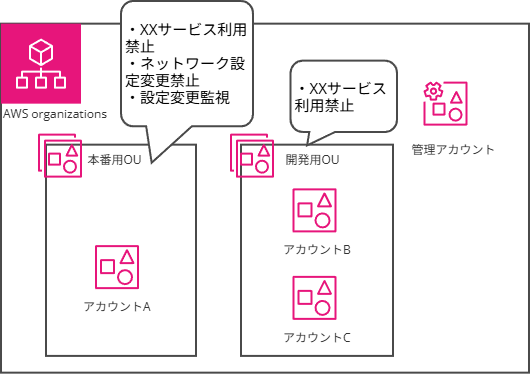

# 一人でもみんなでも AWS Organizationsを使おう！

高野(石原)

 
私は、AWS Organizationsを推したいと思います。

## AWS Organizationsとは

複数のアカウントをグループ化して管理するためのサービスです。

まとめて権限管理、セキュリティ対策やログ設定など、アカウントを管理する上で設定したいリソースをまとめて適用することができます。追加で新しくアカウントを素早く払い出すことも可能です。

AWSで何らかのサービス、システムを運用する際には、少なくとも本番用アカウント、検証用アカウントを用意し、検証用アカウントで問題がないことを確認し本番用に変更作業を適用すべきです。アカウントを分けることは、本番用と検証用リソースの取り違えを防ぐことや、ネットワークの設定変更による影響を減らしたり、1アカウントに1つしか設定できないサービスの検証などメリットが沢山あります。

そのメリットも、アカウントが複数あって管理が煩雑になってしまったら本末転倒です。そのための管理コストを下げるサービスが AWS Organizationsです。

## AWS Organizationsの推せる機能

AWS Organizationsはどう管理コストを下げてくれるか。様々な機能がありますが、特に推しの機能を紹介します。

### その1 グループ化でアカウント管理(SCP・Cloudformation StackSets)

AWS organizationsは、『OUs(organization units)』の単位にアカウントを集約し、まとめて権限許可設定、設定投入を行えます。

{width=60%}

この図のように、本番用、開発用など管理単位でOUを作成し、OUに設定を適用することで、中にあるアカウントに全て設定が適用されます。

OUsは5つまでの階層構造にすることができ、本番用の中でも権限が厳しいもの、開発用でも厳しいもの、など柔軟に管理することが可能です。

権限設定はサービスコントロールポリシー (SCPs) で、設定投入はCloudformation StackSetsで行うことが可能で、全て『管理アカウント』から行い、管理アカウント以外の管理対象アカウントから自由に設定することはできず、管理者が統制を取る運用になります。

管理アカウントはOUsのどこかの任意の1アカウントに委任もできますが、1つのAWS Organizations毎に管理アカウントは1つです。

### その2 セキュリティ系、運用管理サービスの統制

その1のCloudformation StackSetsも使わず、セキュリティ系サービスや運用管理用のサービスをAWS Organizationsを通じ有効にすることができます。

これも『管理アカウント』から有効にでき、管理対象アカウントから設定を変えることはできません。
アカウント管理者として、設定を行っておきたいログ取得・保管機能のCloudTrailや、設定監視のAWS Config、セキュリティ監視のGuardDutyなどを一括で統制できます。

サービスによっては、セキュリティ検知したアラートを管理アカウント上で一括確認する機能も存在します。管理対象アカウントに自分の参照権限設定を行うことなくでき、非常に便利です。

### その3 アカウント増減が簡単にできる

そんな管理対象アカウントは、AWS Organizationsで簡単に増やせます。
数クリックでまっさらなAWSアカウントが手に入ります。請求設定は管理アカウントに紐づきます。

まっさらなアカウントだけでなく、先に設定を投入したアカウントを作成することも可能です。
Cloudformation StackSetsによる適用も1つの方法ですが、 AWS Control Tower 内のAWS Service Catalog Account Factoryという機能を使用し、カスタマイズしたアカウントを払い出すことも可能です。

そして増やしたアカウントはAWS Organizationsで簡単に閉鎖できます(閉鎖要求後、90日の未アクセスをもって削除)。アカウント閉鎖前にリソースの削除は必要なく、閉鎖処理をした後の該当アカウント上のリソースは課金されません。
ただし、閉鎖処理前の利用料、未処理のリザーブドインスタンスの料金・Savings Plans の料金は払う義務がありますので、請求書が引き続き届きます。

## もっと知りたい、そんな時におススメコンテンツ

この章を呼んで、Organizations、やってみたいぜ……となった方、お一人様Organizationsを作り、検証を滾らせましょう！ 紹介した機能毎におススメコンテンツを挙げます。

1. 『AWS IAM Identity Center＆AWS Organizationsを作ろう！』, https://zenn.dev/jawsug_bgnr/articles/758387f29c4c3e

高野が書いたハンズオン用記事です。AWS IAM Identity Centerによるログイン機能と、統合用のAWS Organizationsが作成できます。このハンズオン範囲は課金料金はかかりません。

2. 『Security #1 アカウント作成後すぐやるセキュリティ対策』, https://pages.awscloud.com/JAPAN-event-OE-Hands-on-for-Beginners-Security-1-2022-reg-event.html?trk=aws_introduction_page

AWS Organizationsとの統合の話はありませんが、アカウントにはどういったサービスを有効化すればいいか、基礎を学び、Organizationsで有効化するサービスを検討しましょう。

3. 『AWS Control Tower の Account Factory Customization を使用し、AWS アカウントのカスタマイズを自動化する』, https://aws.amazon.com/jp/blogs/news/automate-account-customization-using-account-factory-customization-in-aws-control-tower/

Service Catalog で独自の設定(ブループリント)を作成し、ブループリントを適用したアカウントを払い出す一連の流れが掲載されています。ハンズオンとしても使用できる記事なので、是非やってみてください。

#### 著者紹介
---

    
    

        

            <b>高野(石原晶子) </b>
            <a href="https://twitter.com/takano0131">X@takano0131</a>
        

        

            サークル名：とりむねにく
        

    

何もわからないまま前任者が退職するためアサインされたAWS案件。やる気を出すために、同人誌を書けるようになるレベルで理解してやる、と斜め上のきっかけで技術同人ジャンルに参加しだしたインフラエンジニア。今ではAWSとだいぶお友達になったはず。主にコミケと技術書典と都内ライブハウスと目黒に出没。酒とうるせぇ爆音が大好き。 
JAWS-UGでは初心者支部の運営、現在の所属会社はAPN企業です。初心者支部はAWS初心者の学びの場になるように手探りでやっておりますので、みなさんの参加お待ちしてます！ 勉強してその後皆で乾杯しましょう！

