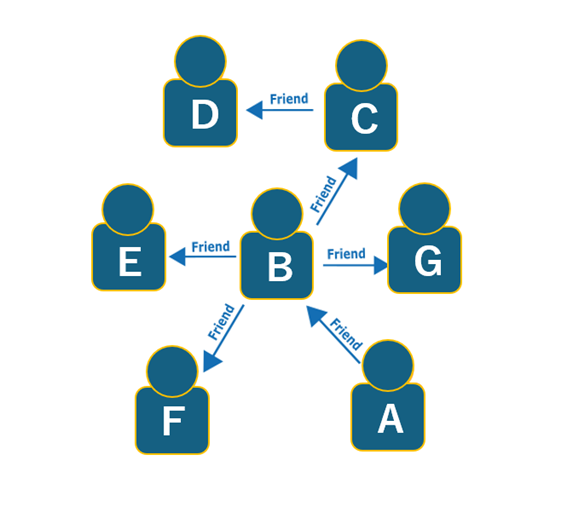
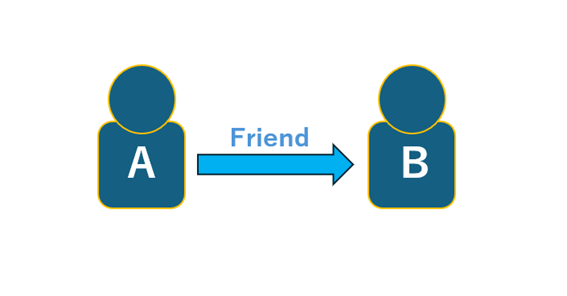
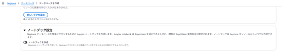

# Amazon NeptuneでグラフDBに入門しよう

<div class="flush-right">
八雲慎之助@yakumo_0905
</div>

## Neptuneの基礎：グラフデータベースとは
まず、Amazon Neptuneに利用されているグラフデータベースについて簡単に触れておきます。グラフデータベースは、ノード（点）とエッジ（線）で構成されたデータ構造を扱います。ノードは「人」「商品」「場所」といった実体を、エッジはそれらの「つながり」「関係性」を表現します。
例えば下記のようなグラフだと、



* 「AさんはBさんの友達」
* 「Aさんから見て、友達の友達は？」
  
といったデータを、直感的かつ効率的に表現できるのがグラフデータベースです。

この構造によって、

* 関係性の深掘り
* ネットワーク分析
  
などの用途において、リレーショナルDBよりも自然に・高速に実装できます。

## Amazon Neptune について
Amazon Neptuneは、AWSが提供する**フルマネージド型のグラフデータベースサービス**です。
主な特徴として、まず特筆すべきなのは高い可用性です。

その高可用性を支える仕組みを主な以下に紹介します。

- **クラスターボリュームによるAZ間の自動レプリケーション**  
    Neptuneのデータは1つのクラスターボリューム内で複数AZに自動レプリケートされます。  
    これにより、AZ障害時でもデータを失うことなく高速に継続運用が可能です。  

* **プライマリ＋最大15台のリードレプリカによるフェイルオーバー**  
    プライマリインスタンスが障害で停止した場合、リードレプリカが自動昇格します。  
    アプリケーション側の切り替えを意識せず、ダウンタイムを最小限に抑えられます。  

* **耐障害性に優れたSSDストレージ設計**  
    Neptuneの仮想化SSDストレージは、ディスク障害時も自動修復がバックグラウンドで実行されます。  
    ユーザー影響を最小限に抑えながら、安定したストレージ性能を維持します。  

* **障害の自動検出・自動復旧**  
    Neptuneはクラッシュや異常を自動で検出し、必要に応じてインスタンスを再起動します。  
    キャッシュの再構築も不要なため、素早い復旧が可能です。  

* **継続的バックアップとポイントインタイムリカバリ**  
    最大35日分の自動バックアップにより、任意の時点への復元が可能です。  
    人的ミスや論理的な破損にも柔軟に対応できる復旧性を備えています。  


これらの仕組みにより、Amazon Neptune は、グラフデータベースでありながら 99.99% の可用性（年間ダウンタイム約52分未満） を実現するように設計されています。

次にフルマネージドなサービスであるという点です。Amazon Neptuneはフルマネージドなサービスなため、ハードウェアのプロビジョニングやパッチ適用、設定やバックアップをいちいち気にする必要もありません。また、障害発生時のフェールオーバやリードレプリカの追加などもすべて自動でやってくれるので、そこもうれしいポイントですね。

また、プロパティグラフとRDFグラフの両方に対応し、クエリ言語も3種類サポートしている点も大きな特徴です。異なるクエリ言語を使用しながら、同じグラフデータに対して好きな方法でアクセス、操作ができます。

| クエリ言語 | 特徴 |
| :--- | :--- |
| Gremlin | 手続き型で柔軟。ネットワーク探索や「経路をたどる」ような処理に向いている。 |
| openCypher | 宣言型でシンプル。SQLに近い感覚で書け、学習コストが低い。 |
| SPARQL | 個DF/セマンティックWeb向け。意味ベースで知識を扱うユースケースに最適。 |

つまり、「使い慣れた構文でアクセスできる」「ユースケースに応じてクエリ言語を選べる」というのも、Neptuneの大きな魅力です。

### 同じグラフに異なるクエリ言語でアクセスしてみる
たとえば、次のような「Aさんの友人」を取得するクエリは、次のように表現できます。



**Gremlin:**
```
g.V().has("name", "A").out("Friend")
```
**openCyper:**
```
MATCH (a {name: 'A'})-[:Friend]->(b) RETURN b
```

これらはどちらを使っても同じ結果が得られます。

この互換性のおかげで、無駄な学習コストを削減できる可能性がありますし、チームのスキルを見てGremlinよりCypherベースのほうがいいといったケースでも、Neptuneであれば柔軟に対応できます。

## Amazon Neptuneの魅力
ここまでNeptuneの魅力を書きましたが、特に私が推したいポイントは、簡単にノードとエッジで構成されたグラフデータベースを構築し、つながりを表現できる点です。
手順としてはとても簡単で、Neptuneクラスター作成時に「ノートブック設定」の「ノートブックを作成」にチェックを入れるだけ。この手順によって、作成したNeptuneクラスターに紐づいたJupyter notebookが作成されます。これによって、notebook上からデータのクエリや可視化が可能になるわけです。



また、NeptuneMLと呼ばれる機械学習との連携機能を利用し、グラフデータを使った高度な予測や分類が手軽に実現できる点も魅力の一つです。この機能によって、「Aさんの友達の友達は誰？」といったような単純なノードのつながりにとどまらず、グラフ上からは見えない価値を引き出すことができます。
一般的なユースケースとして、レコメンド機能があります。通販サイトやSNSでよくある機能です。ユーザーのアクティビティを記録し、気に入ると予測した商品やユーザーをお勧めしている仕組みと同じです。
グラフに機械学習を適用するには時間がかかりますが、NeptuneMLでは工程を自動化し、さらにSageMakerを裏で使って高性能なモデルを構築してくれるので、機械学習に対して知識が浅くても、簡単なステップで実装することができます。


## まとめ
Amazon Neptuneは複雑な関係を可視化、分析したいあらゆる場面で活躍します。RDBでは扱いづらい複雑なデータ構造を分析したいときや、SNSをはじめとしたネットワーク的な関係の追跡、もしくはNeptuneMLを利用した高度な予測を試してみたい方には、Amazon Neptuneがぴったりだと思います。

気になった方はぜひ、Amazon Neptuneを使ってみてください！

<hr class="page-wrap" />

#### 著者紹介

---

<div class="author-profile">
    
    <div>
        <div>
            <b>八雲慎之助</b><br>
           X：<a href="https://x.com/yakumo_0905">https://x.com/yakumo_0905</a></br> 
            Qiita：<a href="https://qiita.com/yakumo_09">https://qiita.com/yakumo_09</a></br> 
        </div>
        <div>
           都内のとあるAPN企業で働いています。初めて触ったAWSサービスがこのAmazon Neptuneでした。<br>普段はQiitaやLTなどで、NeptuneやグラフDB関連についてアウトプットしています。
        </div>
    </div>
</div>
<p style="margin-top: 0.5em; margin-bottom: 2em;">

</p>
