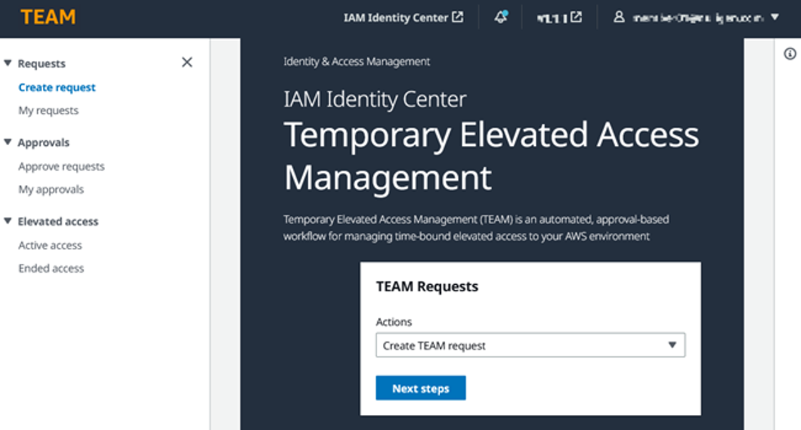
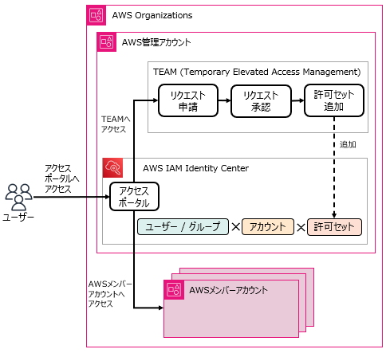
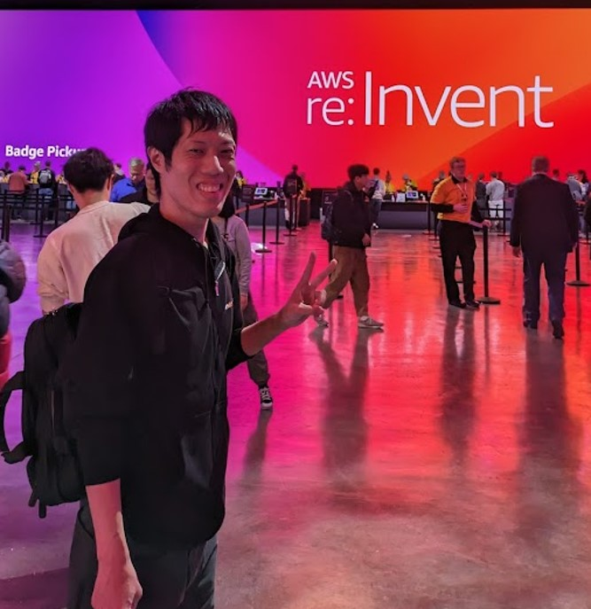

# Temporary Elevated Access Management（TEAM）を利用した一時的なアクセス管理

大島悠司@yuj1osm

## 権限管理の重要性

AWSを利用する中で、アクセス管理の課題は常につきまといます。
例えば、開発者や運用者が普段の業務では不要でも、障害対応や設定変更時に高権限アクセスが必要になる場面は必ず発生します。
そのようなときに、恒常的に高権限を持たせてしまうと、意図しない権限の濫用やセキュリティリスクの増大につながる可能性があります。

クラウドが登場して間もないころ、現場では「申請書の提出＋承認」の社内ワークフローを経て、一時的にIAMロールの権限を付与したり、特定のアカウントでログインしたりといった運用が行われてきました。
しかし、この方法では承認・付与のタイムラグや、権限付与後の取り消し忘れ、さらには操作履歴の不透明さといった課題も多く、効率とセキュリティのバランスを取るのは容易ではありませんでした。

もともとAWSには一時的なアクセス許可を与える管理方法が存在せず、作り込みやサードパーティツールを使うしかありませんでした。
そのような需要野中、AWSは2023年6月にTemporary Elevated Access Management (TEAM)ソリューションをリリースしました。
TEAMは一時的なアクセスを管理することで、リスクを軽減しながら、開発者や運用者の業務効率を向上できるソリューションです。

## TEAMとは？

TEAMは、AWS IAM Identity Centerと連携し、一時的に高権限のアクセス権を払い出し、一定時間後に自動的に権限を剥奪する仕組みです。
利用者は、必要なときに理由を添えて申請し、承認者の確認を経て、一時的に特定の高権限ロールを利用できます。
利用終了後は、自動的に権限が削除されるため、恒久的な高権限のリスクを低減できます。

さらに、申請から承認、利用状況の記録まで一貫してAWS側で管理できるため、監査やセキュリティ対策の強化にも直結します。

## TEAMの推しポイント

### 常に「最小権限の原則」を維持できる

セキュリティの基本原則である「最小権限の原則」を、開発・運用現場で無理なく運用できるのがTEAMの最大の魅力です。
通常業務では、開発者・運用者ともに最低限の権限のみで作業を行い、必要なときだけ必要な権限を一時的に付与する方式へシフトできます。
以前であれば「障害対応のため、root権限に近い権限を常時保持」というケースもありましたが、TEAMを利用することで恒常的に高権限を付与することに起因するリスクを低減できます。

### 申請・承認・操作履歴のトレーサビリティ

高権限の操作は、「誰が、いつ、なぜ、どんな操作をしたか」を追跡できることが重要です。
TEAMは、申請時に理由の記入を必須化でき、承認者のレビューを挟むことで、ガバナンスの効いた運用が可能です。
さらに、AWS CloudTrailと連携することで、実際の操作履歴もログとして残せるため、監査対応も安心です。

とくにインシデント対応時には、「この設定変更は誰の承認で行われたのか」、「本当に必要な操作だったのか」をすぐに確認でき、原因特定と対策の迅速化に役立ちます。

### 開発者の即時性とセキュリティを両立

従来の権限申請は、社内の承認フローを通す関係で、数時間〜数日かかることも珍しくありませんでした。その間にシステム障害が長引いたり、作業の停滞を招いたりすることも多々あります。

TEAMは、Identity Centerのアクセスリクエスト機能と連携し、承認後即座に高権限アクセスが可能になります。
これにより、障害発生時の緊急対応や環境構築作業も即時性を損なわず、安全に実施できるようになりました。

## 実際の効果
私たちのチームでは、TEAM導入後に恒常的な高権限アカウントの利用がゼロとなり、運用ルールの統一も実現しました。また、過去には高権限利用の履歴確認に苦労していた監査対応も、申請・承認・操作履歴が一元管理されることで大幅に効率化。特に障害発生時の調査スピードが倍以上に改善しました。

開発者側からも「急な対応でもすぐ申請・利用できる」「権限返却忘れの心配がない」といった前向きな意見が増え、セキュリティと利便性の両立が現実のものになっています。

## まとめ

TEAMは、一時的な権限付与の管理を強化しつつ、開発・運用現場のスピード感も損なわない、非常に優れたサービスです。
とくに、権限管理に課題を感じていたり、監査・セキュリティ体制を強化したい組織にとっては、大きな価値をもたらします。
AWSをお使いであれば、クラウドセキュリティをより強固なものにするために、TEAMの導入を検討してみてはいかがでしょうか。

### 出典

TEAM 
（出典：https://aws-samples.github.io/iam-identity-center-team/）

### 著者紹介

---

    
    

        

            <b>大島悠司</b>
            <a href="https://x.com/yuj1osm">X@yuj1osm</a>
        

        

            所属：JAWS-UG横浜
        

    

セキュリティや基盤運用を得意とするエンジニア。マルチクラウド/マルチアカウントなクラウド運用、統合的なセキュリティ維持や運用自動化を実践してきた。 
・AWS Community Builder 
・Japan AWS Top Engineers 
・Japan AWS All Certifications Engineers

